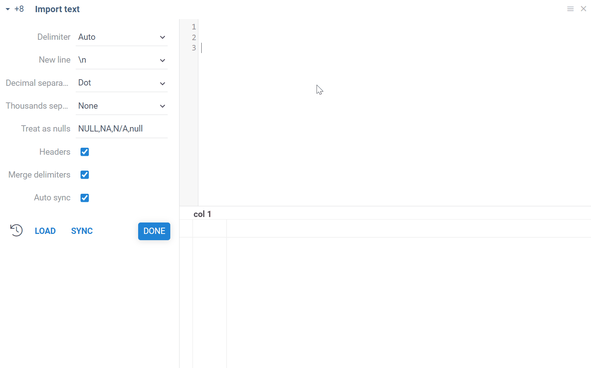
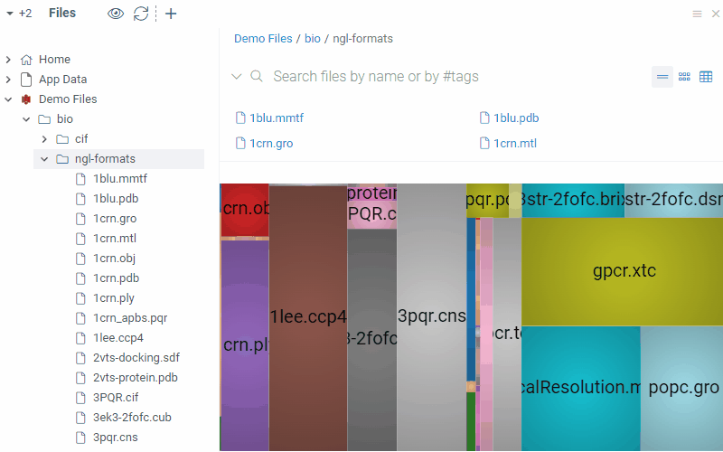
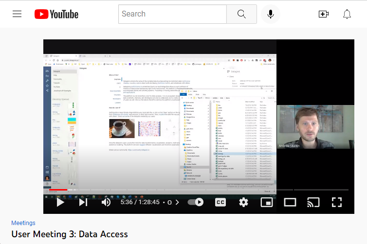

# Files

```mdx-code-block
import Tabs from '@theme/Tabs';
import TabItem from '@theme/TabItem';
```

Datagrok lets you work with files and directories on your system from the convenience of a web browser. You can browse, preview, open, create, delete, rename, download, clone, and share files and directories. When you sign up for Datagrok, a personal directory called **Home** is automatically created for you. Additionally, you can connect to [popular file systems](supported-connectors.md), including the [Amazon S3 bucket](connectors/s3.md), [Dropbox](connectors/dropbox.md), [Google Drive](connectors/googlecloud.md), and [Git](connectors/git.md), as well as [Windows and Linux network shares](connectors/files.md).

:::note

Connecting to an SMB file storage is only available for on-premise deployment and is not available on the public Datagrok instance (public.datagrok.ai).

:::

:::note developers

You can [create custom connectors](create-custom-connectors.md) and [read files programmatically](../develop/how-to/access-data.md/#reading-files).

:::

## Connecting to file storage

To connect to your file storage, follow these steps:

1. Go to **Data** > **Files**.
1. Open the **New file share** dialog (**Toolbox** > **Actions** > **New file share**). Alternatively, click the **New file share** icon on the **Menu Riboon**.
1. In the dialog, choose the data source from the **Data Source** dropdown. The dialog updates with connection-specific parameters.
1. Set the parameters.
1. Click **TEST** to test the connection, then click **OK** to save it.


Some connection parameters have unique characteristics, and it's important to specify them correctly:

* _Directory path_. When connecting to the root directory, leave the **Dir** field empty. Otherwise, enter a directory path.
* _Credentials_. You can specify credentials manually or using the [Secrets Manager](data-connection-credentials.md), such as the AWS Secrets Manager. When entered manually, Datagrok stores secrets in a [secure privilege management system](../govern/security.md/#credentials). To specify who can change the connection credentials, click the **Gear** icon and select from the **Credential owner** dropdown.

  :::caution

  When connecting to _public buckets_ in AWS S3, always check the **Anonymous** checkbox.

  :::

Once you have established a connection to a folder in your file system, the folder appears in the **File Manager** under the corresponding data source. This connection is referred to as a _file share_. You can view the files and subfolders within the _file share_ by expanding it.

:::note

Like other objects in Datagrok, newly created connections are only visible to the user who created them. To let others access the file share, you must share it (right-click the connection and select **Share...** from the list of options).

:::

To modify a connection, right-click it and select **Edit...** from the list of options. To quickly create a connection similar to an existing one, right-click it and select **Clone...**

<!--
### File indexing
For file shares, Datagrok supports indexing of folders and [supported file formats](supported-formats.md), including archives such as .tar or .zip.

Connections and folders are indexed by default when you create a connection. File indexing is optional. To index files, select the **Index Files** option when creating a file share.

:::tip

You can enable file indexing at any time. Right-click the file share and select **Edit...** Then, check the **Index file** checkbox in the dialog that appears. Click **OK** to save.

:::

File indexing is a recurring data job that runs every hour. Datagrok extracts the following information from the indexed file:

* Filename
* File size, in bytes
* Number of rows and columns
* Column-level information such as name, data type, and [semantic type](../discover/semantic-types.md).

For instance, with indexing, you can browse columns within a CSV file inside a ZIP file:


Indexing helps you find datasets quicker as indexed files appear in the search results based on metadata extracted. For example, you can search for dataframes matching the following criteria across specified or all data providers at once:

* Created in the last month
* Has a column that contains molecules, and
* Has a column named "activity."

:::note

To learn how searching works in Datagrok, see [Smart search](../datagrok/smart-search.md).

:::
-->

## Importing text

Datagrok supports text-to-tabular-data conversion for delimiter-separated files with an option to manually edit or customize data during import. To use this feature, open the [**Text Manager**](https://public.datagrok.ai/text) (**Data** > **Text**) and load a file or paste text into the **Text Editor** area. Here you can change the data as needed. Adjust default import parameters like delimiters, decimal separators, and header settings in the **Toolbox** on the left. By default, changes are automatically applied and displayed in the **Preview**, which updates as you modify the data. To manually sync edits, disable the **Auto Sync** checkbox and use the **Sync** button.

When satisfied with the data, click **Done** to open the dataframe in Datagrok. From there, you can export it, make further edits, save it as a project, or share with others via URL.



## File Manager

The **File Manager** is an interface that allows you to manage connections, browse and preview file content, and perform standard file and folder actions such as opening, downloading, deleting, and renaming. To access an object's context actions, right-click it or left-click and expand the **Actions** pane in the **Context Panel** on the left. By clicking a file or folder in the **File Manager**, you can open its preview. Double-clicking a file opens it in Datagrok, and double-clicking a folder expands its content.

:::note

If you don't see a certain action, it may be due to insufficient permissions. For files and folders shared with you, contact the credentials owner. If you are a credentials owner, contact the data source owner.

:::

In addition to the hierarchical browsing, the **File Manager** offers advanced preview and data augmentation capabilities using **Directory**, **Preview**, and **Context Panel**.

The **Directory** section shows the contents of your current folder. Click a file to see its preview and properties, or right-click it for more actions. Use the search bar to search for files and folders within your current directory. The search bar allows you to search for items by name, file extension, or metadata.

For folders, the **Preview** generates a [treemap](../visualize/viewers/tree-map.md) that highlights the largest items. For files, the functionality varies based on the file's format and data properties. It includes custom viewers for [supported formats](supported-formats.md), such as interactive spreadsheets for displaying tabular data, cell and image renderers, and chemical and biological structure viewers. You can also view the content of ZIP files and edit Markdown, TXT, and HTML files.


:::note

File preview is limited to files under 10MB. The platform won't display larger files. Unsupported file formats cannot be previewed, but you can download them.

:::

:::note developers

You can [add custom formats using package extensions](../develop/how-to/create-package.md). In addition, you can create organization-specific previews:

<details>
<summary> Example: Create custom file viewers </summary>

In this example, a script is executed against the folder content. If the folder contains files that match the file extension parameter PDB, the **Preview** displays a custom NGL viewer to visualize the molecule.



To add a custom viewers, you have two options:

* Develop in JavaScript using the [Datagrok JavaScript API](../develop/js-api.md).
* Use the visualizations available for popular programming languages like Python, R, or Julia.

To learn more about each option, see [Develop custom viewer](../develop/how-to/develop-custom-viewer.md).

</details>

<details>
<summary> Example: Create custom folder viewers </summary>

In this example, a [script](../develop/how-to/folder-content-preview.md) is executed against the folder content. If the folder contains files matching the file extension parameter, the **Preview** shows a custom [widget](../visualize/widgets.md) (in this case - the application launch link) every time the folder is opened.


</details>
<details>
<summary> Example: Create custom cell renderers </summary>

In this example, a [script](/develop/how-to/custom-cell-renderers.md) is executed against the [SMILES](https://en.wikipedia.org/wiki/Simplified_molecular-input_line-entry_system) strings within the CSV file. The script computes the structure graph and 2D positional data, and renders the structure graphically.


</details>

:::

The [Context Panel](../datagrok/navigation.md#properties) provides additional information about a selected file or folder, and the ability to execute conext actions. For example, when you click a CSV file, the **Context Panel** updates to show the file's metadata, available context actions, and other relevant information. If you subsequently click any of the dataframe's columns in the **Preview**, the **Context Panel** will update to display information and actions specific to that column, such as summary statistics for the column under **Stats**, or its data and semantic types under **Details**.


:::note developers

**Context Panel** can be extended. You can add custom [info panes](../develop/how-to/add-info-panel.md) and [context actions](../develop/how-to/context-actions.md).

<details>
<summary> Example: Image augmentation </summary>

In this example, a [Python script](/develop/how-to/create-custom-file-viewers.md) creates a custom _info pane_ called **Cell Imaging Segmentation**. This script executes against JPEG and JPG files during the indexing process and extracts custom metadata (such as the number of cells) and performs predefined transformations (such as cell segmentation). When a user selects the corresponding image, the **Context Panel** shows a custom info panel that displays the augmented file preview and the number of detected cell segments.


</details>

:::

## File sharing and access control

You can share files in two ways: by sharing the actual file (or folder), or by sharing an URL that points to it. To share an URL, open the file in Datagrok and copy the URL from the address bar. To access the file from the link provided, users must have permissions to open it. Once the file is open, users can download the file and then upload it to their **Home** directory, or [save the file as a project](/datagrok/create-project.md). The URL links never expire and can't be revoked.

:::tip

For tabular formats, you can create dynamic dashboards and share them with others via URL or reference them on external websites. To learn more about dynamic data updates, see [Dynamic data](../datagrok/project.md/#dynamic-data).

:::

Another option is to share directly in Datagrok by creating a _file share_ and specifying access privileges for each shared item, such as separate files and subfolders. Once the item is shared, it appears in the recipient's **File Manager**. When using this method, you have several options:

* Share a _connection_ (root folder) to give access to the entire directory.
* Share a _folder_ to give access to the content of individual folders in your directory.
<!--* Share a _file_ to limit access to individual files within a folder.-->

To share, follow these steps:

1. Right-click the item you want to share and select **Share...** from its context menu. The **Share...** dialog opens.
1. In the identity/email field, start typing a person's name, username, email, or group name, and pick from the list of matching identities.
1. From the respective dropdowns, select access privileges for either or both: (1) the connection and (2) individual
   files/folders. You can select any or all of the following options:

    * _Can view_: Users can view, open, and download
    * _Can edit_: Users can rename, edit, delete, and reshare with any other user or group.

    :::caution

    A file's _name_ and _namespace_ are encoded within the URL. When you rename a file (or its location), the link changes accordingly, which may cause broken URL links, script errors, and similar issues.

    :::

1. Optional. Enter a description in the text field provided. You may also notify the users you share with. If you don’t want to send a notification, clear the **Send notification** checkbox.

  :::note

  To send an email notification, enter the user's email in the identity/email field. The email notification contains a link to the shared item and entered description. If you enter a user or group name, they will be notified via the Datagrok interface.

  :::

1. Click **OK** to share. Once shared, the shared item appears in the recipient's **File Manager**.

   

:::tip

To inspect or quickly adjust access permissions to your file shares, send comments to those you're sharing with, and more, use the **Sharing** info pane in the **Context Panel**.

:::

## Resources

[](https://www.youtube.com/watch?v=dKrCk38A1m8&t=417s)
