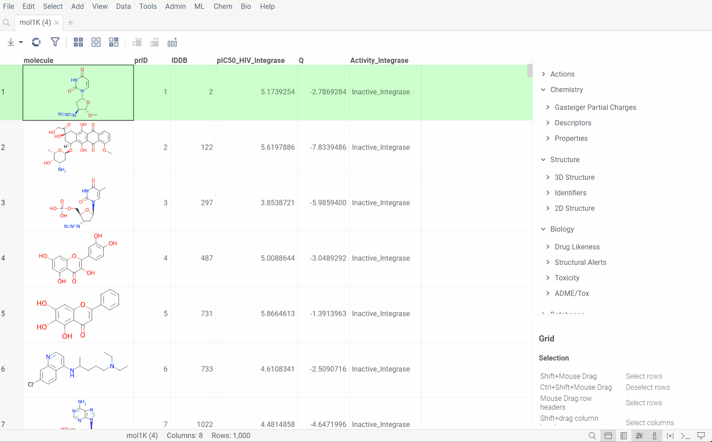

**Chemical space** performs [dimensionality reduction](https://en.wikipedia.org/wiki/Dimensionality_reduction) on a column of molecules.

Dimensionality reduction can be used to visualize high-dimensional data in two dimensions. It is particularly useful for visualizing the clusters of similar molecules on 2D scatter plot. The algorythm uses either [UMAP or t-SNE](https://en.wikipedia.org/wiki/Nonlinear_dimensionality_reduction), in combination with [molecule fingerprint](https://www.rdkit.org/UGM/2012/Landrum_RDKit_UGM.Fingerprints.Final.pptx.pdf) generation and bit array distance functions, to calculate pairwise distances between molecules and then reduce the dimensionality of the data.

## Usage

The dialog has the following inputs:

* **Table**: The table containing the column of sequences.
* **Column**: The column containing the sequences.
* **Encoding function**: The encoding function that will be used for pre-processing of molecules. Currently, only one encoding function is available, that will use [chemical fingerprint](https://www.rdkit.org/UGM/2012/Landrum_RDKit_UGM.Fingerprints.Final.pptx.pdf) distances between each molecule to calculate pairwise distances. The `Fingerprints` function has 1 parameter which you can adjust using the gear (⚙️) button next to the encoding function selection: 
    * Fingerprint type: The type of molecular fingerprints that will be used to generate monomer substitution matrix. Options are `Morgan`, `Pattern` or `RDKit`.
* **Method**: The dimensionality reduction method that will be used. The options are:
    * UMAP: [UMAP](https://umap-learn.readthedocs.io/en/latest/) is a dimensionality reduction technique that can be used for visualisation similarly to t-SNE, but also for general non-linear dimension reduction.
    * t-SNE: [t-SNE](https://en.wikipedia.org/wiki/T-distributed_stochastic_neighbor_embedding) is a machine learning algorithm for dimensionality reduction developed by Geoffrey Hinton and Laurens van der Maaten. It is a nonlinear dimensionality reduction technique that is particularly well-suited for embedding high-dimensional data into a space of two or three dimensions, which can then be visualized in a scatter plot.

    Other parameters for dimensionality reduction method can be accessed through the gear (⚙️) button next to the method selection.
* **Similarity**: The similarity/distance function that will be used to calculate pairwise distances between fingerprints of the molecules. The options are: `Tanimoto`, `Asymetric`, `Cosine` and `Sokal`. All this distance functions are based on the [bit array](https://en.wikipedia.org/wiki/Bit_array) representation of the fingerprints.

* **Plot embeddings**: If checked, the plot of the embeddings will be shown after the calculation is finished.
* **Cluster embeddings**: If checked, the embeddings will be clustered using the [DBSCAN](https://en.wikipedia.org/wiki/DBSCAN) algorithm. The DBSCAN algorithm groups together points that are closely packed together (points with many nearby neighbors), marking as outliers points that lie alone in low-density regions (whose nearest neighbors are too far away). The DBSCAN algorithm has two parameters that you can adjust through the gear (⚙️) button next to the cluster embeddings checkbox:
    * Epsilon: The maximum distance between two points for them to be considered as in the same neighborhood.
    * Minimum points: The number of samples (or total weight) in a neighborhood for a point to be considered as a core point. This includes the point itself.

