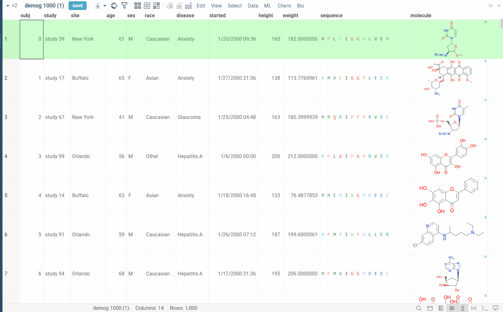
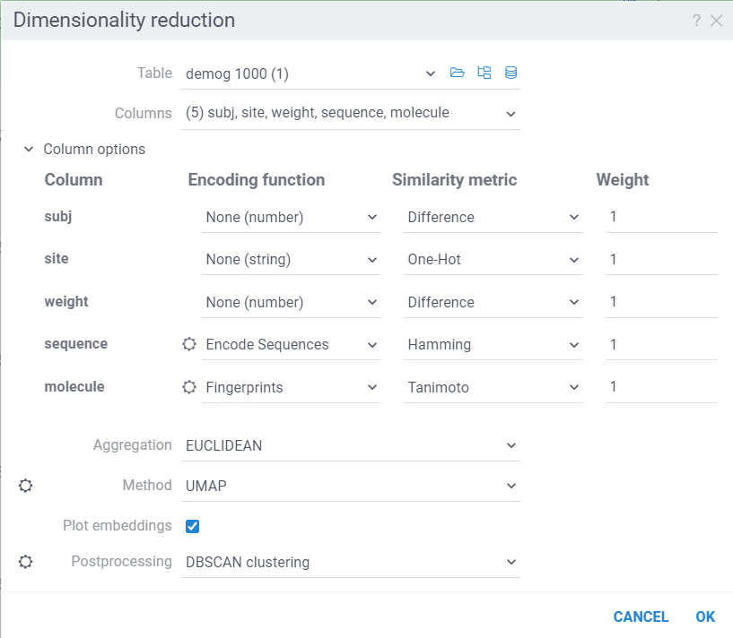
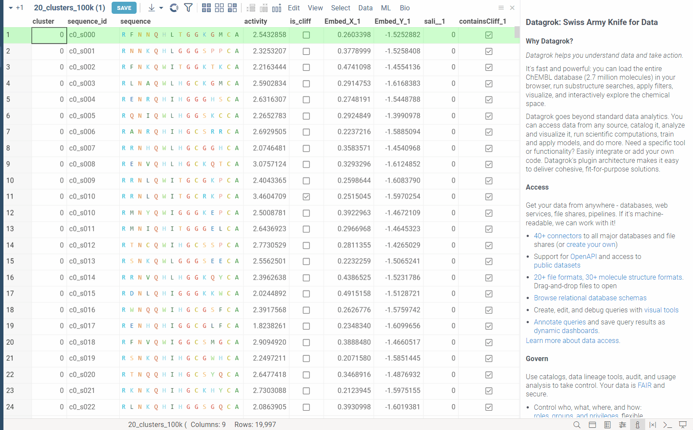

**Dimensionality Reduction** capabilities of Datagrok allow you to reduce the number of features in your dataset while preserving the most important information using either [UMAP or t-SNE](https://en.wikipedia.org/wiki/Nonlinear_dimensionality_reduction) algorythms. It extends the functionality of the [Chemical Space](./chem-space.md) and [Sequence Space](./sequence-space.md) tools, while also providing a way to combine **multiple columns** and **different data types** in a single analysis. Each column can be configured with its own encoding function (for example, molecules are first converted to fingerprints), distance metric, weight and other parameters (for example, which fingerprints should be used for molecules). The distances between corresponding values are combined using a weighted aggregation function (Manhattan or Euclidean) to produce a single distance matrix, which is then used for dimensionality reduction. 




## Usage

The dialog has the following inputs:

* **Table**: The table used for analysis.
* **Columns**: List of columns for dimensionality reduction.
* **Column Options**: For each chosen column, you can specify what encoding function to use, distance metric, weight, and other parameters.
For example, for biological sequences, you can choose encoding function to convert them to big molecules and then calculate the distance between them using the chemical fingerprint distance, or treat them as sequences and use one of sequence distance functions (Hamming, Levenstain, Needleman-Wunsh or Monomer chemical distance). In case if encoding function can be configured further, you can adjust its parameters using the gear (⚙️) button next to the encoding function selection. For example, for molecules, you can adjust which fingerprints should be used for encoding.
* **Aggregation**: The function used to combine distances between corresponding values in different columns. The options are:
    * **Euclidean**: The Euclidean distance between two points in Euclidean space is the length of the line segment connecting them.
    * **Manhattan**: The Manhattan distance between two points is the sum of the lengths of the projections of the line segment between the points onto the coordinate axes.
* **Method**: The dimensionality reduction method that will be used. The options are:
    * **UMAP**: [UMAP](https://umap-learn.readthedocs.io/en/latest/) is a dimensionality reduction technique that can be used for visualisation similarly to t-SNE, but also for general non-linear dimension reduction.
    * **t-SNE**: [t-SNE](https://en.wikipedia.org/wiki/T-distributed_stochastic_neighbor_embedding) is a machine learning algorithm for dimensionality reduction developed by Geoffrey Hinton and Laurens van der Maaten. It is a nonlinear dimensionality reduction technique that is particularly well-suited for embedding high-dimensional data into a space of two or three dimensions, which can then be visualized in a scatter plot.

    Each method has its own set of parameters that can be accessed through the gear (⚙️) button next to the method selection. For example, for UMAP, you can adjust the `number of neighbors`, `minimum distance`, `learning rate`, `epochs`, `spread` and `random seed`.

* **Plot embeddings**: If checked, the plot of the embeddings will be shown after the calculation is finished on scatter plot.

* **Postprocessing**: The postprocessing function that will be applied to the resulting embeddings. The options are:
    * **None**: No postprocessing will be applied.
    * **DBSCAN**: The DBSCAN algorithm groups together points that are closely packed together (points with many nearby neighbors), marking as outliers points that lie alone in low-density regions (whose nearest neighbors are too far away). The DBSCAN algorithm has two parameters that you can adjust through the gear (⚙️) button next to the postprocessing selection:
        * **Epsilon**: The maximum distance between two points for them to be considered as in the same neighborhood.
        * **Minimum points**: The number of samples (or total weight) in a neighborhood for a point to be considered as a core point. This includes the point itself.
    * **Radial Coloring**: The radial coloring function will color the points based on their distance from the center of the plot. The color will be calculated as a gradient from the center to the border of the plot.




## Under the hood

The dimensionality reduction process consists of the following steps:

1. **Encoding**: Each value in the column is encoded using the specified encoding function. For example, molecules can be converted to fingerprints, sequences can be converted to big molecules or hashed representations, etc. The encoding functions can be added from any package to add support for other types/semantic types of data. Encoding function needs to have given annotations:
    * `dim-red-preprocessing-function` tag, which specifies that this function can be used for preprocessing in dimensionality reduction.
    * `meta.supportedTypes` annotation, listing the supported types of columns that can be encoded using this function.
    * `meta.supportedSemTypes` (**optional**) annotation, listing the supported semantic types of columns that can be encoded using this function.
    * `meta.supportedUnits` (**optional**) annotation, listing the supported units of columns that can be encoded using this function (for example, there is an encoding function that only supports HELM columns, which is a **Unit** of Macromolecule semtype columns).
    * `meta.supportedDistanceFunctions` annotation, listing the supported distance functions that can be used for calculating the distance between encoded values.
    * First two inputs of the function must be a **column** and **distance metric** name. These can be followed by
    any number of other inputs that can be used to configure the encoding function (for example, which fingerprints should be used for molecules). These additional inputs will be shown as configuration parameters in the column options.

    * The function must return an object with the following structure:
        ```typescript
        {
            entries: any[], // List of encoded values
            options: object // Additional options that will be passed to distance function.
            //For example, for macromolecules, it can be substitution matrix, gap open penalty, gap extend penalty, etc.
        }
        ```


    For example, this is how the encoding function for macromolecules looks like:
    ```typescript
    //name: Encode Sequences
    //tags: dim-red-preprocessing-function
    //meta.supportedSemTypes: Macromolecule
    //meta.supportedTypes: string
    //meta.supportedUnits: fasta,separator,helm
    //meta.supportedDistanceFunctions: Hamming,Levenshtein,Monomer chemical distance,Needlemann-Wunsch
    //input: column col {semType: Macromolecule}
    //input: string metric
    //input: double gapOpen = 1 {caption: Gap open penalty; default: 1; optional: true}
    //input: double gapExtend = 0.6 {caption: Gap extension penalty; default: 0.6; optional: true}
    //input: string fingerprintType = 'Morgan' {caption: Fingerprint type; choices: ['Morgan', 'RDKit', 'Pattern', 'AtomPair', 'MACCS', 'TopologicalTorsion']; optional: true}
    //output: object result
    export async function macromoleculePreprocessingFunction(
    col: DG.Column, metric: MmDistanceFunctionsNames, gapOpen: number = 1, gapExtend: number = 0.6,
    fingerprintType = 'Morgan'): Promise<PreprocessFunctionReturnType> {
    if (col.semType !== DG.SEMTYPE.MACROMOLECULE)
        return {entries: col.toList(), options: {}};
    const {seqList, options} = await getEncodedSeqSpaceCol(col, metric, fingerprintType);
    return {entries: seqList, options: {...options, gapOpen, gapExtend}};
    }

    ```

    ### Currently, we support numerical, string, molecule, macromolecule and text(semtype) columns.

2. **Distance calculation**: The pairwise distances between encoded values is calculated using the specified distance metrics. Distances are then aggregated using the specified aggregation function to produce a single distance. These aggregated distances are then used as the basis for dimensionality reduction.

3. **Dimensionality reduction**: The dimensionality reduction method is applied to the distance matrix to produce the embeddings. The embeddings are then plotted on a scatter plot.

4. **Postprocessing**: The postprocessing function is applied to the embeddings. For example, DBSCAN can be used to cluster the embeddings (and color them accordingly), or radial coloring can be used to color the points based on their distance and angle from the center of the plot.

## Optimizations

1. The dimensionality reduction process runs in dedicated web worker to avoid blocking the main thread.
2. The pairwise distances are calculated in parallel using multiple web workers: As UMAP and t-SNE rely on firstly constructing the K nearest neighbors(KNN) graph, and then optimizing the embeddings based on this graph, the KNN graph is constructed in parallel using condensed distance matrix approach. This way, we avoid duplicate calculations, which in total speeds up the process ~10x. The aggregation happens at the time of calculating distances, so we don't need to store the full distance matrix in memory. This also allows us to use dimensionality reduction on large datasets of **100_000+** rows.
3. DBSCAN clustering is written in C++ and compiled to webAssembly: This massively speeds up clustering step, which is able to cluster 100_000 points in under 2 seconds.

## WebGPU (experimental)

WebGPU is an experimental feature that allows you to use the GPU for calculations in browser. We have implemented the KNN graph generation (with support to all simple and non-trivial distance functions like Needleman-Wunsch, Tanimoto, Monomer chemical distances, etc.) and UMAP algorithms in webGPU, which can be enabled in the dimensionality reduction dialog. This can speed up the calculations significantly, especially for large datasets, up to 100x. This option can be found in the gear (⚙️) button next to the method selection (UMAP).

In the example bellow, we perform dimensionality reduction on a dataset with 20_000 protein sequences, which took webGPU implementation 4 seconds to complete (With integrated graphics card, on commodity cards, the speedup is much more). The same calculation on CPU (With our parallelized implementation) took 1 minute and 30 seconds. Commodity graphics cards (like RTX 3060) can perform dimensionality reduction on datasets with 100_000+ rows in under 10 seconds.



Please note, that webGPU is still considered as experimental feature, and for now only works in Chrome or Edge browsers (although it is planned to be supported in Firefox and Safari in the future). If webGPU is not supported in your browser, this checkbox will not appear in the dialog. To make sure that your opperating system gives browser access to correct(faster) GPU, you can check the following:
* Go to settings and find display settings
* Go to Graphics settings.
* In the list of apps, make sure that your browser is set to use high performance GPU.

