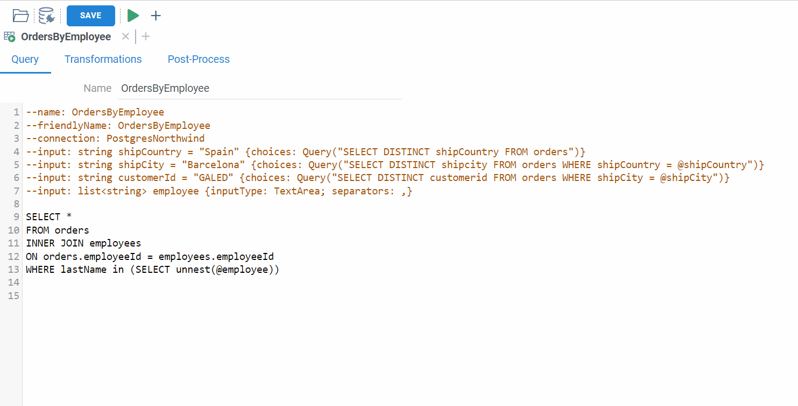

This page contains detailed description
of all annotation comments possible for thr header section.

## Header parameters

All annotation comment start for the parameter name.
The following parameters exist in Datagrok:

| Parameter   | Description                                                                         |
|-------------|-------------------------------------------------------------------------------------|
| name        | Name                                                                                |
| description | Description                                                                         |
| language    | Script language (see the [list of supported languages](#supported-languages) below) |
| help-url    | Datagrok's Wiki URL                                                                 |
| reference   | Reference to a research paper, Wikipedia article, Git repository, etc.              |
| top-menu    | Top menu path separated with pipes (\|)                                             |                                           |
| tags        | Tags                                                                                |
| sample      | Name of a sample file                                                               |
| input       | Input parameter                                                                     |
| output      | Output parameter                                                                    |
| environment | Environment name                                                                    |
| condition   | Script applicability conditions                                                     |

Also, it is possible to add custom parameter using "meta." prefix.

### Supported Languages

| Language parameter value | Description    |
|--------------------------|----------------|
| r                        | R              |
| python                   | Python         |
| octave                   | Octave         |
| julia                    | Julia          |
| grok                     | Grok Scripting |
| JavaScript               | JavaScript     |

### Format template for 'input' and 'output'

```
#<direction>: <type> <name> = <value> {<option tag>:<value>; ...} [<description>]
```

**direction** - parameter direction:

* input
* output

**type** - parameter type:

* **dataframe** \- data frame
* **int** \- integer scalar
* **double** \- float scalar
* **bool** \- boolean scalar
* **graphics** \- graphics
* **string** \- string
* **column** \- column from selected table
* **column_list** \- list of columns from selected table
* **datetime** \- datetime
* **file** \- file, variable in script contains path to file
* **blob** \- blob, variable in script contains array of bytes

**name** - parameter name that will be used in script. Optional for graphical output.

**value** - used for scalar inputs as value and graphics outputs as index of graphical element. Optional.

**option tag** - list of default UI options for parameter. Optional.

**description** - parameter brief description, text. Optional.

### Options

#### Common

| Option     | Value                     | Description              |
|------------|---------------------------|--------------------------|
| validators | List separated with comma | List of named validators |
| caption    | Text string               | Custom field caption     |
| postfix    | Text string               | Field postfix            |
| units      | Same as postfix           |                          |

Named validators:

* containsMissingValues
* columnName - checks if table contains current column name
* columnIsNumerical
* columnIsCategorical

Validator also can be any function that that returns "null" if validation is right, or string with error message
otherwise.

#### For "dataframe" type

| Option      | Value       | Description                             |
|-------------|-------------|-----------------------------------------|
| columns     | numerical   | Only numerical columns will be loaded   |
| categorical | categorical | Only categorical columns will be loaded |

#### For "column" and "column_list" types

| Option     | Value                           | Description                                                                 |
|------------|---------------------------------|-----------------------------------------------------------------------------|
| type       | numerical                       | In dialog will be showed only numerical types columns                       |
| type       | categorical                     | In dialog will be showed only categorical types columns                     |
| type       | dateTime                        | In dialog will be showed only dateTime columns                              |
| format     | MM/dd/yyyy                      | Datetime format, for dateTime columns and datetime type only                |
| allowNulls | true/false                      | Adds validation of missing values presents                                  |
| action     | join("table parameter name")    | Joins result to specified table, for output parameters only                 |
| action     | replace("table parameter name") | Replaces result with columns in specified table, for output parameters only |

#### For "string" type

| Option      | Value                                                                                      | Description                              |
|-------------|--------------------------------------------------------------------------------------------|------------------------------------------|
| choices     | List separated with comma, or function name that returns list of strings                   | List of choices for string parameter     |
| suggestions | Function name that returns list of strings with string input corresponding to script input | List of suggestions for string parameter |

Header line examples:

```
#input: string choices = int {choices: ["string", "int", "bool"]}
#input: string choices = int {choices: jstypes}

#input: string option = int {suggestions: jssuggesttype}
```

#### For "list" type

| Option      | Value                                                                                      | Description                              |
|-------------|--------------------------------------------------------------------------------------------|------------------------------------------|
| separators     | String that consists of consecutive separators (different characters needed to facilitate the splitting process)                   | String of separators applied to the string parameter     |

Use **separators** options to obtain the output of a list type. You need to provide separators as a string. This allows to split the string based on the specified characters.

**Separators** work only for the TextArea input type. The following example demonstrates how separators work.

```sql
--name: OrdersByEmployee
--friendlyName: OrdersByEmployee
--connection: PostgresNorthwind
--input: string shipCountry = "Spain" {choices: Query("SELECT DISTINCT shipCountry FROM orders")}
--input: string shipCity = "Barcelona" {choices: Query("SELECT DISTINCT shipcity FROM orders WHERE shipCountry = @shipCountry")}
--input: string customerId = "GALED" {choices: Query("SELECT DISTINCT customerid FROM orders WHERE shipCity = @shipCity")}
--input: list<string> employee {inputType: TextArea; separators: ,}

SELECT *
FROM orders
INNER JOIN employees
ON orders.employeeId = employees.employeeId
WHERE lastName in (SELECT unnest(@employee))
```


