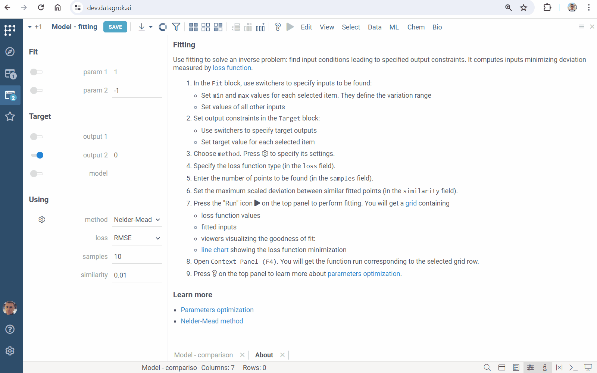

Parameter optimization solves an inverse problem: finding the input conditions that lead to a specified output of the model. It computes inputs minimizing deviation measured by [loss function](https://en.wikipedia.org/wiki/Loss_function).

Using Datagrok fitting feature, you can improve performance and accuracy of a model.

## Usage

To run parameter optimization:

* Click the "Fit inputs" icon <i class="grok-icon fal fa-chart-line"></i> on the top panel. **Fitting View** opens.

* In the `Fit` block, use switchers to specify inputs to be found:

  * Set `min` and `max` values for each selected item. They define the variation range
  * Set values of all other inputs

* Set output constraints in the `Target` block:
  * Use switchers to specify target outputs
  * Set target value for each selected item

* Specify settings of fitting:
  * Choose numerical optimization method (in the `method` field). Click the gear icon <i class="grok-icon fal fa-cog"></i> to specify its settings
  * Set loss function type (in the `loss` field)
  * Specify number of points to be found (in the `samples` field)
  * Set the maximum scaled deviation between similar fitted points (in the `similarity` field): the higher the value, the fewer points will be found

* Click the "Run" <i class="fas fa-play"></i> icon on the top panel to perform fitting. You will get a
[grid](../visualize/viewers/grid) containing

  * loss function values and fitted inputs
  * viewers visualizing the goodness of fit
  * [line chart](../visualize/viewers/line-chart) showing the loss function minimization


An inverse problem may have several solutions. Specify their expected number in the `samples` field. To filter fitted points, set `similarity`:

* it is the maximum scaled deviation between "similar" points
* the higher the value, the fewer points will be displayed



## Table output

Apply the feature to models with table outputs as well:

* Specify the target dataframe in the table input
* Set dataframe column with values of independent variable (in the `argument` choice input)


Open `Context Panel` (F4). You will get the model run corresponding to the selected grid row:


## Platform function annotaion

Apply parameter optimization to any function with the [RichFunctionView](https://datagrok.ai/help/compute/scripting/advanced-scripting/) editor. Add `meta.features: {"fitting": true}` to enable it:

```javascript
//name: Test
//language: javascript
//input: double x
//output: double y
//editor: Compute:RichFunctionViewEditor
//meta.features: {"fitting": true}

let y = x * x;
```

## See also

* [Optimization](https://en.wikipedia.org/wiki/Mathematical_optimization)
* [Nelder-Mead method](https://en.wikipedia.org/wiki/Nelder%E2%80%93Mead_method)
* [Scripting](https://datagrok.ai/help/compute/scripting/)
