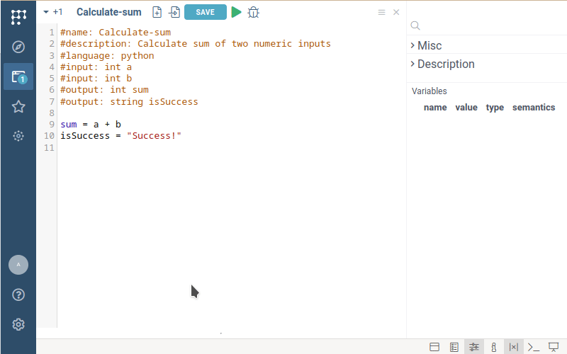

```mdx-code-block
import Tabs from '@theme/Tabs';
import TabItem from '@theme/TabItem';
import BrowserWindow from '@site/src/components/browser-window';
```

This section explains the basic concepts of scripting in Datagrok.
Code examples are provided in **JavaScript**.

:::tip Consider JavaScript

In Datagrok, JavaScript offers unique benefits compared to traditional
data science languages like Python or R.

JavaScript script executes right in your browser, leading to:

* shorter spin-up time,
* and better debugging experience.

Datagrok provides an extensive JavaScript API, giving you:

* access to core Datagrok functions,
* precise control over UI appearance.

:::

### Prerequisites

* Sign up and log in to [public server of Datagrok](https://public.datagrok.ai/).
* Alternatively, set up a [local Datagrok environment](../../deploy/docker-compose/docker-compose.md).

### Create a script

<div style = {{ display: 'flex' }}>

<div style = {{ width: '50%' }}>

* Open Datagrok (e.g. [public homepage](https://public.datagrok.ai/))
* Select `Browse` icon on the left toolbar.
* Select Datagrok's [Scripts section](https://public.datagrok.ai/scripts).
* Click on the "New" button. Supported languages list appears
* Click on "JavaScript" item.

</div>

<div style = {{ width: '50%', display: 'flex', gap: '20px', 'justify-content': 'end' }}>

```mdx-code-block
<BrowserWindow url="" bodyStyle={{'padding': '0px'}}>
```


```mdx-code-block
</BrowserWindow>
```

</div>

</div>

The code editor appears with the following code inside.

```javascript title="Default javascript script"
//name: Template
//description: Hello world script
//language: javascript

alert('Hello World!');
```

### Run the script

Let's run the script and see how it works.
The built-in editor has the **Run** <i class="fas fa-play"></i> button on the top panel.
Press it to run a script. You will see the following:

```mdx-code-block
<BrowserWindow url='' bodyStyle={{'padding': '0px'}}>
```


```mdx-code-block
</BrowserWindow>
```

### Review the script header

Each Datagrok script has a **header**. A header contains **header parameters** \-
special comment strings used by Datagrok to: 
- determine script name,
- specify the scripting language,
- pass to the script input parameters,
- capture script output,
- provide script metadata.

The template script has the following ones:

* `name: Template`: The short name of the script.
* `description: Hello world script`: The human-readable description.
* `language: javascript`: The script language. Supported: *R*, *Python*, *Octave*, *Julia*, *JavaScript*.

For more details, refer to the [functions parameter annotation](../../datagrok/concepts/functions/func-params-annotation).

### Add inputs

Template script only shows the alert message. Let's edit the script to calculate the sum of the numeric inputs.
Add the following lines to the [header](#review-the-script-header) of the script:

```javascript title="Adding 2 numeric inputs"
//input: int a
//input: int b
```

[Run](#run-the-script) the script. Datagrok will automatically create the form for your script.

```mdx-code-block
<BrowserWindow url=''>
```

<div style={{'text-align': 'center'}}>


</div>

```mdx-code-block
</BrowserWindow>
```

### Add outputs

It is time to add actual calculations and specify the expected outputs. Replace the code of the script (it is `alert("Hello world") by default`) by the the following code:

```javascript
let sum = a + b;
let isSuccess = "Success!"
```

and specify the outputs of the script in the [header](#review-the-script-header):

```javascript
//output: int sum
//output: string isSuccess
```

### Review the results

[Run](#run-the-script) the script. Fill the input form by arbitrary decimal numbers 
and click on the "OK" button.

Datagrok will run the script, parse the output and return the results. In this case, 
the result consists of the decimal number `sum` and the string `isSuccess`.

```mdx-code-block
<BrowserWindow url='' bodyStyle={{'padding': '0px'}}>
```



```mdx-code-block
</BrowserWindow>
```

### Customize the script

You can add custom captions for your inputs and default values. To do this,
change input headers as follows:

```javascript
//input: int a = 3 {caption: First component}
//input: int b = 6 {caption: Second component}
```

```mdx-code-block
<BrowserWindow url=''>
```

<div style={{'text-align': 'center'}}>


</div>

```mdx-code-block
</BrowserWindow>
```

### Process a dataframe

You could also process complex data structures such as dataframes (basically, data tables).
Change the script header to have:
- single input of the `dataframe` type and 
- single output of `int` type.

```javascript
//input: dataframe myData
//output: int cellCount
```

Also, change the code to handle input dataframe and count the number of cells in it.

```javascript
let cellCount = myData.rowCount * myData.columns.length;
```

```mdx-code-block
<BrowserWindow url=''>
```

<div style={{'text-align': 'center'}}>


</div>

```mdx-code-block
</BrowserWindow>
```

Running this script you will get the following result in **Variables** panel:

```mdx-code-block
<BrowserWindow url=''>
```

<div style={{'text-align': 'center'}}>


</div>

```mdx-code-block
</BrowserWindow>
```

:::tip Pro tip

Depending on the metadata associated with the parameters, the editor can be
enriched by [validators](../../datagrok/concepts/functions/func-params-annotation.md#validation), [choices](../../datagrok/concepts/functions/func-params-annotation.md#choices),
and [suggestions](../../datagrok/concepts/functions/func-params-annotation.md#autocomplete). Validators, choices, and suggestions are
[functions](../../datagrok/concepts/functions/functions.md), that means they can be implemented in different ways
(database query, script, etc.), and reused.

:::

### Handle an error

Datagrok properly handles errors happened during the script execution.
For example, let's add explicit error throw in the script. Add the following code to the 
start of the script:

```javascript
throw new Error('Something gone wrong!')
```

Running the script shows you an error balloon in the right-upper corner.
The script execution will be stopped and no result will be returned.

```mdx-code-block
<BrowserWindow url=''>
```

<div style={{'text-align': 'center'}}>


</div>

```mdx-code-block
</BrowserWindow>
```

