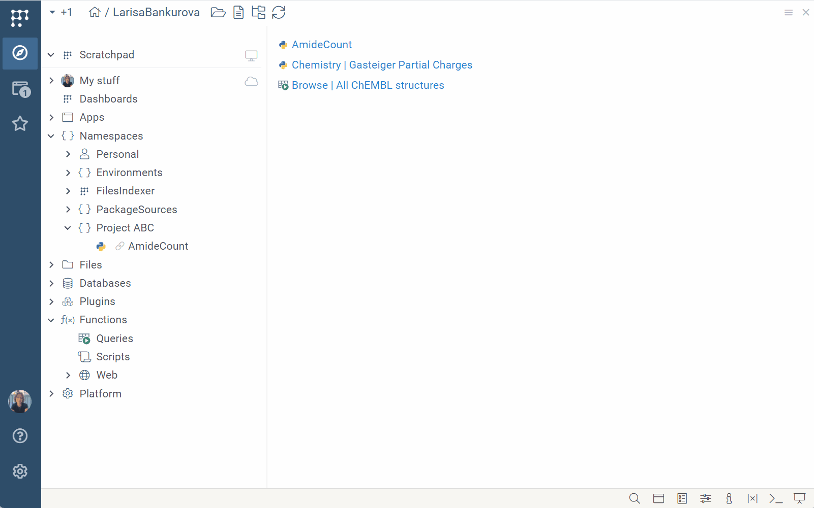

Projects act like folders that contain various [entities](../objects.md), such as tables,
queries, or scripts. For example, [dashboards](dashboard.md) are projects that have two types of entities: [tables](../table.md) and [layouts](../../../visualize/view-layout.md). 

Projects are essential for organizing, managing, and sharing data.

## Project hierarchy

In Datagrok, there are two types of projects:

* **Root projects**: Act as the primary _namespace_ and can include child
  projects.
* **Child projects**: Exist under root projects and are prefixed with the name
  of the root project they belong to. For example, the name `Demo:CoffeeCompany` indicates
  that `CoffeeCompany` is a child project under the root project `Demo`. Child projects inherit [privileges](../../../govern/access-control/access-control.md#permissions) from the root project.

Datagrok automatically creates root projects for
[plugins](../../../develop/how-to/create-package.md) and users:
* **Plugins**: Each plugin version is a child project under the corresponding
  root project.
* **Users**: Unless you choose an existing project, any entity you create is
  saved to your personal root project, accessible under **My
  stuff** in the **Browse** view (e.g., `jdoe:MyNewDashboard` or `jdoe:MyNewQuery`). 

## Creating and managing projects

[Browse](../../navigation/views/browse.md) organizes projects in a tree
that governs their hierarchy. You can create your own hierarchy under **Namespaces**: 

* **Root projects**: Right-click **Namespaces**, select **Create
Namespace...**, and name your project in the dialog that opens.
* **Child projects**: right-click an existing project, select
  **Create Child Namespace...**, and name your project in the dialog that opens.

You can create as many root and child projects as you like. 

You can change the project's type in the [Context Panel](../../navigation/panels/panels.md#context-panel) under
**Namespaces**. Changing a project from child to root moves it to the top
level of the **Namespaces** directory and updates the names of all entities in
it.

To perform an action on a project, find it in the **Browse** tree and right-click it. This opens the context menu with commands like share, delete, rename, and so on.

## Saving entities to projects

When you save an entity, you always save it to a project. All newly created
entities are saved to your personal root project, visible under **My stuff** on
the **Browse** tree.

If you modify an existing entity project (such as changing its layout), you have these
options:

1. Save changes to the original project.
1. Create a new project to save the modified entity.

The options depend on your needs and privileges.

[Learn how to save entities to projects](../../navigation/basic-tasks/basic-tasks.md#save).

## Moving entities between projects

If you have the necessary privileges, you can move entities between projects by
dragging them to a different location in the **Browse** tree. Valid locations are highlighted with a dotted border. Moving entities
impacts their hierarchy, names, and privileges.

When moving entities, you have these options:

1. **Clone**:
   * This action creates a copy of the entity in the new project. The entity in the original project remains unaffected.
1. **Move**:
   * The entity is moved to the new project, is automatically renamed, and adopts the permissions of the new project.
   * A view-only copy of the moved entity is created in the original project. This view-only copy is linked to the entity in the new project.
   * Any changes made to the entity in the new project are automatically reflected in the linked copy.
1. **Link**:
   * This action creates a view-only copy of the entity in the new project. This copy is linked to the entity in the original project.
   * Any changes made to the entity in the original project are automatically reflected in the linked copy.

Linked entities are visually distinguished by a **Link** (<FAIcon icon="fa-solid fa-link" size="1x"/>) **icon**. You cannot edit linked entities directly, but you can clone them.

## Removing entities from projects

To remove an entity from a project:

1. Locate the entity you want to remove in the **Browse** tree.
1. Right-click the entity to open the context menu.
1. Select **Remove from project** from the context menu. A dialog opens.
1. In the dialog, click **OK**. The entity is removed from the project.

:::danger

Don't to use the **Delete...** command to remove entities from projects. If you choose the **Delete...** command, it will permanently delete the entity from the server for all users and projects. This action cannot be undone.

:::

## Searching projects

To find projects using [smart search](../../navigation/views/browse.md#entity-search), you can use this metadata:

| Field       | Description                            |
|-------------|----------------------------------------|
| name        |                                        |
| description |                                        |
| ID          |                                        |
| createdOn   |                                        |
| updatedOn   |                                        |
| author      | [User](../../../govern/access-control/users-and-groups#users) object |
| starredBy   | [User](../../../govern/access-control/users-and-groups#users) object |
| commentedBy | [User](../../../govern/access-control/users-and-groups#users) object |
| usedBy      | [User](../../../govern/access-control/users-and-groups#users) object |

## See also

* [Browse](../../navigation/views/browse.md)