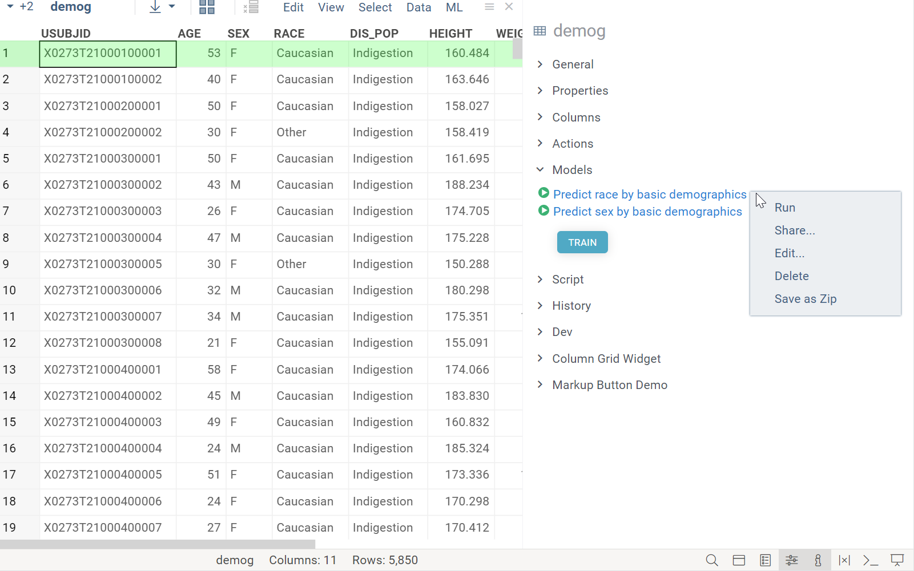
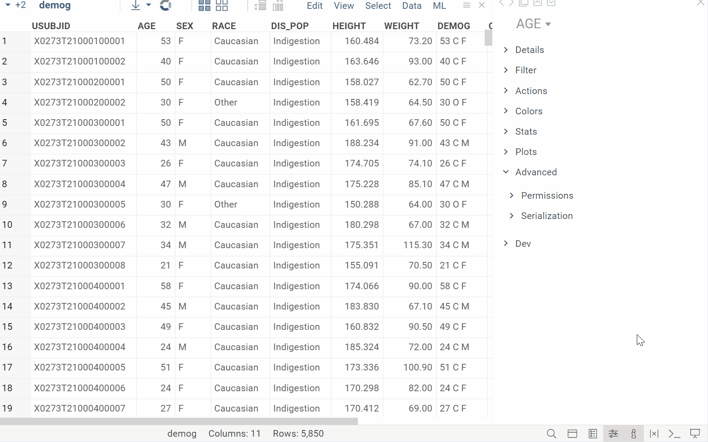
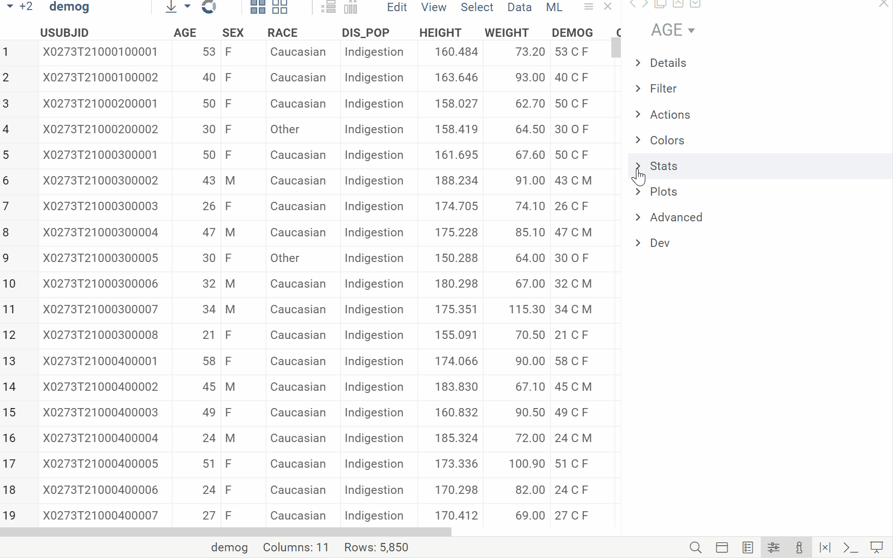
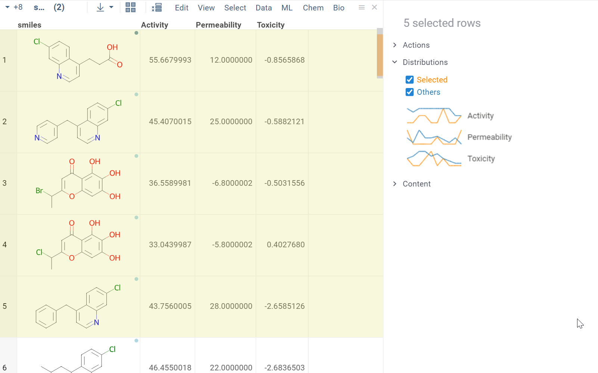
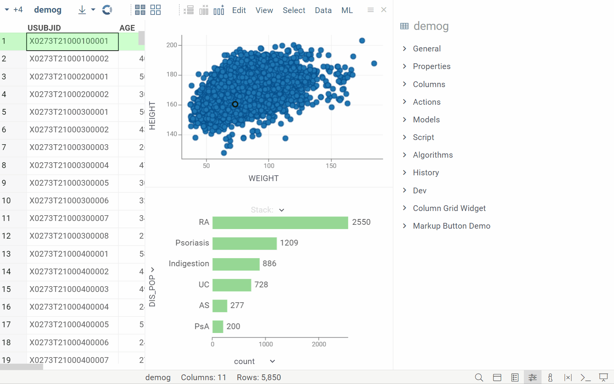

```mdx-code-block
import Tabs from '@theme/Tabs';
import TabItem from '@theme/TabItem';
```

Info panes provide contextual information about current objects, such as tables,
queries, or molecules. The concept is similar to an email client, where clicking
a subject reveals the content of an email in another pane. However, in Datagrok,
info panes serve a wider range of functions, making use of all Datagrok's
capabilities, including [scripting](../../../compute/scripting/scripting.mdx),
[queries](../../../access/access.md#data-query),
[functions](../../concepts/functions/functions.md),
[viewers](../../../visualize/viewers/viewers.md), [predictive
models](../../../learn/learn.md), and so on.

Examples:

<Tabs>
<TabItem value="details-actions" label="Details and actions" default>

In this example, the info panes help you browse database objects, get data, and more. For example,
when you click a table, the info panes let you view the table's metadata,
dynamically preview the table's contents, or run queries.

<br/>


</TabItem>

<TabItem value="molecule" label="Calculation and visualization">

In this example, a number of scripts execute when you click a molecule,
including calculation and visualization of the molecule's Gasteiger partial charges,
solubility prediction, toxicity and so on. 
[Learn more about the cheminformatics info panes](../../solutions/domains/chem/chem.md#exploring-chemical-data).

<br/>


</TabItem>
<TabItem value="image-augmentation" label="Image augmentation">

In this example, a Python script executes against JPEG and JPG files during the
indexing process to get custom metadata (cell count) and performs specified
transformations (segmenting cells). When you click a corresponding image,
the info pane shows augmented file preview and the number of detected cell
segments.

<br/>


</TabItem>
<TabItem value="dialogs-apps" label="Dialogs and mini apps">

In this example, a query executes a similarity search on the ChEMBL database.
When you click the query, it shows the **Run** info pane with a
sketcher for drawing query molecules. As you sketch, the info panes update
dynamically to show details about your substructure. Once the query runs, it
opens a table with matching structures.

<br/>


</TabItem>
</Tabs>

<br/>

:::note developers

[Create custom info panes](../../../develop/how-to/add-info-panel.md).

:::

## What gets shown and when?

Info panes are displayed based on specific conditions:

* user
* dataset
* context
* user preferences

These conditions are defined using GrokScript, allowing the use of various
functions and operators. When the current object changes, the conditions of all
registered info panes are checked against the specified parameters, and matching
info panes are displayed accordingly. 

### User condition

You can control access to specific types of info panes based on user attributes
such as roles, groups, etc. This condition can be set directly within the script
or externally through [global permissions](../../../govern/global-permissions.md).

<details>
<summary>Code snippet</summary>

To set the user condition in a script, use the `user` variable like this:

```
# condition: user.name == "john doe" || user.name == "jack smith"
# condition: user.hasrole("chemist")
# condition: user.inteam("high-throughput screening")
```

</details>

### Dataset condition

Certain info panes are only relevant when applied to data retrieved from
specific data sources. You can define the dataset condition to specify the data
source for the table. 

<details>
<summary>Code snippet</summary>

To set the dataset condition in a script, use the `table` variable like this:

```
# condition: table.gettag("database") == "northwind"
```

</details>

### Context condition

Info panes accept only one input parameter, which can be a column, a table, a table
cell, or any other [object](../../concepts/objects.md). A condition
may check against that object using the parameter name ("x" in a
sample code snippet below).

<details>
<summary>Code snippet</summary>

```
#input: column x
#condition: x.isnumerical && x.name == "f3" && x.stats.missingvaluecount > 0
```

</details>

### User preferences

Subject to your permissions, you can control the display of an info pane from
the UI. To hide a specific info pane, click the **Gear** icon on the pane
header, then click **Do not show**. To manage hidden panes, on the **Sidebar**,
click **Settings** > **Panels**, and add or remove hidden columns from there.

## Default info panes for tabular data

When working with the [grid](../../../visualize/viewers/grid.md), the default info panes are:

| <div style={{ width:100 }}></div>||
|---|---|
|Table, Column, Row, Selection, Current object|<h5>**Actions**</h5>Lists available actions (subject to permissions) |
|Table, Column|<h5>**Dev**</h5>Provides access to documentation, class references, and code snippets for the current object. It also has an editor with template scripts for common actions related to the object <br/><br/> [Learn more](https://github.com/datagrok-ai/public/tree/master/packages/DevTools#components)| 
|Table|<h5>**General**</h5>Shows basic metadata, such as number of rows, columns, source, etc.|
|Table|<h5>**Columns**</h5> Shows all table columns as clickable links, enabling navigation to individual column info panes|
|Table|<h5>**Models**</h5>Shows relevant models for your dataset (created by you or shared by others). From here, you can manage or train models <br/><br/> |
|Table|<h5>**History**</h5>Shows the history of actions performed on the table|
|Column|<h5>**Details**</h5>Shows column properties and summary statistics or distributions for the column's data |
|Column|<h5>**Filter**</h5>Quick access to a column's filter|
|Column|<h5>**Colors**</h5> Color code a column <br/><br/> |
|Column|<h5>**Stats**</h5> Shows summary statistics for a column <br/><br/> |
|Column|<h5>**Permissions**</h5> Specify who can edit a column |
|Selected columns|<h5>**Plots**</h5>Visualizes selected columns for quick profiling <br/><br/> |
|Selected rows|<h5>**Distributions**</h5> Shows distributions for numerical columns based on selected rows <br/><br/>|
|Selected rows|<h5>**Content**</h5> Shows details for selected rows in a spreadsheet format<br/><br/>|

<!--
|Table|<h5>**Properties**</h5>|
|Table|<h5>**Script**</h5>|
|Table|<h5>**Markup Button Widget**</h5>|
|Table|<h5>**Column Grid Widget**</h5>|
|Column|<h5>**Serialization**</h5>|

-->

:::note

Certain grid info panes are provided with the 
[PowerGrid package](https://github.com/datagrok-ai/public/blob/master/packages/PowerGrid/README.md),
which is recommended for installation.

In addition, domain-specific info panes are available in specialized packages,
such as the [cheminformatics info panes](../../solutions/domains/chem/chem.md#exploring-chemical-data)
from the 
[Chem package](https://github.com/datagrok-ai/public/blob/master/packages/Chem/README.md).

:::

<!--
## Custom info panes examples

### Using predefined visualizations

Oftentimes, it is beneficial to show users an interactive plot, pre-customized
based on the structure of the table that is currently open.

See the following info pane (viewer-scatter.grok) in action by opening
(project:demog). It creates a [Scatter
Plot](../../../visualize/viewers/scatter-plot.mdx), sets the axes to the predefined
columns, and adds a regression line.

<details>
<summary>Code snippet</summary>

```
#name: Scatter plot
#description: Panel that contains an interactive Scatter plot
#language: grok
#tags: panel
#input: dataframe table
#condition: table.name == "demog" && table.columns.containsAll(["height", "weight", "age", "sex"])
#output: viewer plot

plot = table.ScatterPlot("height", "weight", "age", "sex")
plot.showRegressionLine = true
```
</details>

### Digital signal processing

Depending on the nature of the data, our platform makes assumptions regarding the ways users would want to analyze it.
For instance, whenever a scientist working in the digital signal processing domain opens a dataset that contains digital
signals, it is likely that they would want to easily see certain features from the frequency domain
(common actions would be analyzing results of the Fourier transform, doing an auto-correlation, or checking out
spectrogram or scalogram). Typically, when such a need arises, the scientist would fire up Matlab, load that dataset,
then either write a script or use Matlab's DSP toolbox (along the way, they would need to enter metadata that is often
not included in the dataset, such as sampling rate).

Within the Datagrok platform, a simple info pane can be developed that would understand when the data is a digital
signal, perform all of the above-mentioned operations in the background (utilizing the metadata stored within the
dataset), and push the results to the user. The result of the script below is a "Spectrogram" pane that would get shown
in the **Context Panel** on the right when user clicks on a column with the digital signal.

See the following info pane (spectrogram-panel.grok) in action by opening (project:eeg)

```
#name: Spectrogram info panel
#description: Panel that contains graphics produced by the R script
#language: grok
#tags: panel,dsp
#input: column signal {type:numerical}
#output: graphics pic
#condition: "F3" == signal.name

pic = Spectrogram("eeg", signal, 256.0, 1024, 0.1, true)
```

### Actions

In addition to providing additional information (such as data, graphics, interactive viewers, etc), it is also possible
to add commands that would do something with the current context. For instance, you might want to send an email to a
user, or update a record in the database.

```
#name: Transaction review panel
#description: Actions available for the credit card transaction
#language: grok
#tags: panel
#input: row activity
#output: string actions {action: markup}
#condition: activity.table.name = "credit card transactions"

actions = "#{button("Flag as suspicious", "http.Post(myserver, row.transactionId)")}"
```
<!--TODO: Move to the Develop section

### Predicting molecule solubility

The following pane calculates different molecular properties of a given chemical structure. It appears whenever user
clicks on a structure.

`#{x.ChemScripts:SolubilityPrediction}`

```
#name: Solubility prediction
#description: Predicts solubility by molecule descriptors ("Ipc", "MolWt", "NumValenceElectrons", "MolLogP", "LabuteASA", "TPSA", "HeavyAtomCount", "NumhAcceptors", "NumHDonors", "NumRotatableBonds", "RingCount")
#language: grok
#tags: panel, prediction, chem
#condition: smiles.semtype == "Molecule"
#input: dataframe table
#input: column smiles {semtype: Molecule} [Column with molecules, in smiles format]
#output: dataframe predictions {action: join(table)}
featureNames = ["TPSA", "Ipc", "NumHAcceptors", "NumHDonors", "LabuteASA", "RingCount", "MolWt", "NumValenceElectrons", "HeavyAtomCount", "MolLogP", "NumRotatableBonds"]
ChemDescriptors(table, smiles, featureNames)
MissingValuesImputation(table, featureNames, featureNames, 5)
ApplyModel(Demo:PredictSolubility, table, showProgress=false)
predictions = ExtractColumns(table, ["outcome"])
```

### Predicting yearly sales of a franchise store

Info pane scripts can use all features of the Datagrok platform, including predictive modeling capabilities. The
following script would do the following behind the scenes when user clicks on a row that contains store address:

* convert address to to demographic statistics (~50 features such as median income, age, etc)
* using extracted statistics, predict yearly sales of a franchise store if it opens at that address

```
#name: Predicted sales
#description: Predicting yearly sales of the franchise store by using previously trained predictive model
#language: grok
#tags: panel
#sample: stores.csv
#input: cell address
#output: double predictedsales
#condition: cell.table.name == "stores" && cell.column.name == "address"

//todo Vasiliy: implement
statistics = AddressToStatistics()
predictedSales = PredictSalesByStatistics(statistics)
```


-->

## See also

* [Data augmentation](../../../explore/data-augmentation/data-augmentation.md)
* [Scripting](../../../compute/scripting/scripting.mdx)
* [Semantic types](../../../govern/catalog/semantic-types.md)
