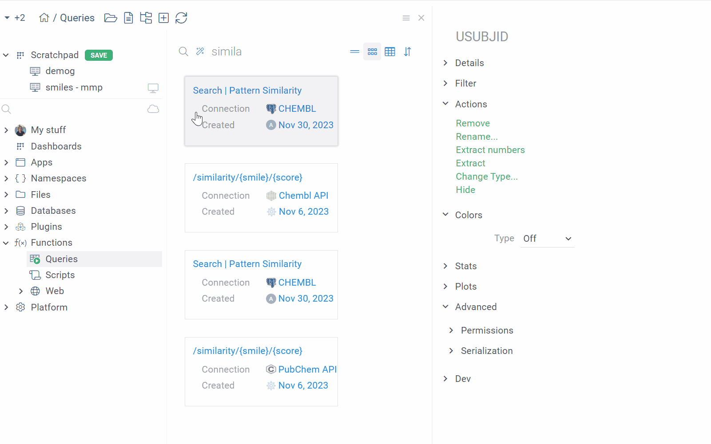
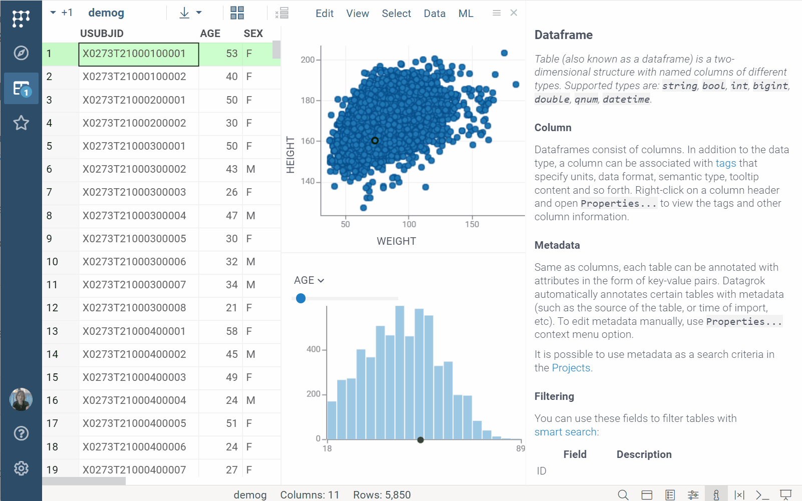

```mdx-code-block
import Tabs from '@theme/Tabs';
import TabItem from '@theme/TabItem';
```

Panels serve as supplementary windows alongside your main _view_ and include:

* [Context Panel](#context-panel)
* [Context Help](#context-help) 
* [Console](#console)
* [Variables](#variables)

Depending on your needs, you can toggle visibility of any panel from the
**Status Bar**. To save your panel display preferences, go to **Sidebar** >
**Settings** > **Windows**.

## Context Panel

Located at the top right hand-side, the **Context Panel** serves two main functions:

* For visual UI components like [viewers](../../../visualize/viewers/viewers.md)
or [widgets](../../../visualize/widgets.md), it provides
access to settings. To access settings, click the **Gear** (⚙) icon in the
top right corner of the visual component.
* For Datagrok [entities](../../concepts/objects.md) and other data objects
  (e.g., molecules), it shows information and options for your _current object_.
  To make an object current, click it. For example, clicking a molecule shows
  details like its weight or toxicity. Clicking a query shows its associated
  data connection, SQL code, and parameters for execution.


The **Context Panel** consists of distinct [info panes](info-panels.md), each
serving a specific purpose. For example, the **Actions** info pane shows
available commands, while the **Details** info pane shows the object's metadata.
Depending on your privileges, individual info panes can be hidden or detached to
float independently in a separate window. To toggle the visibility of the entire
**Context Panel**, press <kbd>F4</kbd>.

<details>
<summary>Info pane examples</summary>

Developers: You can [create custom info panes](../../../develop/how-to/add-info-panel.md).

<Tabs>
<TabItem value="details-actions" label="Details and actions" default>

In this example, the info panes help you browse database objects, get data, and more. For example,
when you click a table, the info panes let you view the table's metadata,
dynamically preview the table's contents, or run queries.

<br/>


</TabItem>

<TabItem value="molecule" label="Calculation and visualization">

In this example, a number of scripts execute when you click a molecule,
including calculation and visualization of the molecule's Gasteiger partial charges,
solubility prediction, toxicity and so on. 
[Learn more about the cheminformatics info panes](../../solutions/domains/chem/chem.md#exploring-chemical-data).

<br/>


</TabItem>
<TabItem value="image-augmentation" label="Image augmentation">

In this example, a Python script executes against JPEG and JPG files during the
indexing process to get custom metadata (cell count) and performs specified
transformations (segmenting cells). When you click a corresponding image,
the info pane shows augmented file preview and the number of detected cell
segments.

<br/>


</TabItem>
<TabItem value="dialogs-apps" label="Running queries">

In this example, a query executes a similarity search on the ChEMBL database.
When you click the query, it shows the **Run** info pane with a
sketcher for drawing query molecules. As you sketch, the **Context Panel** updates
dynamically to show details about your substructure.

<br/>



</TabItem>
</Tabs>
</details>

The **Context Panel** stores a history of viewed objects and your favorites,
allowing you to quickly revisit past items or retrieve information on favorites without
needing to navigate or click through them again. To do so, use the navigation icons on the panel's header.

You can create a static copy of the **Context Panel** for the current object by
clicking the **Clone and detach** icon on the **Context Panel**'s header. This
action opens a copy of the **Context Panel** in a separate window. The content of the cloned panel remains
static, while the main **Context Panel** continues to update with the current
object.


<details>
<summary>Context Panel controls</summary>

Hover over the panel's header to reveal these icons:

|      Icon        |            Action                                           |
|------------------|-------------------------------------------------------------|
| Back/Forward     | Navigate between viewed objects                             |
| Clone and detach | Detach a copy of the Context Panel preserving its content   |
| Collapse all     | Collapse all info panes                                     |
| Expand all       | Collapse all info panes                                     |
| Favorites        | Show the Context Panel for your favorite object             |

:::note

You can favorite any Datagrok [entity](../../concepts/objects.md) like a data connection, query, or a project.
You can't favorite an individual file or a specific value within a cell. <!--This can be solved with sticky meta.Suggestion submitted-->

:::

</details>

## Context Help

**Context Help** shows a help page relevant to your current object. By default,
it's located in the bottom right corner of the screen, but you can toggle its
visibility by pressing <kbd>F1</kbd> or by clicking the **Context Help
(i)** icon on the **Status Bar**.

To make an object current, click it. 

The **Context Help** stores a history of viewed objects, allowing you to quickly
revisit pages for past items without needing to navigate or click through them
again. To do so, use the navigation icons on the panel's header.

You can create a static copy of the **Context Help** for the current object by
clicking the **Clone and detach** icon on the panel's header. This
action opens a copy in a separate panel. The content of the cloned panel remains
static, while the main **Context Help** continues to update with the current
object.



<details>
<summary>Context Help controls</summary>

|      Icon                |            Action              |
|--------------------------|--------------------------------|
| Back/Forward             | Navigate between visited pages  |
| Home page                | Open Datagrok's wiki home page |
| Clone and extend to view | Open a page as your main view   |
| Open in new tab          | Open the help page in a new browser window      |

</details>

## Console

You can use **Console** to call [functions](../../concepts/functions/functions.md) and record
[macros](../../concepts/functions/functions.md#macros). Clicking the function in
the **Console** updates the [Context Panel](#context-panel) with its details. 

Console uses [Grok script language](../../../develop/under-the-hood/grok-script.md).

<details>
<summary>Command examples</summary>

Run the `Mul` command (multiply two numbers) with the specified parameters:

```
Mul(2,3)
```

Edit parameters of the `Mul` command and evaluate it in a dialog window:

```
Mul
```

Get help for the `Mul` command:

```
Mul?
```

Access the current object from the console with the `o` variable:

```
o.name
```

Select rows with empty values in the `HEIGHT` column:

```
SelectRows("demog", IsNull("HEIGHT"))
```

Extract rows with empty values in the `HEIGHT` column into a new dataframe:

```
ExtractRows("demog", IsNull("HEIGHT"))
```

</details>

To open **Console**, press the tilde key <kbd>~</kbd> or click the **Console**
icon on the **Status Bar**.


<details>
<summary>Console controls</summary>

At the top of the **Console**, there are two icons:

* **Clear**, which clears the
content of the **Console**
* **Variables**, which opens the [Variables
panel](#variables).

|     Key     |    Action             |
|-------------|-----------------------|
| Tilde `~`   | Open the console      |
| Tab         | Complete a command    |
| Up/Down     | Previous/next command |

</details>

### Recording macros

Every visual transformation on the platform corresponds to a specific [function](../../concepts/functions/functions.md).
Each function call is automatically logged in the **Console**, requiring no
action on your part. This means you can both:

1. Use the **Console** to examine which functions are triggered by particular UI
events and reproduce these steps in the future. This can be useful for [data
transformations](../../../transform/recipe-editor.md) and data pipelines. 
1. Directly execute functions on your data from the **Console**, which is especially helpful for
debugging custom functions within a [package](../../../develop/develop.md#packages).


## Variables


The **Variables** panel is used to declare variables and is commonly used for script debugging.

Variables can be declared in various ways:

* Through direct assignment in the [Console](#console), e.g., `x = 5`
* By dragging and dropping an object to the **Variables** panel.


To open a **Variables** panel, press <kbd>Alt + V</kbd> or click the **Variables** (**|x|**) icon on the **Sidebar**.