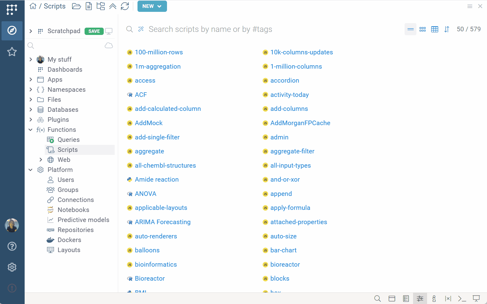
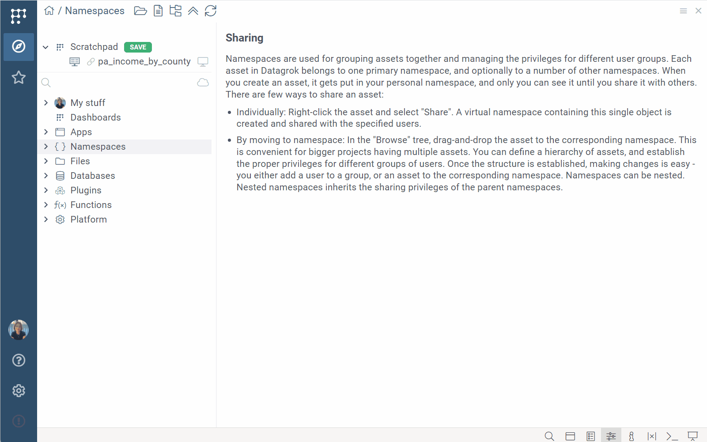

```mdx-code-block
import Tabs from '@theme/Tabs';
import TabItem from '@theme/TabItem';
```

**Browse** is a [view](views.md) that organizes all Datagrok objects (like
files, queries, or projects) in a tree, allowing you to search,
preview, manage, and access anything in Datagrok. 

To open **Browse**, click the **Browse** icon on the **Sidebar**.


## Controls

Within the **Browse** tree:
* Click an object to preview it.
* Double click to open.
* Right click to see context commands.

Use the up/down (↑↓) keys to navigate and the left/right (←→) keys to expand a tree node.

The following commands are available from the **Top Menu**:

* **Home**: Opens the **Home Page**
* **Open local file**: Opens a dialog to upload a file from your local drive
* **Open text**: Opens a [window to import text](../../../access/files/files.md)
* **Refresh view**: Refreshes the **Browse** view

You may see view-specific options at the top, such as the **Create new connection** button for [databases](../../../access/databases/databases.md).

## Tree

**Browse** organizes objects in several ways:

* **My stuff**: Items that we think are relevant to you, such as favorites and recently opened projects.
* **Dashboards**: Dashboards
* **Apps**: Installed apps
* **Namespaces**: Here, you can create
   folders that align with organizational use, such as by project or department. Each folder is a Datagrok [project](../../concepts/project/project.md) that can be shared with teams.  
* **Files**: [File shares](../../../access/files/files.md)
* **Databases**: Connections, queries, database schemas, tables, and columns
* **Plugins**: All installed [plugins](../../plugins.md)
* **Functions**: Queries, scripts, [OpenAPI](../../../access/open-api.md)
* **Platform**: Users, groups, [connectors](../../../access/databases/connectors/connectors.md), notebooks, predictive models, repositories, dockers, [layouts](../../../visualize/view-layout.md), [sticky meta](../../../govern/catalog/sticky-meta.md)

<!--
* **Platform-centric** (**Platform**): This hierarchy provides quick access
  to the platform's connections, repositories, users and groups, and so on.-->

Subject to your privileges, you can move objects from other directories to your personal directory or
**Namespaces**. To do this, click an object and start dragging. As you drag,
drop zones within the **Browse** tree and **Preview** are highlighted:

* On the **Browse** tree, potential directories are indicated by a dotted border.
* In the **Preview**, drop zones are marked by a gray area.


When moving objects, you have two options:

* **Move**: Move an object to a new directory. The object will be automatically renamed, and
  the original location will link to it. The object will also adopt the
  permissions of the new directory.
* **Link**: Link an object to its original location. You can't edit linked objects, but you
  can clone them. Linked objects are marked with a link icon.

## Scratchpad

A special section of the **Browse** view right below the **Top Menu** is called
**Scratchpad**. Here, you can organize and manage your work in progress.
[Learn more about the Scratchpad](../../concepts/project/project.md#scratchpad). 

## Entity views

Like in Windows Explorer, clicking an object in the **Browse** tree opens a view
alongside **Browse** specific to that object. These views vary depending on what
you click. For example, clicking a file shows its contents, while clicking **Layouts**
shows available layouts.

Here are a few examples.

<Tabs>
<TabItem value="files" label="Files" default>

When clicking a file, what you see depends on its format and the data inside it. For example:

* Clicking a spreadsheet file visualizes its data using an interactive
  [spreadsheet viewer](../../../visualize/viewers/grid.md).
* Clicking an image file shows the image.
* Molecules or proteins are automatically rendered using [cell renderers](../../../visualize/viewers/grid.md#cell-renderers) and interactive
  viewers.
* Clicking text-based files like Markdown, TXT, and HTML opens a text editor.


:::note developers

You can create custom viewers for
[files](../../../develop/how-to/create-custom-file-viewers.md) and
[folders](../../../develop/how-to/folder-content-preview.md).

:::

</TabItem>
<TabItem value="entity-galleries" label="Entity galleries">

Clicking a directory that contains entities of the same type (like queries or
layouts) opens a **Gallery** view. This view typically has three display modes
(cards, table, list) and a search bar that lets you [search for a specific
entity](#entity-search), such as by name or tag.

<br/>



</TabItem>
<TabItem value="dashboards" label="Dashboards">

Clicking a dashboard shows a fully interactive [Table View](../views/table-view.md).

<br/>



</TabItem>
</Tabs>

### Entity search

Instead of navigating the **Browse** tree, you can search for a specific
[entity](../../concepts/objects.md) within an [Entity Gallery view](#entity-views). 

The search allows free-text input. Typing a single string prompts the search
engine to filter entities by name. You can also search by the entity's metadata,
like [tags](../../../govern/catalog/tags.md),
[parameters](../../concepts/objects.md#parameters), and
[properties](../../concepts/objects.md#properties). For example, entering
`#demo` shows all entities tagged with `#demo`, and `imported < 01/01/2024`
shows all entities imported before that date. 

To apply multiple filters, use `AND` and `OR` operators and parentheses.

<details>
<summary>Examples</summary>

Unstructured query; looks for 'biologics' in title and description:

```
Biologics
```

Tagged as #demo:

```
#demo
```

Tagged as either either #demo or #chem:

```
#demo or #chem
```

Created in the last 7 days:

```
createdOn > -1w
```

Complex conditions:

```
(#demo and #chem) or author = "john@google.com"
starredBy = @current or author = @current
```

Created by recently joined users:

```
author.joined > -5d
```

</details>

## Home page

When you first log in, the **Browse** shows a special landing view called **Home Page**. This view contains
[widgets](../../../visualize/widgets.md) like **Recent projects** or **Usage**.
The widgets you see depend on the [plugins](../../plugins.md) installed. For example, the
**Recent projects** widget is provided by the [PowerPack
package](https://github.com/datagrok-ai/public/tree/master/packages/PowerPack),
and the **Learn** widget appears with the [Tutorials
package](https://github.com/datagrok-ai/public/tree/master/packages/Tutorials).

Above the main area, there is a search ribbon for searching anything both within and outside the platform.

<br/>


You can customize the appearance of the **Home Page** as follows:
* Toggle [panels](../panels/panels.md) like **Context Panel** or **Context
  Help**. To do this, use the icons located in the right corner of the **Status
  Bar**.
* Choose which widgets to display, arrange their order, and assign custom names.
  To do this, hover over the widget's top to access its controls. You can close
  a widget or adjust its settings using the [Context Panel](../panels/panels.md#context-panel). To manage hidden widgets, go to
  **Sidebar** > **Settings** > **Panels**.

:::note developers

You can customize the **Home Page** programmatically.

:::
