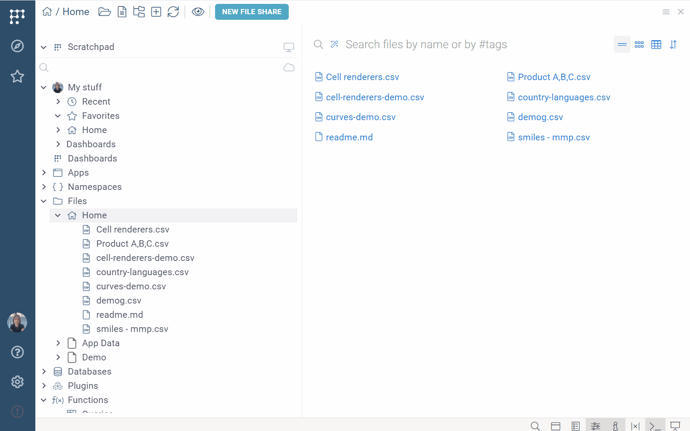
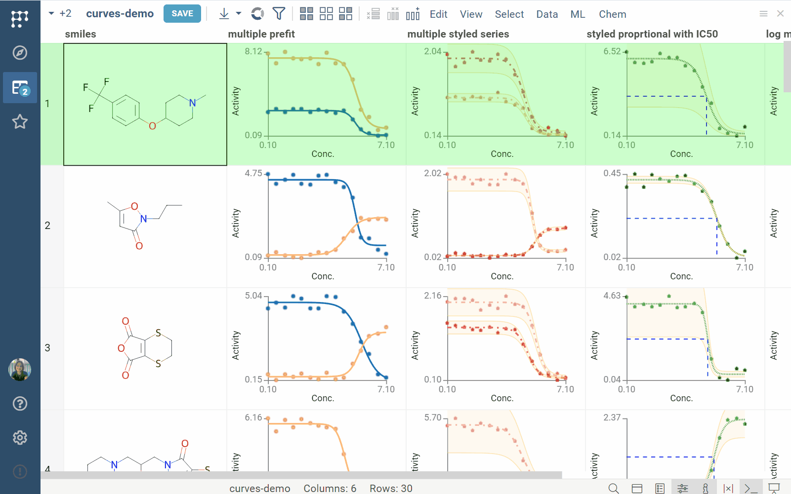
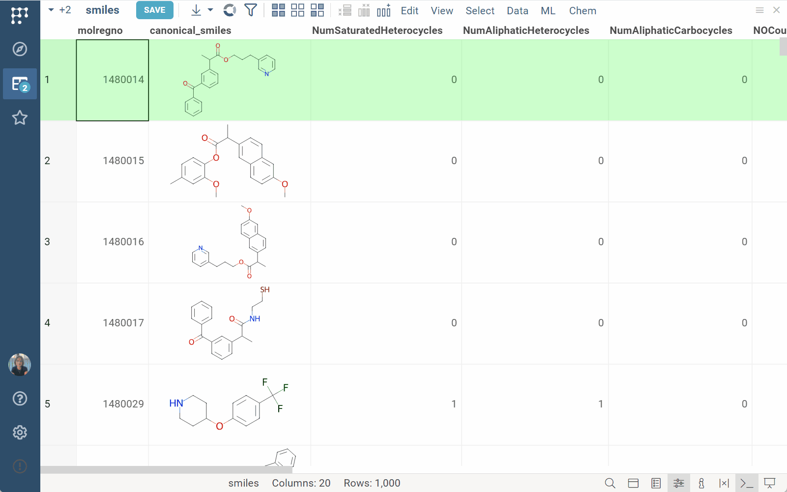
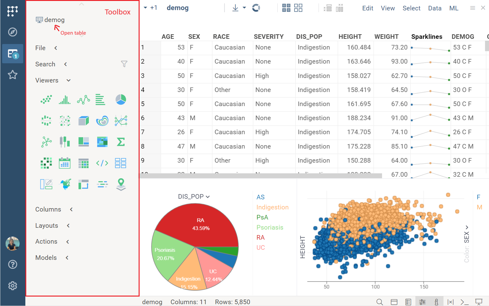
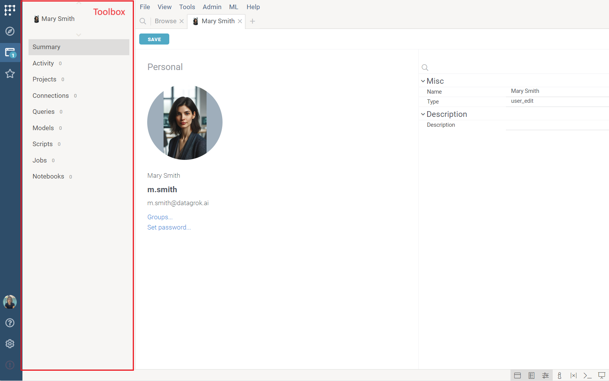

---

title: Views
keywords:
 - Table View
 - Table Manager
 - Column Manager
 - Flex View
 - Toolbox
format: mdx
---

```mdx-code-block
import Tabs from '@theme/Tabs';
import TabItem from '@theme/TabItem';
```

A **View** takes up most of the screen and is your primary work area. Commonly
used views include [Browse](browse.md) and [Table View](table-view.md).
Additionally, there are views for specialized tasks, like data access or
scripting, and [plugins](../../plugins.md) can introduce custom views. For more
information on such views, see the appropriate sections in our documentation.

A view may have UI elements associated with it: [Toolbox](#toolbox), **Top Menu**, and **Status Bar**.

Open views appear on the **Sidebar**. Views of the same
type, such as multiple tables, are grouped with a badge showing the
number of open views. 

Here are other ways to switch between views, depending
on the mode:

<Tabs>
<TabItem value="default-mode" label="Default mode" default>

To navigate between views, use the control at the top left
corner of the screen. 



</TabItem>
<TabItem value="tabs-mode" label="Tabs mode">

In tabs mode, views open as individual tabs. To activate this mode, on the
**Status Bar**, click the **Windows** icon. To navigate between views, click the tab header of the view you want to access.
 
 <!--Update gif following changes in the TopMenu (the Top Menu now is ot context driven and shows options like chem or bio. In addition, need to change the Windows Icon tooltip (now reads "Top Menu")-->

</TabItem>
</Tabs>

You can also open multiple views alongside each other. To do this, click the **Hamburger**
icon on the right and select **Split right** or **Split down**.



## Embedding views

For saved [projects](../../concepts/project/project.md), you can also embed views into an external site as an iframe.
Embedded views remain fully interactive and maintain the connection with the
data from which it was created inside Datagrok.

To embed a view: 

1. Open your project.
1. In the view's **Top Menu**, click the **Hamburger** icon and select **Embed...** This opens an **Embed** dialog.
1. From the dialog, copy the generated iframe and use it on your site.

## Toolbox

A **Toolbox** is a panel associated with a view. The content of the **Toolbox** is view-dependent, for example:

<Tabs>
<TabItem value="table-view" label="Table View" default>

In the [Table View](table-view.md), the **Toolbox** lets you add viewers, refresh dynamic
dashboards, [filter](table-view.md#select-and-filter), [search](table-view.md#search), and do more. The upper part of the **Toolbox** acts
as a navigation tool, displaying a list of all open tables. From here, you can
easily switch between different tables by simply clicking on the desired table. 



</TabItem>
<TabItem value="user-profile-view" label="User Profile View">

In the [User Profile View](user-profile-view.md), the **Toolbox** lets you switch between different
views related to the user's profile.



</TabItem>
</Tabs>

To show the **Toolbox**, hover over the **Sidebar**. To pin it, clicking the **Pin (<FAIcon icon="fa-solid fa-thumbtack"/>) icon** in the top right corner.  