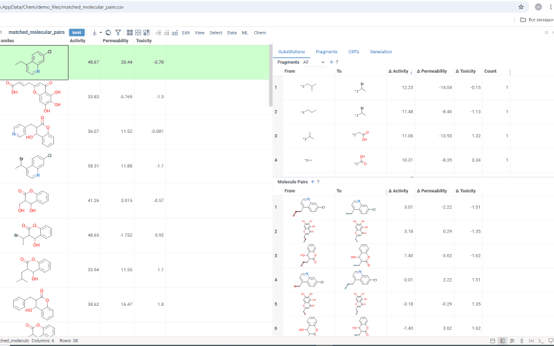
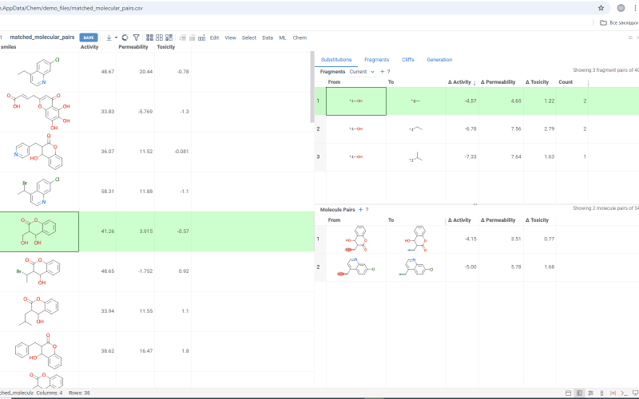
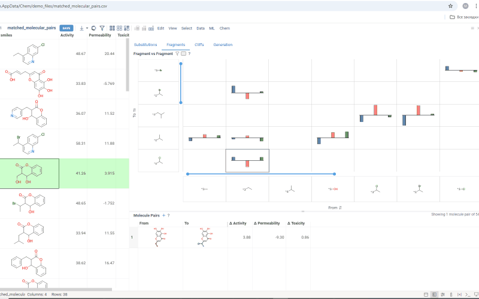

### Matched molecular pairs

The **Matched Molecular Pairs** ("MMP") tool lets you explore chemical space and
identify structural transformation rules that can be used to improve potency and
ADMET properties during lead optimization. This tool automatically detects
matched molecule pairs in your dataset and calculates the difference in property
or activity values between them. The mean change in property or activity values
across your dataset represents the expected size of the change when the
transformation is applied to a molecule.

The results of the MMP analysis are presented in a series of tables and
visualizations, allowing you to:

* View fragments and substitutions in your dataset 
* Analyze the effect of specific fragments on the chosen activity or property of
  a lead compound
* Generate new molecules based on the transformations present in your dataset
  and view their predicted properties and activities.

How to use

To run MMP analysis:

1. In the **Top Menu**, select **Chem** > **Analyze** > **Matched Molecular
   Pairs...** A dialog opens.
1. In the dialog, select the table you want to analyze (**Table**), the column
   containing molecules within this table (**Molecules**), the
   activity/property columns (**Activity**) and maximum fragment size relative to core (**Fragment Cutoff**). Click **OK**. An MMP section is
   added to the view. It has four tabs:

<Tabs>
<TabItem value="substitutions" label="Substitutions" default> 

The **Substitutions** tab has two tables:

* **The upper table (Fragments)** shows all fragment substitutions found in the dataset. It includes the frequency of each substitution and the
  corresponding change in the analyzed activity or property. There are two modes to explore fragments dataset:
  - *All* shows all found fragment pairs at once
  - *Current* shows fragment pairs fount for current molecule in the initial dataset.
  Information message on the left top corner of the table shows how many rows of total are filtered. 
  

  Click any row in the table to show all molecule pairs from the initial dataset having corresponding substitution.
  Select rows with `Ctrl` + click to select all molecules with corresponding substitution (having either *From* or *To* fragment) in the initial dataset.
  

* **The lower table (Molecule pairs)** shows all pairs of molecules associated with the
  substitution from the upper table. It provides details about the analyzed
  activity or property for each pair of molecules.
  Click any row in the **Fragments** table to filter molecule pairs with current substitution. If *Current* mode is selected on **Fragments** table then pair containing current molecule from initial dataset will be on top.
  Corresponding fragments are highlighted within each molecule.
  Click any row in **Molecule pairs** table to pin corresponding *From* and *To* molecules in the initial dataset and open **Context panel** with molecules details.
  Select rows with `Ctrl` + click to select corresponding *From* and *To* molecules in the initial dataset.
  

Click **+** icon above corresponding table to add it to workspace.

</TabItem>
<TabItem value="fragments" label="Fragments">

The **Fragments** tab has two components:

* [trellis plot](../../../../visualize/viewers/trellis-plot.md) shows all identified
fragments on the x and y axes. Each intersection in the plot displays the change
in the analyzed activity or property resulting from a fragment substitution.

* **Molecule pairs** table. The same as on **Substitutions** tab

Click on any non-empty cell on the trellis plot to filter molecule pairs with corresponding substitution in the **Molecule pairs** table.

Filter trellis plot using the filter icon above the viewer.

Sort trellis plot using sort icons on the axes. Two sorting options are available: by fragment frequency and molecular weight.

</TabItem>
<TabItem value="cliffs" label="Cliffs"> 

The **Cliffs** tab has two components:

* [scatterplot](../../../../visualize/viewers/scatter-plot.md) shows clusters of
molecules with similar structures but significant differences in the analyzed
activity or property. Arrows connecting molecules represent changes in the
specified activity or property, with the arrow pointing toward the molecule with
the higher value.

* **Molecule pairs** table. The same as on **Substitutions** tab. Show or hide the table using **Show Pairs** checkbox above the scatter plot.
Click any row to zoom to the corresponding molecule pair on the scatter plot and show details in the **Context Panel**.
Navigation also works vice versa: click an arrow on a scatter plot to zoom in and make molecule pair current in the **Molecule pairs** table.

Use activity filters on a scatter plot to filter pairs by activity difference. Filter is reflected in the **Molecule pairs** table.

</TabItem>
<TabItem value="generation" label="Generation">

In the **Generation** tab, transformation rules derived from the matched molecule pairs in
your dataset are used to generate new molecules and predict their property and
activity values. For every molecule in your dataset, the table shows each
potential transformation, providing:

* Both the starting and new compounds.
* The maximum common substructure for this pair and the substituted fragment.
* Original and predicted values for one of the analyzed activities or
  properties.
* Whether new molecule already exists in the initial dataset or newly generated

In the **Context panel** there is scatter plot showing observed vs predicted values for each activity for molecules from initial dataset.

</TabItem>
</Tabs>

