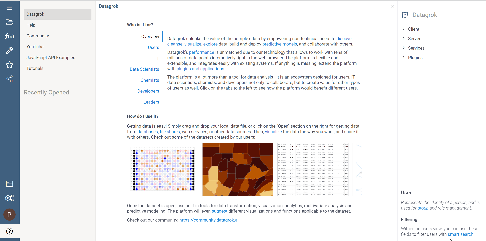

# Export logs to Amazon CloudWatch

This document explains how to configure log exporting to [Amazon CloudWatch](https://aws.amazon.com/cloudwatch/).

> Note: You need already configured CloudWatch and created Log group with streams.

To export logs:

1. Go to **Data** > **Databases**.

2. Right-click the **AWS** datasource and select the context action **Add new connection**.

3. Fill the form with the region and credentials of the IAM user that has [PutLogEvents](https://docs.aws.amazon.com/AmazonCloudWatchLogs/latest/APIReference/API_PutLogEvents.html) permission.

4. Go to **Settings** > **Logger** > **Export logs to CloudWatch**. Click **Add new export block** link. The Export form appears.

5. Fill out the form with the necessary information and choose the appropriate connection to **AWS**.

    > Note: You can create several forms to export different types of logs to different Log groups or streams. Log sending is done in the order of forms. So it's better to put more specific cases above more generalized ones.

6. Click **Apply** button. This will schedule the job and log events will be exported every minute.

To disable log sending:

1. Toggle **Enabled** switch in the form. It will disable log sending without the need to remove the form.

