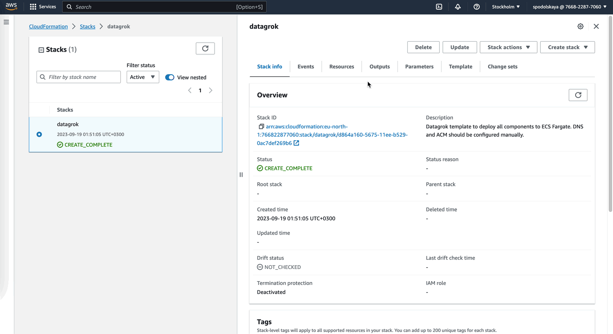

To provide our users with the easiest way to deploy Datagrok to AWS, we integrated Datagrok with [AWS Marketplace](https://aws.amazon.com/marketplace). Using AWS Marketplace, you can deploy all [Datagrok components](../../develop/under-the-hood/infrastructure.md) and the required AWS infrastructure from scratch with just a few clicks. If you want to customize the deployment or use your existing infrastructure, we suggest using [CloudFormation](deploy-amazon-cloudformation.md) or [Terraform](deploy-amazon-terraform.md) options instead.

<!-- markdownlint-disable no-bare-urls -->
:::note

Datagrok product on AWS Marketplace uses BYOL (Bring Your Own License) pricing model. To purchase a license directly from Datagrok before using the product, please contact info@datagrok.ai.

:::
<!-- markdownlint-enable no-bare-urls -->

## First deployment

1. Open [Datagrok product](https://aws.amazon.com/marketplace/pp/prodview-uqum2jw2yvp52) on AWS Marketplace > Continue to Subscribe > Accept terms. Wait until the subscription request is processed, and then Continue to Configuration.

   <!-- markdownlint-disable no-bare-urls -->
   :::info

   Datagrok product has yet to be publicly available on AWS Marketplace. To request early access, please contact support@datagrok.ai.

   :::
   <!-- markdownlint-enable no-bare-urls -->

2. Choose one of the fulfillment options from the list, and click Continue to launch.

   <!--   
      

      
Fulfillment options description

   
       * **ECS [Fargate](https://aws.amazon.com/fargate/) with manual DNS**. Requires to add SSL certificate to ACM and create DNS records manually. It creates all other infrastructure resources. 
       * **ECS [Fargate](https://aws.amazon.com/fargate/) with [Route53](https://aws.amazon.com/route53/) DNS**. Creates all infrastructure from scratch, including SSL certificates and DNS records
   
      

   --->

3. To start deployment, click on the **CloudFormation** deployment template. Quick create stack page opens.

4. Fulfill all parameters for the stack; they can vary depending on the chosen fulfillment option. Click Create stack. The AWS starts the deployment, and the stack has 'CREATE_IN_PROGRESS' status. 

   

   
Details

   * **Region**. CloudFormation uses current region to set up datagrok. To select another region [change region in the navigation bar](https://docs.aws.amazon.com/awsconsolehelpdocs/latest/gsg/select-region.html). 
   * **Stack name.** To meet AWS naming requirements, name must be shorter than _10 symbols_ and correspond [S3 Bucket naming rules](https://docs.aws.amazon.com/AmazonS3/latest/userguide/bucketnamingrules.html).
   * **The following resource(s) require capabilities: [AWS::IAM::ManagedPolicy, AWS::IAM::Role].** Datagrok creates [IAM roles](https://docs.aws.amazon.com/IAM/latest/UserGuide/id_roles.html) with custom names to access S3, RDS, ECS tasks. The IAM policies are very strict and allows only required operations to a limited amount of resources. You can review the policies before startup in cloudformation template using _Template URL_.

   

5. Wait until AWS completes the deployment. The stack status will be 'CREATE_COMPLETE.' Your Datagrok instance is now ready to use.

   If you see one of the following statuses then something went wrong: CREATE_FAILED, ROLLBACK_IN_PROGRESS, ROLLBACK_COMPLETE, ROLLBACK_FAILED. [Check the stack events](https://docs.aws.amazon.com/AWSCloudFormation/latest/UserGuide/troubleshooting.html#basic-ts-guide) for more information about error.

   

   
Manual DNS

   If you chose the fulfillment option with manual DNS, remember to create CNAME DNS records for CVM and Datagrok Load Balancers.
   To get the Load Balancer endpoints for DNS record:
   
   1. Go to stack Resources. Type 'LoadBalancer' in the search field. Find internet-facing load balancers: _LoadBalancerCvm_, _LoadBalancerDatagrok_. Open _Physical ID_ for LoadBalancerCvm, LoadBalancerDatagrok. A new tab with the selected load balancer opens. Copy _DNS name_.

      

   2. Use copied DNS names to create CNAME DNS records, for example
      * Host: datagrok.example.com, Target: LoadBalancerDatagrok DNS name
      * Host: cvm.example.com, Target: LoadBalancerCvm DNS name

   

   

6. Enter the platform using the `admin` user. To get the password:
   1. Go to stack Resources. Type 'Cluster' in the search field. Find Datagrok Cluster: _Cluster_. Open _Physical ID_ for Cluster. A new tab with the selected cluster opens.
   2. Go to Tasks. Click on _datagrok_ task definition revision. Task definition opens.
   3. Select _datagrok_ container. From environment variables, copy the value of `ADMIN_PASSWORD`. It is a password for the first login.
   4. To increase security, [change the password for the admin user](../complete-setup/configure-auth.md) on the first login. Datagrok will ignore the admin password from environment variables on subsequent restarts.

   

7. If you chose the fulfillment option with _manual DNS_, you need to change CVM endpoint. On the sidebar, go to **Settings** > **Scripting**. Change the _Cvm Url Client_ to the CVM DNS record you created.
8. Your Datagrok platform is now ready to use. Configure [authentication](../complete-setup/configure-auth.md), [SMTP](../complete-setup/configure-smtp.md), [install-packages](../complete-setup/install-packages.md). And enjoy fast and flexible data analysis.
