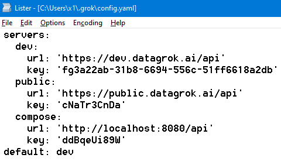
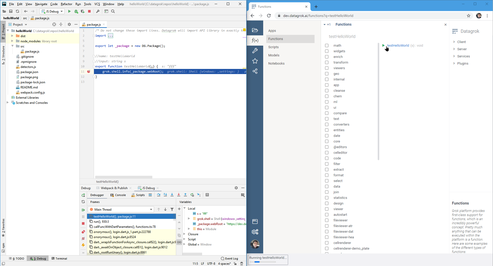
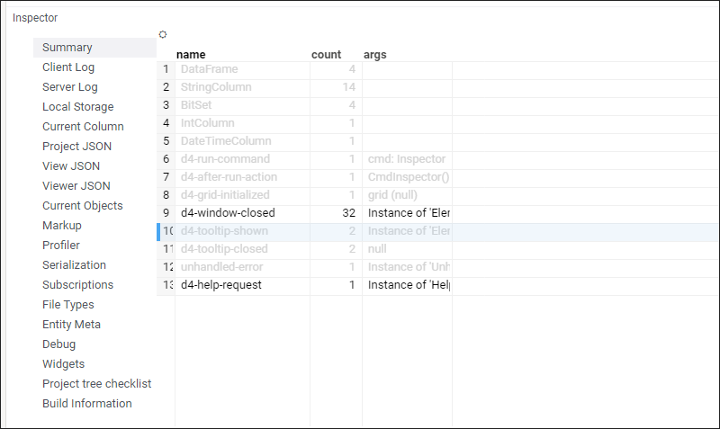
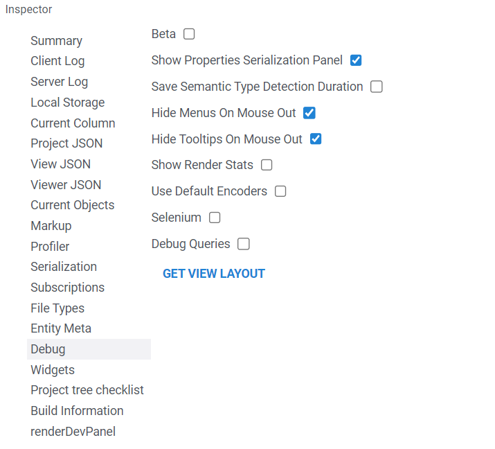

```mdx-code-block
import Tabs from '@theme/Tabs';
import TabItem from '@theme/TabItem';
```

This article will guide you through the process of debugging your Datagrok packages. In most cases, these packages are
TypeScript projects that utilize the `webpack` module bundler. However, if your package is based on a non-standard
template, you may need to configure it differently for debugging.

Here are the main points that we will cover:

* [Prerequisites](#prerequisites)
* [Recommendations for IDE](#recommendations-for-ides):
  * [Visual Studio Code](#one-click-debugging-with-visual-studio-code)
  * [JetBrains IDEs](#one-click-debugging-with-jetbrains-ides)
* Additional tools:
  * [Logger](#logger)
  * [Inspector](#inspector)

## Prerequisites

First, make sure your package has the sourcemap options enabled:

1. In `tsconfig.json`:

  ```json
  "compilerOptions": {
    "sourceMap": true,
  }
  ```

1. In `webpack.config.js`:

  ```js
  module.exports = {
    devtool: 'source-map',
  };
  ```

In some cases, especially when using 3rd-party libraries that have their own source maps, you may need to install an
additional loader:

```shell
npm install source-map-loader --save-dev
```

To enable `source-map-loader`, add the following rule to your `webpack.config.js`:

```js
module.exports = {
  module: {
    rules: [
      {
        test: /\.js$/,
        enforce: "pre",
        use: ["source-map-loader"],
      },
    ],
  },
};
```

## Recommendations for IDEs

While the "Sources" tab in a browser's developer tools provides essential debugging features, more complex tasks often
require a robust IDE. Below you can find instructions for package debugging in popular IDEs such as [Visual Studio
Code](https://code.visualstudio.com) and [JetBrains IDEs](https://www.jetbrains.com/webstorm).

### One-click debugging with Visual Studio Code

To set up a `.vscode` debugging configuration for your package, use `grok create <package-name> --ide=vscode` when
creating a package, or `grok init --ide=vscode` in the directory of an existing package (see [datagrok-tools
docs](https://github.com/datagrok-ai/public/tree/master/tools#datagrok-tools) for details):

```shell
# For new packages
grok create <package-name> --ide=vscode

# For existing packages
cd <package-name>
grok init --ide=vscode
```

As a result, there will be a `.vscode` folder with two files in your package folder: `launch.json` and `tasks.json`.
Once you are ready to launch your code, open `Run and Debug` in the sidebar (`Ctrl+Shift+D`) and hit "Run" to start
debugging (`F5` or `Ctrl+F5`). Wait for your application to "compile" (in our case — go through webpack, and potentially
through linters, etc.), then start it in Datagrok and explore your runtime state through breakpoints, variable watches,
call stacks etc.

Below we explain what the debugging configuration does. The first file, `launch.json`, has contents similar to this:

```json
{
  "version": "0.2.0",
  "configurations": [
    {
      "preLaunchTask": "rebuild",
      "type": "chrome",
      "request": "launch",
      "name": "Launch Chrome against Dev",
      "url": "https://dev.datagrok.ai/",
      "webRoot": "${workspaceFolder}"
    }
  ]
}
```

It allows VS Code to launch an isolated Chrome session in debugging mode linked to IDE, targeting the desired web
address from `url`. In case you are working on a [package application](../function-roles.md#applications), put the
application's URL in the configuration: `https://<GROK_HOST>/apps/<APP_NAME>` (see the
[article](../how-to/build-an-app.md#launching-applications) on applications).

The second file, `tasks.json`, contains the following:

```mdx-code-block
<Tabs>
<TabItem value="windows" label="Windows">
```

```json
{
  "version": "2.0.0",
  "tasks": [
    {
      "type": "shell",
      "command": "cmd.exe /c \"webpack && grok publish <GROK_HOST>\"",
      "label": "rebuild"
    }
  ]
}
```

```mdx-code-block
</TabItem>
<TabItem value="unix" label="Linux/MacOS" default>
```

```json
{
  "version": "2.0.0",
  "tasks": [
    {
      "type": "shell",
      "command": "webpack && grok publish <GROK_HOST>",
      "label": "rebuild"
    }
  ]
}
```

```mdx-code-block
</TabItem>
</Tabs>
```

This command builds your package with webpack. The webpack step helps track some syntactic errors before they occur in
runtime, and consequently ship the package to your Datagrok server. In this example, a default server would be chosen to
deploy to. The server configurations are pre-created by you with `grok config` earlier and stored in
`%USERPROFILE%/.grok/config.yaml`, where you can modify them, and choose the default configuration. To override the
default configuration, call `grok publish` with an explicit configuration name: i.e. `grok publish dev`.

After these two files are in yours working folder, what is left is to set up VS Code internally.

* Open `Run → Install additional debuggers...`, find `JavaScript Debugger` in the appeared list and install it; restart
  VS Code.
* Activate `View → Appearance → Show activity bar`. This will bring the `Run` button into the view. You can also use
  `Ctrl+Shift+D` and `F5` or `Ctrl+F5` to run the application.

Make sure the `.vscode` folder is in your workspace (inside the folder you open with VS Code via `File → Open Folder`).

Now open the folder with your package with `File → Open Folder`, add some breakpoints to your code, and hit the `Run`
button. You should see a view with a left-side pane and a green "Run" (play) button on top of it, with the neighbor
dropdown repeating the name of the configuration from `launch.json`. If this is not the case, and you see some other
names or an invitation to create a configuration, it means the pre-made `.vscode` folder isn't recognized by VS Code. In
such case, check that you do `File → Open Folder` on the folder which *contains* the pre-made `.vscode` folder.

First time you hit run, you'll need to enter your Datagrok credentials into the newly appeared Chrome window. After you
have done this, close Chrome, stop debugging from VS Code and start debugging same way again. This time your breakpoints
should work, and you'd see locals and stack traces as usual.

This [video](https://youtu.be/zVVmlRorpjg?list=PLIRnAn2pMh3kvsE5apYXqX0I9bk257_eY&t=871) gives an overview of setting up
debugging in VS Code.

### One-click debugging with JetBrains IDEs

Below we use WebStorm IDE on Windows as an example, this practice should extrapolate to IntelliJ IDEA, and to other OS.

Open the `Edit Configurations...` dialog in WebStorm:


In this dialog, add a new `Shell Script` configuration by the `+` button:


Fill this configuration with the following:

```shell
/c call webpack && call grok publish dev && call echo
```


*Note.* This configuration looks controversial, but this is so only to overcome the known problems in WebStorm. It turns
out both interpreter and script parameters have to be specified. Omitting the script parameter will work if you run the
`Webpack & Publish` configuration standalone, but *won't* work as part of the other's configuration build step, which
we'd need later. As for the trailing `echo`, it is simply due to the way this build step works in WebStorm: it
concatenates the interpreter line with the script call line, and we use it to suppress the redundant script call line.

This `Webpack & Publish` configuration shall become a step running a webpack on your package and publishing it to a
configuration of your choice. In the above screenshot we've chosen a `dev` configuration, declared in your grok config
file at `%USERPROFILE%/.grok/config.yaml`:



Use the configuration of your choice in the `Shell Script` configuration instead of `dev`.

Proceed to creating the actual JavaScript debug configuration. Using the same `+` button, add a `JavaScript Debug`
configuration, and fill it with the following:


Basically, you need to add the previously created `Shell Script` configuration as a `Before Launch` step. After this
step is executed on hitting the `Debug` button and displaying the `webpack` log and errors in the WebStorm tool output
window, WebStorm will launch the browser in the debugging mode and let you hit your breakpoints:



*Troubleshooting.* Many users reported inability to employ any kind of JavaScript debugging from the WebStorm IDE after
it initially worked. As of 2021, this is a [known
issue](https://intellij-support.jetbrains.com/hc/en-us/community/posts/360009567459-Webstorm-2020-2-1-Remote-Debugging-do-not-work)
of WebStorm IDEs. To fix it, remove these two files and restart the IDE (replace the IDE version with yours):

* `%USERPROFILE%\AppData\Roaming\JetBrains\WebStorm2020.1\options\web-browsers.xml`
* `%USERPROFILE%\AppData\Roaming\JetBrains\WebStorm2020.1\options\other.xml`

*Note 1.* You may notice there's an option to add a `Run External tool` step, which could serve us this `Webpack &
Publish` step. Unfortunately, this step won't work due to a [known
issue](https://youtrack.jetbrains.com/issue/IDEA-229467) in WebStorm IDEs. We broke the run step into two steps
intentionally to alleviate this problem.

*Note 2.* Since 2017 the JetBrains IDE Support plugin is [no longer
required](https://intellij-support.jetbrains.com/hc/en-us/community/posts/360010507240-where-is-JETBRAINS-IDE-SUPPORT-chrome-extension-it-cant-be-found-anywhere-now-on-the-internet)
to debug JavaScript from JetBrains IDEs. In February 2021 JetBrains has removed this plugin from the Chrome store.

*See also:*

* Debugging JavaScript in WebStorm ([1](https://www.youtube.com/watch?v=Qcqnmle6Wu8),
  [2](https://www.youtube.com/watch?v=YNNDMpoGV0w))
* IntelliJ IDEA JavaScript debugging ([link](https://www.jetbrains.com/help/idea/debugging-javascript-in-chrome.html))

## Logger

You can use a package logger to report debug records to the server. Datagrok JS API has a class called
[DG.PackageLogger](https://datagrok.ai/js-api/classes/dg.PackageLogger). Here is an example of accessing a logger object
in your package code:

```ts
export const _package = new DG.Package();

//name: Main Application
//tags: app
export function app() {
  _package.logger.debug('MainApplication started');
  grok.shell.info(_package.name);
}
```

## Inspector

You can use a built-in Inspector to investigate what's happening on the platform. To open Inspector, type `Alt+I`. The
Inspector tool provides information about which events get fired and when, how views and viewers are serialized, what
widgets are registered by the platform, and other important aspects of how Datagrok works.



The "Debug" pane contains settings designed to enhance the debugging experience. You can enable beta plugins, see
properties serialization and the duration of semantic type detection, comfortably examine menus and tooltips, as well as
rendering stats, switch to default encoders for column serialization, enable settings for Selenium or additional logs to
debug queries:



Apart from these settings, you can inspect events in the "Client Log" pane and see function call logs in the "Profiler"
pane. Depending on the task, you may find other Inspector panes useful, so take a moment to familiarize yourself with
this tool.

See also:

* [Getting started](../onboarding/getting-started.md)
* [JavaScript development](../develop.md)
* [Audit](../../govern/audit/audit.md)
* [Query debugging](./query-debugging.md)
