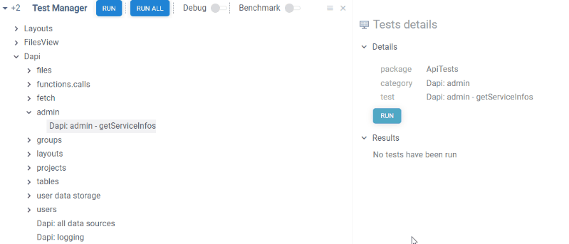

Testing is an essential part of development process. You should ensure that your product works properly at each stage of
it's lifecycle. For instance, when developing a new version of a package you should perform regression testing and
confirm that new changes haven't affected previous functionality. Each package should include a bunch of unit tests
responsible for either UI or logic underneath. And Datagrok provides various capabilities and tools to conveniently run
those tests any time during development.

## Local testing

To test packages locally before release, you can use the [datagrok toolkit](../tools/libraries.md#datagrok-toolkit).
The easiest way is to execute the following commands:

```shell
cd <package-dir>
grok test [--host]
```

It will publish your package in the debug mode to a specified host and run the
tests. The `host` option should correspond to one of the server aliases provided
in the configuration file. If not given, the default host is used for testing.
For your local setup, there may be additional steps to successfully launch tests
(see the full algorithm below).

If you do not have any datagrok instance run locally, you can use [docker-compose](../admin/docker-compose.md) to run
the stand.

## Tests after a change in a public package

It is always a good practice to test the changes before publishing the package.

All public packages in the [repository](../../collaborate/public-repository.md)
are tested using GitHub Actions on every commit. For every changed package GitHub creates a new separate instance of
Datagrok from the latest Datagrok docker image. Then, it publishes a new version of the package to this instance. And
then, the tests are executed on it.

The results are available in the actions output.

### Trigger GitHub Actions manually

If an error occurred for the action triggered by the commit, it is possible to trigger the action manually.

1. Use [Packages workflow](https://github.com/datagrok-ai/public/actions/workflows/packages.yml)
2. Press `run workflow` and set packages list to test separated with spaces, for example: `Demo Tutorials`. Choose the
   target branch. Then `Run workflow`. Note that publish to the NPM registry is executed for the master branch only.
3. Check that the GitHub Actions workflow finished successfully
4. The results are available in the actions output

## Test manager

'Test manager' is a tool within the Datagrok platform that provides a convenient interface to select and run package
unit tests with further results exploration.
'Test manager' itself is a part of the DevTools package.

To start 'Test manager' go to top menu Tools -> Dev -> Test manager


Application starts showing a list of all packages containing unit tests. Inside each package, tests are divided by
category. Categories support multiple nesting (subcategories should be divided by `:`). To select a test or a category,
click on it, or use keyboard.


### Running tests

There are multiple ways you can run tests:

- by right clicking on package, category, or test and selecting `Run` from context menu
- by selecting package, category, or test and pushing `Enter`
- by selecting package, category, or test and pushing `Run` on a ribbon panel
- by selecting package, category, or test and pushing `Run` on a context panel
- individual tests can be run by double click
- you can run all tests at once using `Run all` button on the ribbon
- package, category, or test can be run by putting the corresponding url into address bar of the browser. The format is
  the following `your_server_name/apps/DevTools/TestManager/package_name/category_name/test_name`
- Progress icon is shown opposite to active test/category/package, it will end up in result icon after completion. In
  case at least one test fails within category or package the fail icon will be shown.



Progress bar on the bottom of the page shows the percentage of completed tests.


### Reviewing results

Information about test results is available via tooltip or in the context panel. Selected test, category, or package to
explore results. In case category/package contain multiple tests results are shown as a grid which can be added to
workspace for further exploration.


## Running tests in the platform console

It is possible to run tests in the platform's console. Press the tilde key `~` to open the console or enable it from the
toolbox (`Windows | Console`). To
launch tests for a category, type `PackageName:test(category="category-name")`,
e.g., `ApiTests:test(category="Layouts")`, or add a specific test as a
parameter: `PackageName:test(category="category-name", test="test-name")`, e.g.,
`ApiTests:test(category="Layouts", test="ViewLayout.toJson()")`.

## More information

- [How to add package tests](add-package-tests.md)
