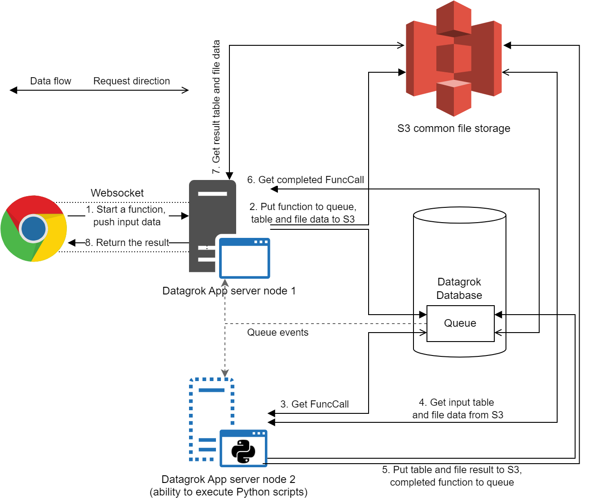
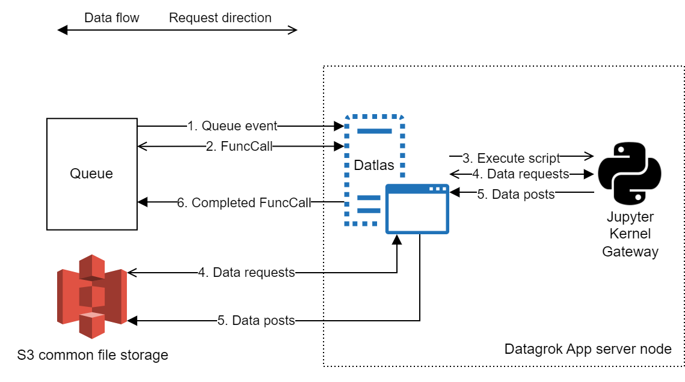

The primary objective of the queue mechanism in Datagrok is to offer a scalable and extensible computing system.

Features:

- Ability to spawn new nodes without registering them manually
- Automatic load balancing without load balancer configuration
- Single entry point instead of multiple URLs
- Capability to spin up nodes with specialized hardware and software
- Users can specify hardware and software requirements without specifying particular computation nodes
- Control access to computation nodes

## Functions

Datagrok is a function-based system where everything is a function. Each function has specified capabilities that must be fulfilled by the Datagrok computation node before it can be executed. For instance, a python script needs Jupyter Kernel Gateway and Python to be installed. Users can specify their custom capabilities in their scripts.

## Nodes

Each Datagrok server serves as a node. By default, it acts as a web application and back-end server. Each node has access to the database and file storage, where persistent data is stored. The Datagrok database also serves as a queue. By default, Datagrok nodes have no additional computing capabilities and can't serve as computation nodes. They can only place a function in the queue.

A computation node with configured capabilities and suitable software can receive an event from the queue and start performing the required computation. After completing the function, the computation node places the result in the queue, and the user receives it.

User can create custom nodes based on Datagrok images, which can contain additional packages or be run on specialized hardware. The list of node capabilities can be extended to match the functions that require such hardware.

## Running a Function on Datagrok

1. User initiates the function, which sends a message through the web-socket to Datagrok's web application node.
2. Datagrok's web application node places a FuncCall in the queue and saves the table data to a common S3 storage.
3. The queue broadcasts an event that contains the function's required capabilities. If a computation node meets these capabilities, it reads the FuncCall from the queue.
4. The computation node reads the table data from the S3 storage and runs the script.
5. The computation node saves the output data to the S3 storage and puts the FuncCall back to the queue.
6. Datagrok's web application node retrieves the completed FuncCall from the queue.
7. The web application node reads the output script data from the S3 storage.
8. Datagrok's web application node returns the output and the table data to the client application.

## Advantages of the Queue-Based Architecture

Datagrok's queue-based architecture provides several advantages for scalable and efficient computation services:

- The web application node serves only as a transport and does not keep any context. This means that the node can handle a large number of requests without being overloaded.
- Computation nodes can decide whether to accept new function calls based on their own workload. This self-balancing feature helps ensure that computation nodes are not overloaded, which can lead to slower processing times and decreased efficiency.
- There is no need for complex client-side logic because users only need to access a single endpoint to execute their functions.
- New nodes can be spawned at any time, which means that workload can be automatically shared among the available nodes. This scalability feature allows for faster processing times and greater efficiency.
- Node capabilities lists are extensible, which means that new feature support can be added at any time by simply spawning a new node with a new capability set. This extensibility feature helps ensure that the system can accommodate new requirements as they arise.

## Node explained

Each computation node consists of Datagrok back-end application that works with the queue and proxies data calls for computing application, such as Jupyter Kernel Gateway.
