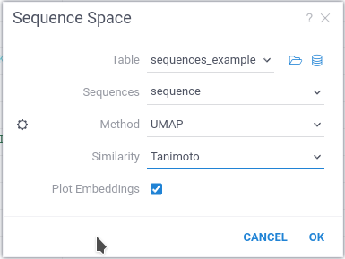
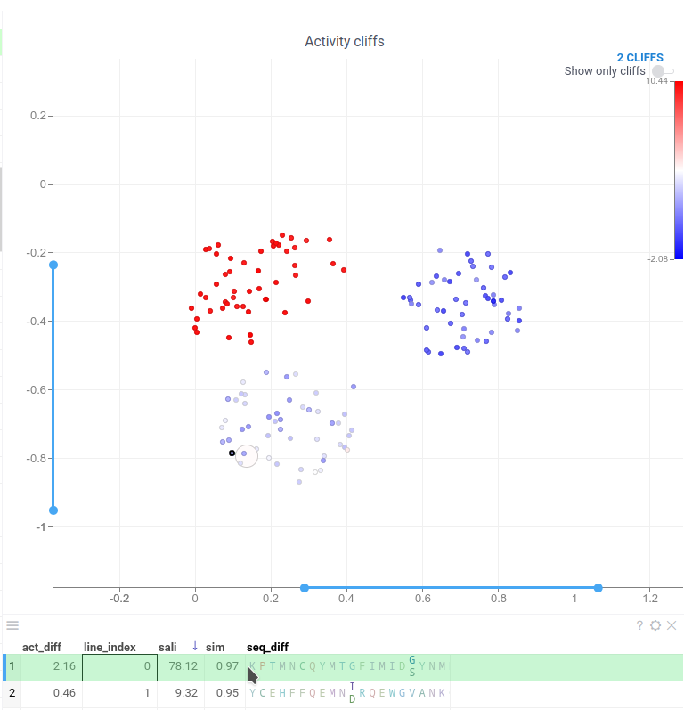

Bioinformatics (see also the [Wikipedia](https://en.wikipedia.org/wiki/Bioinformatics) article)
is the application of computer and information science methods to understand biological data,
especially when the data sets are large and complex.

Here are some areas where bioinformatics plays a vital role:

* New generation clinical diagnostics
* Personalized predictive medicine
* Analysis of cancer mutations and repurposing of existing anti-cancer drugs
* Assessment of the biological activity of natural biomolecules, particularly antimicrobial and anti-cancer compounds
* Designing new biomolecules with specific target activities
* High-throughput analysis of biological images
* Extracting insights and data mining from scientific publications

These are just a few examples, and there are many more applications of bioinformatics.

Datagrok provides extensive support for bioinformatics capabilities,
particularly in analyzing the relationship between sequence and activity of macromolecules (SAR analysis).

## Biological data format support

Datagrok has a convenient feature that automatically detects the data format
and offers custom loaders for various biological data formats:

* FASTA (DNA/RNA/protein)
* HELM
* PDB
* Newick

This functionality is not limited to specific file extensions.
Datagrok identifies columns that contain data in these supported formats within any dataframe.

## Custom data rendering

Datagrok provides custom rendering capabilities for each supported biological data type,
allowing you to have  directly within a dataframe:

* Peptide sequences are displayed with color highlighting based on amino acid properties.
* DNA sequences are colored to represent different nucleotides.
* HELM structures are displayed with colors corresponding to each monomer.
If you have loaded a monomer library for HELM structures
(you can do this by opening the column properties,
accessed by left-clicking on the column header, and selecting "Manage libraries"),
you gain access to previewing and editing macromolecules.
The HELM renderer supports circular and branching structures.
* For PDB structures, Datagrok generates graphical previews directly within the dataframe cells.
You can click on a cell to open a separate 3D viewer, which allows you to rotate, zoom, and change the color scheme.
* [Newick trees](https://en.wikipedia.org/wiki/Newick_format) are parsed
and represented as a dataframe containing nodes and distances.

## Data editing

Datagrok offers custom data editing capabilities directly within the dataframe for certain data types:

* For DNA, RNA, and protein sequences in FASTA format, you can edit the sequences as needed.
* If you have loaded the HELM monomer library, you can edit HELM sequences.
This includes adding or removing monomers and modifying connections.
The editor supports circular and branching structures.

## Data filtering

When working with a sequence column, you can specify a subsequence
and filter the dataframe to display only sequences that contain this specified subsequence.

The filtering is performed based on a 100% exact match of the subsequence.
Datagrok does not currently support subsequence filtering with mismatches.

## Macromolecule-specific Viewers and Actions

Datagrok provides a range of specialized viewers and analysis tools for macromolecules.
You can find them in the "Bio" section of the main menu.

### Multiple Sequence Alignment (MSA)

The [Multiple Sequence Alignment](https://en.wikipedia.org/wiki/Multiple_sequence_alignment)
(MSA) feature allows you to create alignments of biological sequences.
This action generates a new column containing the aligned sequences.

If your data has already been clustered, Datagrok provides an option to specify a "cluster" column
to align sequences only within the same cluster.

MSA works for macromolecules in both FASTA and HELM formats.
For DNA, RNA, and natural peptides, Datagrok utilizes
[KAlign](https://github.com/TimoLassmann/kalign) to perform the alignment.
When dealing with peptides containing non-natural amino acids,
Datagrok employs [PepSeA](https://github.com/Merck/PepSeA) for alignment purposes.

### Compositional analysis

Allows you to generate a "weblogo" representation, also known as a
[sequence logo](https://en.wikipedia.org/wiki/Sequence_logo).
This visual representation illustrates the letter composition for each position in a sequence.

Typically, a sequence logo is created from a set of aligned sequences
and helps to identify patterns and variations within the sequences.
For example, it is commonly used to visualize protein-binding sites in DNA or functional units in proteins.

### Similarity search

A linked dataframe displaying the most similar sequences to a selected sequence from the initial table.
You have the flexibility to adjust the number of sequences displayed and set a similarity cutoff
in the dataframe properties.

### Diversity search

Creates a new dataframe containing the most diverse sequences within a given dataframe.
Unlike the [similarity search] feature, this dataframe is not interactive
and does not respond to sequence selections in the initial dataframe.

### Sequence space

The **Sequence Space** feature in Datagrok is a powerful tool for investigating
sequence similarity and diversity.
This is a complex analysis including several steps:

* Calculating sequence similarity
* Performing [dimensionality reduction](https://en.wikipedia.org/wiki/Dimensionality_reduction)
to transformation sequence similarity into 2D space,
* Sisualizing the results on a scatter plot

To use Sequence Space, access it from the main menu (Bio -> Structure -> Sequence Space)
and specify the column that contains the sequences of interest.
It is recommended to run Sequence Space on previously aligned sequences for optimal results.

Sequence Space supports various metrics for measuring sequence similarity,
such as Tanimoto and Sokal, and offers two methods of dimensionality reduction: UMAP and t-SNE.

By using Sequence Space, you can uncover clusters of similar sequences,
facilitating the identification of groups with shared characteristics.
For example, it can help to identify clusters of antibodies with similar CDRs
(complementarity-determining regions)
or cluster gene variants.

### Activity Cliffs

The Activity Cliffs tool is an enhanced version of Sequence Space, 
specifically designed for Sequence-Activity Relationship (SAR) analysis. 
It allows you to explore the relationship between sequences and their corresponding activity levels.

To run Activity Cliffs, you need a dataframe that contains peptide/DNA sequences 
along with numerical data representing the associated activity. 
For example, you can use sequences of short peptides with measured antimicrobial effects 
or DNA sequences with measured affinity to a specific protein.

When you run Activity Cliffs (Main Menu -> Bio -> SAR -> Activity Cliffs...), 
it initially performs the same clustering and visualization as Sequence Space. 
Next, it analyzes the activities and identifies "cliffs": 
sequence pairs where a small change in the sequence leads to a significant change in activity.

All identified cliffs are listed in the separate dataframe. 
You can browse and explore each cliff individually on the scatter plot 
by selecting it in the cliffs dataframe.

By leveraging the Activity Cliffs tool, 
you can gain insights into the relationship
between sequence variations and their impact on activity,
aiding in the achieving desired biological activities.

### To atomic level

Reconstructs the chemical structure of peptides/DNA/RNA. Requires presence of a monomer library containing all monomers.

### Peptides SAR

The big module analysing the peptides sequence-activity relationships and identifying the most promising changes.
See detailed description here:

### Dendrogram

DataGrok has its own viewer “Dendrogram”, specially designed for fast rendering of big trees.
The tree about 100000 nodes are rendered in several seconds.
Also, DataGrok has built-in connectors to PhyloTree package, which is not so fast
but provides some additional functionality.
