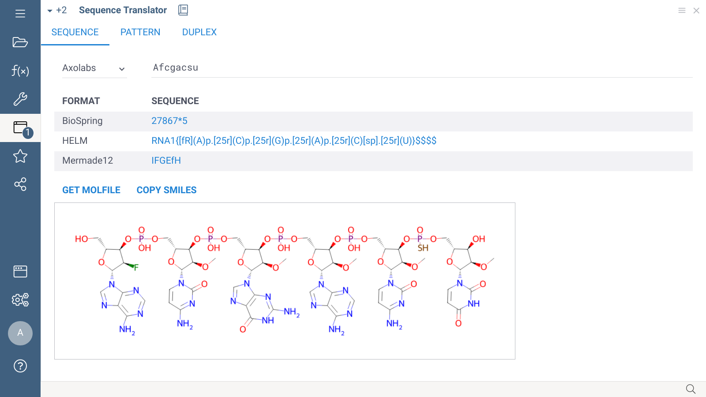
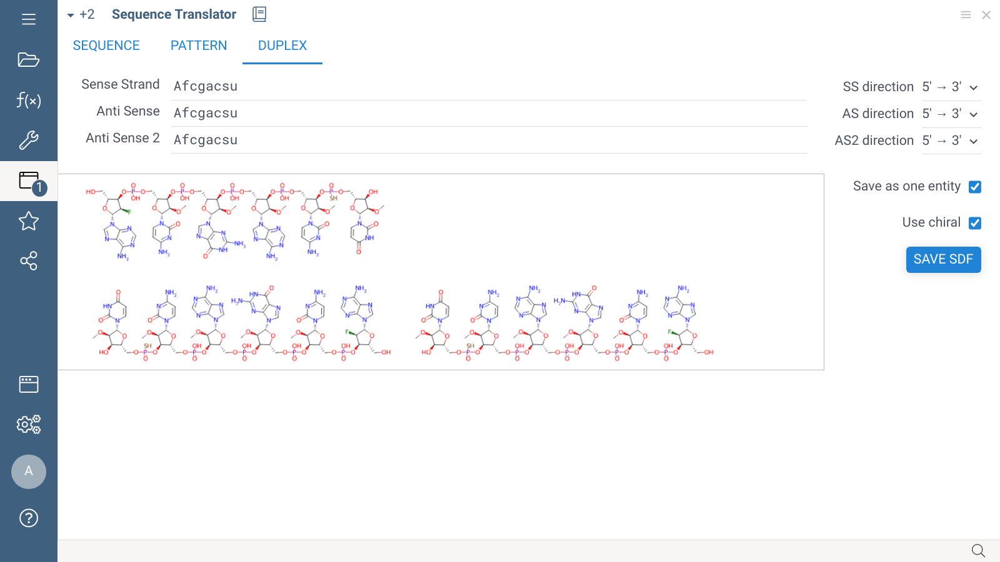

# Oligonucleotide Sequence Design

[Sequence Translator](https://public.datagrok.ai/apps/SequenceTranslator/) is a Datagrok application that facilitates design and synthesis of [oligonucleotides](https://en.wikipedia.org/wiki/Oligonucleotide).

## Translation

To facilitate translation of oligonucleotide sequences across different notations, such as FASTA or HELM, or formats used by specific synthesizers, the application provides a dedicated `SEQUENCE` tab:

In the provided example, the translation is performed from a sequence written in the AXOLABS format into HELM notation and formats supportable by BioSpring and MerMade12 synthesizers. Any other format can be easily added to the output list on demand. The molecular structure of the corresponding polymer is also rendered and can be saved as SMILES or Molfile.

## Design

Oligonucleotides are characterized by the sequence
of [nucleotide modifications](https://github.com/datagrok-ai/public/tree/master/packages/SequenceTranslator#axolabs-nucleotide-modifications)
that make up the entire molecule. The length of the oligonucleotide is usually up to 35 nucleotides long. To facilitate creation and sharing of modification patterns, the `DESIGN` tab of the application is provided.

## Visualisation

It is also possible to visualize the molecular structure for a dimer, with a possibility to add an extra fragment of the antisense strand.

## Use cases

| Name                                               | Steps                                                                                                                                                                                                                                                                                                                                                                                                                      |
|----------------------------------------------------|----------------------------------------------------------------------------------------------------------------------------------------------------------------------------------------------------------------------------------------------------------------------------------------------------------------------------------------------------------------------------------------------------------------------------|
| Translate one sequence of types list               | Paste sequence into the text field in `SEQUENCE` tab of App                                                                                                                                                                                                                                                                                                                                                                    |
| Translate sequences using new Axolabs pattern      | 1. Go to `DESIGN` tab  2. Drag & drop an Excel or CSV file with sequences into Datagrok  3. Choose your table in the `Table` field  4. Choose `SS Column`, and, if needed, `AS Column` and `ID Column`(needed to add column with concatenated ID and pattern name)  5. Press `Convert Sequences` button   This will add the result column(s) to the right of the table. Save pattern, if needed       |
| Translate sequences using existing Axolabs pattern | 1. Go to `DESIGN` tab  2. Select your pattern in `Load Pattern` field  3. Do steps #2-5 from previous use case                                                                                                                                                                                                                                                                                                    |

## Sequence representations

In the modification section on the right side of the screen you can select modification for each base in your input
sequence and check if PTO after the base is required.

Representations are splitted into categories by synthesizer's sequence format(BioSpring/Axolabs/MerMade).
molecule (Gapmers / siRNA).

## Axolabs nucleotide modifications

| Name           | Description                                              | Symbols                              |
|----------------|----------------------------------------------------------|--------------------------------------|
| `RNA`          | RNA nucleotides                                          | `A, C, G, U`                         |
| `DNA`          | DNA nucleotides                                          | `dA, dC, dG, dT`                     |
| `2'-Fluoro`    | 2'-Fluoro nucleotides                                    | `Af, Cf, Gf, Uf`                     |
| `2'-O-Methyl`  | 2'-O-Methyl nucleotides                                  | `a, c, g, u`                         |
| `2'-O-MOE`     | 2'-O-MOE nucleotides (including 5-Methyl C)              | `Am, Cm, Gm, Tm`                     |
| `GNA`          | Glycol nucleic acid                                      | `(GNA-A), (GNA-C), (GNA-G), (GNA-T)` |
| `LNA`          | Locked nucleic acid (including 5-Methyl C)               | `Ab, Cb, Gb, Tb`                     |
| `UNA`          | Unlocked nucleotides                                     | `Ao, Co, Go, Uo`                     |
| `A`            | Adenine                                                  | `a`                                  |
| `C`            | Cytosine                                                 | `c`                                  |
| `G`            | Guanine                                                  | `g`                                  |
| `U`            | Uracil                                                   | `u`                                  |
| `X-New`        |                                                          | `X`                                  |
| `Y-New`        |                                                          | `Y`                                  |
| `Z-New`        |                                                          | `Z`                                  |
| `InvAbasic`    | Inverted abasic capped                                   | `(invabasic)`                        |
| `InvAbasic(o)` | Inverted abasic capped (overhang)                        | `(invabasic)`                        |
| `2'-OMe-U(o)`  | Nucleotide Uridine with 2’O-Methyl protection (overhang) | `mU`                                 |

## App glossary

| Term                  | Definition                                                                                                                                                                           |
|-----------------------|--------------------------------------------------------------------------------------------------------------------------------------------------------------------------------------|
| Pattern               | Defines translation rules. Contains: pattern name, modifications and PTO linkages for both strands, and comment, displayed on image                                                  |
| PTO linkage           | Indicates whether oligonucleotide has phosphorothioated bond (ps linkage) after the base                                                                                             |
| Sense strand (SS)     | Contains the exact nucleotide sequence to the mRNA which encodes for a functional protein. Has the information that would be readable on the RNA, and that's called the coding side. |
| Antisense strand (AS) | Non-coding DNA strand of a gene. A cell uses antisense DNA strand as a template for producing messenger RNA (mRNA) that directs the synthesis of a protein.                          |
