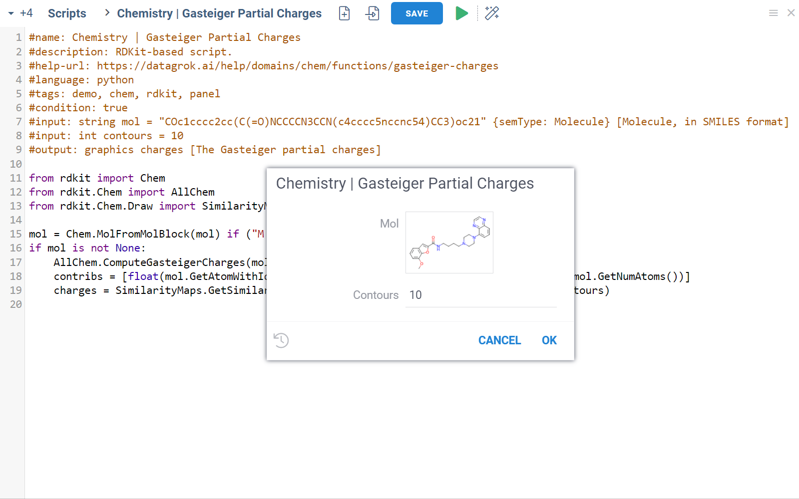
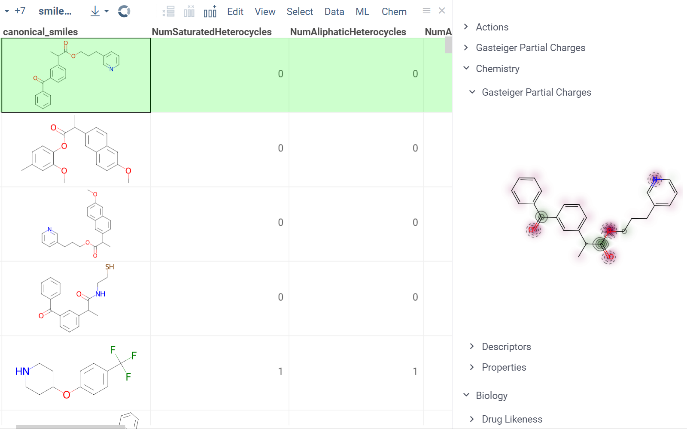
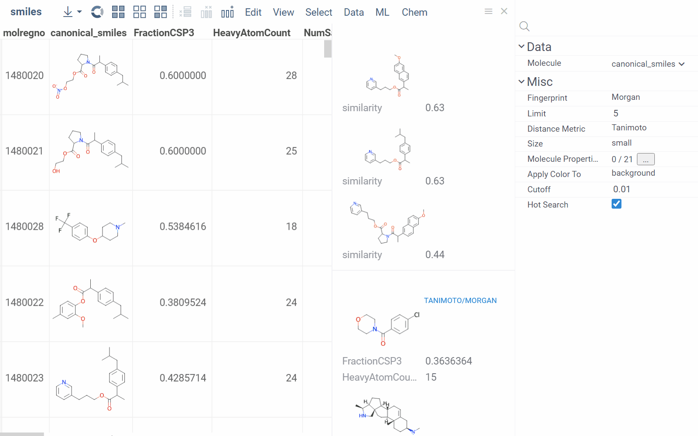
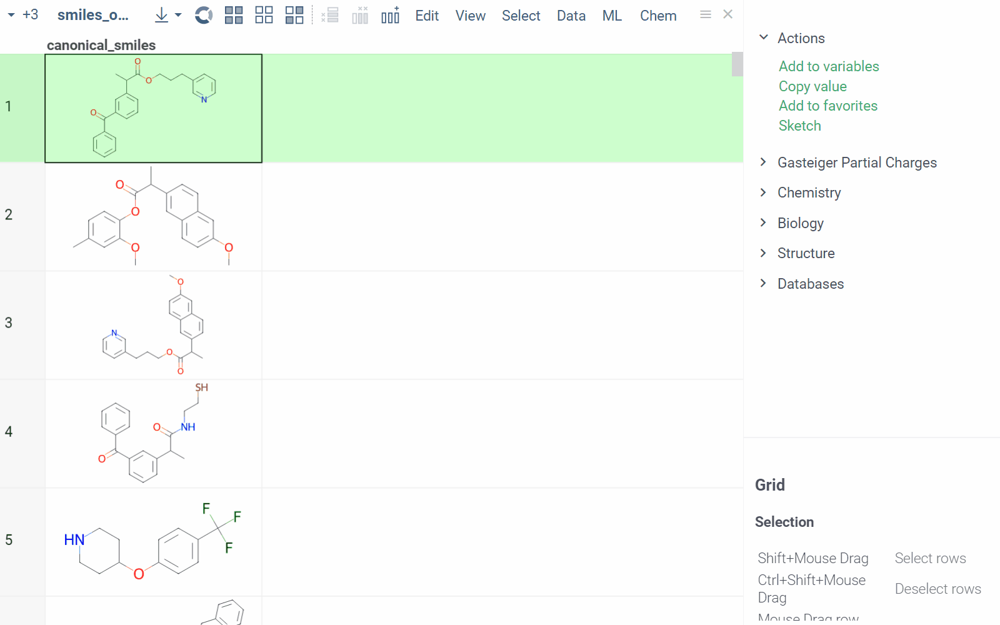
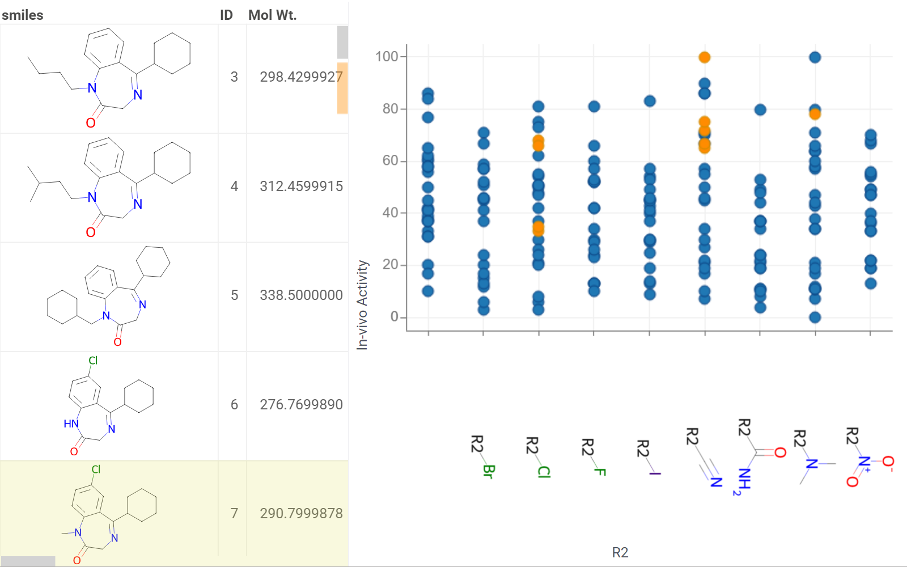
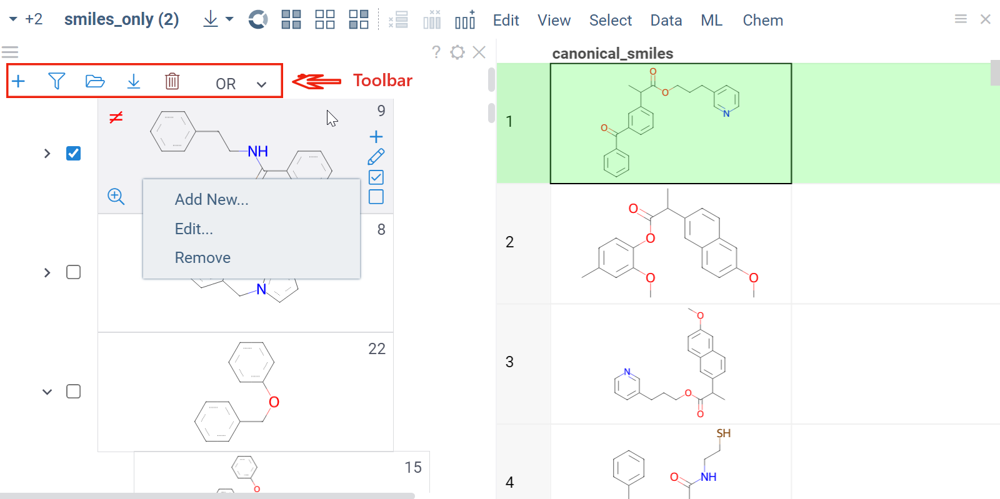

# Cheminformatics

```mdx-code-block
import Tabs from '@theme/Tabs';
import TabItem from '@theme/TabItem';
```

:::caution note

<details>
<summary> To access the cheminformatics functionality, install these
packages </summary>

* Required. [Chem](https://github.com/datagrok-ai/public/tree/master/packages/Chem).
* Required. One of available molecular sketchers. [Ketcher](https://github.com/datagrok-ai/public/tree/master/packages/Ketcher) is installed by default.

  :::note

  Some packages may require an active commercial license to use.

  :::

* Optional. [Chembl](https://github.com/datagrok-ai/public/tree/master/packages/Chembl): In-memory structure search in ChEMBL database .
* Optional. Strusture search on webservices:

  :::danger important

  Installing these packages may result in data transmission to a public webservice.

  :::

  * [ChemblAPI](https://github.com/datagrok-ai/public/tree/master/packages/ChemblAPI)
  * [PubChem](https://github.com/datagrok-ai/public/tree/master/packages/PubChemApi)
  * [DrugBank](https://github.com/datagrok-ai/public/tree/master/packages/DrugBank)

To see the full list of available packages, see the Cheminformatics section in [Manage > Packages](https://public.datagrok.ai/packages).

</details>

:::

Datagrok provides an intuitive interface and a wide range of tools for working
with chemical data:

* **Data access**
  * Ability to access and query data from [any data
    source](../../access/access.md/#data-sources).
  * [Data governance](../../govern/).
* Comprehensive set of **data transformation tools**, including chemical tools like [structure curation](#curation) and [dataset mutation](#mutation).
* **Data visualization and exploration**
  * 2D and 3D molecular representations and support for [popular data formats](#supported-data-formats).
  * Interactive visualization of chemical data using [chemically aware viewers](#chemically-aware-viewers), including a powerful,
    [chemically-aware spreadsheet](#chemically-aware-spreadsheet).
  * Customizable [chemical info panes](#chemical-scripts) with infomation about molecules and context actions.
  * [Exact, substructure, and similarity/diversity searches](#structure-search). Molecular [sketchers](#sketching-and-filtering).
  * Structure analysis using [R-groups decomposition](#r-groups-analysis) and [scaffold tree](#scaffold-tree-analysis).  
  * Interactive exploration of [SAR data](#structure-relationship-analysis) and [ADME/Tox properties](#admetox).
  * Flexible reporting and sharing options, including [dynamic
    dashboards](../../access/databases.mdx/#sharing-query-results).
* [**QSAR and QSPR modeling support**](#qsar-and-qspr-modeling)
  * Train, assess, execute, deploy, reuse, and incorporate custom predictive
    models that accept molecular structures as their input.
* [**Extensible environment**](#customizing-and-extending-the-platform)
  * Ability to add or customize any functionality using [functions and scripts](#chemical-scripts).
  * Ability to create custom plugins and fit-for-purpose applications.

## Data access

Datagrok provides a single, unified access point for organizations, allowing you to connect to various machine readable sources, such as [file storages](../../access/file-shares.mdx), [databases](../../access/databases.mdx), or [webservices](../../access/open-api.md).  You can use the Datagrok UI to connect directly to any of the [30+ supported data sources](../../access/supported-connectors.md), retrieve data, and securely share data with others.

:::note developers

You can [create custom connectors](../../access/create-custom-connectors.md) and connect to data [programmatically](../../develop/how-to/access-data.md).

:::

Chemical queries against data sources require a chemical cartridge, such as [RDKit Postgres cartridge](https://www.rdkit.org/docs/Cartridge.html) or [JChem cartridge](https://docs.chemaxon.com/display/docs/JChem+Cartridge), which allows molecule-specific operations like substructure and similarity searches to be integrated into SQL queries using SQL syntax.

To query a proprietary database, a chemical cartridge must be installed on the Datagrok server. To search public databases, such as ChEMBL or PubChem, you can use the following packages that automatically create a [data connection](../../access/access.md#data-connection) with a preinstalled chemical cartridge:

* Run in-memory queries on a client-accessible copy of the ChEMBL database (requires an installation of the [Chembl](https://github.com/datagrok-ai/public/tree/master/packages/Chembl) package).
* Query public webservices directly (requires package installation; for available packages, see the **Cheminformatics** section in [Manage > Packages](https://public.datagrok.ai/packages)).

  :::danger important

  Using these packages may result in data transmission to the associated webservices.

  :::

Once you've created the query, it functions as a [regular Datagrok query](../../access/access.md#data-query), allowing you to run it, share it with others, and more.

<details>
<summary> Example: Running substructure search against ChEMBL </summary>

To run an in-memory query against the ChEMBL database, follow these steps:

1. [Run](../../access/databases.mdx#running-queries) a [parameterized data query](../../access/databases.mdx#parameterized-queries) with input paramters that specify a semantic type. Here's an example:

  ```sql
  --input: string pattern {semType: Substructure}
  select molregno,m as smiles from rdk.mols where m@>@pattern::qmol
  ```

1. Datagrok generates a parameter dialogw where you can draw or paste the desired substructure and specify other parameters.
1. Click **Run**. The query returns a dataframe with all matching substructures.


</details>

To learn more about querying data and data access in general, see the [Access](../../access/access.md) section of our documentation.

### Supported data formats

Datagrok supports most popular data formats, such as SMILES, SMARTS, InChI,InChiKey, SDF, PDB, MOL2 and other [file formats](../../access/supported-formats.md), molecular fingerprints (such as MACCS,ECFP, FCFP, and others), molecular descriptors, and graph-based representations. To restore MOL files for subsequent processing, the platform uses SMILES. For chemical reactions, the platform uses the modified strings of [SMIRKS notation](https://www.daylight.com/dayhtml/doc/theory/theory.smirks.html).

<!--Thanks to the highly optimized database memory use, we are capable of working with huge volumes of data.-->

#### Molecule identifier conversions

Datagrok supports conversion of various molecule identifiers, including proprietary identifiers, allowing you to work with muliple data sources and tools. For example, you can convert a SMILES string to an InChI and vice versa.

[GIF]

<details>
<summary>How to use</summary>

For indiviual molecules, the coversion happens automatically as you browse the dataset. Upon clicking a molecule, the **Context Panel** dynamically updates to show all available identifiers in the **Identifiers** info pane (**Context Panel** > **Structure** > **Identifiers**). 

To perfrom conversion on the column, use the **Actions** info pane:

1. Select the SMILES column by clicking its header. The **Context Panel** updates with available actions.
1. In the **Context Panel**, expand the **Actions** info pane and select **Chem | Map Identifiers**. A dialog opens.
1. In the dialog, select the source for the conversion and the desired output from the list of options.
1. Click **OK**. A new column containing InChI is added to the dataframe.

</details>

<details>
<summary> Supported data sources </summary>

|             |            |             |        |
|-------------|------------|-------------|--------|
|actor        | drugbank   | lipidmaps   | pubchem|
|atlas        | drugcentral| mcule       | pubchem_dotf|
|bindingdb    | emolecules | metabolights| pubchem_tpharma|
|brenda       | fdasrs     | molport     | recon|
|carotenoiddb | gtopdb     | nih_ncc     | rhea|
|chebi        | hmdb       | nikkaji     | selleck|
|chembl       | ibm        | nmrshiftdb2 | surechembl|
|chemicalbook | kegg_ligand| pdb         | zinc|
|comptox      | lincs      | pharmgkb    | |

</details>

:::note developers

To run programmatically, use the `#{x.ChemMapIdentifiers}` function.

:::

## Data transformation

Datagrok offers [multiple ways to transform and enrich your data](../../transform/data-wrangling.md). For example, you can link tables, extract values, or add metadata to annotate your dataset with experimental conditions or assay results<!--need a link out to how to add metadata-->. You can also use [chemical scripts](#chemical-scripts) to execute operations on chemical data, including calculation of fingerprints and descriptors, toxicity prediction, and more. 

### Curation

Datagrok supports [chemical structure curation](https://pubs.acs.org/doi/10.1021/ci100176x), including kekulization, normalization, reionization,  neutralization, tautomerization, and the selection of the main component.

<details>
<summary> How to use </summary>

To perform chemical structure curation:

1. Navigate to **Menu Ribbon** > **Chem** > **Transform** > **Curate**.
1. In the **CurateChemStructures** dialog, select from the available options and click **OK**. This action adds a new column containing curated structures.

  :::note

  You can choose specific options to perform various tasks, such as detecting pairs of graphs representing the same structure under certain conditions.<!--what does this mean? Is it removing duplicates?--> If no options are selected, the tools sanitize the input data and standardize chemotypes without altering them.

  :::

<!--replace with new UI-->

</details>

### Mutation

You can mutate molecules by adding atoms or bonds, or removing bonds.

<details>
<summary> How to use </summary>

To perform chemical structure mutation:

1. Navigate to **Menu Ribbon** > **Chem** > **Transform** > **Mutate**.
1. In the **Mutate** dialog, draw or paste the desired structure and set other parameters, including the number of mutated molecules. Each mutation step can have randomized mutation mechanisms and places (select the **Randomize** checkbox).
1. Click **OK** to execute. A new table with mutated structures opens.

[GIF]

</details>

## Chemical scripts

Datagrok provides a wide range of scripts to manipulate chemical data. The scripts can be written in any programming language and are implemented as [Datagrok functions](../../datagrok/functions/functions.md) that take a molecule as input. These chemical functions can be integrated in larger scripts and workflows accross the platform, enabling a variety of use cases such as data transformation, enrichment, calculations, building UI components, workflow automation, and more. Here's an example:

<Tabs>
<TabItem value="script" label="Script" default>



</TabItem>
<TabItem value="script-output" label="Script output">


</TabItem>
<TabItem value="script-output-in-info-pane" label="Script output in info pane">


</TabItem>

</Tabs>

In this example, a [Python script based on RDKit](https://public.datagrok.ai/script/276a5929-6f21-5105-8eec-576845aabae0) is used to calculate Gasteiger partial charges and generate a visual representation of the results. When you run the script, Datagrok autogenerates a parameter input dialog, which can be exposed to users as a [standalone application](../../develop/how-to/create-package.md). However, in this particular example, the script is implemented within a UI component known as an [info pane](../../discover/info-panels.md), which dynamically updates as you browse the dataset.

:::tip

<details>
<summary> Some info panes are interactive and can be customized from the UI</summary>

To reveal available options, expand the info pane and hover over its top:

* View and/or edit the underlying script (click the **Script** icon).
* Change parameters (click the **Parameter** icon).
* Change the info pane's settings (click the **Gear** icon).
* Append info pane as a column (click the **More actions** icon and select **Add as a column**).

[GIF]

</details>

To learn how to customize and extend the platform programmatically, see the [Develop](../../develop/) section of our documentation.

:::

<details>
<summary> Default chemical info panes and actions for the current value </summary>

* **Context actions**
  * Sketch
  * Use as filter
  * Sort by similarity
  * Copy as SMILES, SMARTS, MOLFILE V2000, MOLFILE V3000
* **Info Panes**
  * **Gasteiger Partial Charges**: Shows a 2D representation with partial charges highlighted.
  * **Descriptors**: Shows [descriptors](descriptors.md). These descriptors are shown by default:
    * FractionCSP3
    * HeavyAtomCount
    * NHOHCount

    To change, click the **Select** button.
  * **Properties**: Shows physicochemical properties, such as molecular weight, LogP, and others.
  * [**Drug Likeness**](info-panels/drug-likeness.md): Shows the score indicating the likelihood of a molecule being a drug, along with the interpretation of how different substructure fragments contribute to the score.
  * [**Structural Alerts**](info-panels/structural-alerts.md): Shows drug specific structural alerts which could lead to severe toxicity in most cases.
  * [**Toxicity**](info-panels/toxicity-risks.md): Predicts mutagenicity, tumorigenicity, irritating effects, and reproductive effects using [openchemlib calculations](https://github.com/Actelion/openchemlib).
  * **Identifiers**: Shows [all known identifiers](#molecule-identifier-conversions) for the selected structure.
  * **3D Structure**: Shows a 3D molecular representation.
  * **2D Structure**: Shows a 2D molecular representation.
  * **Databases**: Performs substracture and similarity searches for the selected sctructure against all connected data sources.

</details>

<details>
<summary> Default chemical info panes and actions for the current molecular column/dataset </summary>

* **Context actions**
  * **Filter/Sketch**: Use [a skether](#molecule-sketcher) to filter or edit/add molecules.
  * **Calculate descriptors**: Calculates specified [descriptors](descriptors.md) and adds a column for each.
  * **Calculate fingerprints**: Calculates specified [fingerprints](fingerprints.md) and adds a column for each.
  * **Convert identifiers**: Converts molecule identifiers from one type to another and adds a column for each. 
  * [**Mutate**](#mutation): Mutates chemical structure and creates a new dataset based on the results.
  * [**Curate**](#curation): Curates chemical structures.
  * **Similarity search**: Shows N most similar structures in a dataset.
  * **Diversity search**: Shows N most diverse structures in a dataset.
  * [**Chemical space**](#similarity-analysis-using-distance-based-dimensionality-reduction-algorithms): Visualizes molecular similarity using a scatterplot.
  * [**Elemental analsyis**](#elemental-analysis): Analyzes the elemental composition of a molecular structure and visualize the results using a radar viewer.
  * [**Scaffol tree**](#scaffold-tree-analysis): Generates a tree hierarchy based on scaffolds.
  * [**R-group analysis**](#r-groups-analysis): Decomposes a set of molecules into a core and R-groups (ligands at certain attachment positions), and visualizes the results using a trellis plot.
  * **Activity cliffs**: Identifies and visualizes pairs of molecules that have similar structures but different levels of activity using a scatterplot.
  * **ADME/Tox prediction**: Predicts absorption, distribution, metabolism, excretion, toxicity, solubility, and lipophilicity properties for chemical structures.
* **Info panes**
  * **Most Diverse Structures**: Finds most diverse structures in the current column and shows them in the column's info pane.
  * **Rendering**: [ADD DESCRIPTION]

</details>

<!--:::tip

You can search for functionality using the smart search
(press Alt+Q) [NOT APPLICABLE ANYMORE?].

::: -->

Datagrok automatically detects any molecule-associated type accross various [entities](../../datagrok/objects.md), such as scripts, queries, database tables, tooltips, and others. Once detected, the relevant functions are executed accordingly. For example, when you open a TXT file containing SMILES, the following happens:

* The data is loaded using a chemical spreadsheet.
* SMILES are automatically rendered in 2D.
* A context menu item labeled **Chem** appears.
* The **Context Panel** shows relevant info panes with chemical information and actions.

To view the chemical sripts you've created or those shared with you, open the [Scripts Gallery](https://public.datagrok.ai/scripts?q=%23chem) (**Functions** > **Scripts**) and filter by the tag `#chem`. You can search for individual scripts and use the **Context Panel** to view details, edit, run, manage, and perform other actions for the selected script.

[GIF]

:::note

For a full list of chemical scripts, along with details on their implementation and associated performance metrics, see [Chemical functions](functions/chem-functions.md).

To learn more about scripting, see [Scripting](../../compute/scripting.md).

:::

## Chemically aware viewers

Datagrok viewers are chemically aware and can recognize and display chemical data. These viewers were built from the ground up to take advantage of Datagrok's in-memory database, enabling seamless access to the same data across all viewers without duplication. This design makes the viewers optimized to handle large datasets, interactive, and synchronized. Any action taken on one viewer, such as hovering, selecting, or [filtering](../../visualize/viewers/filters.md), is automatically applied to all other viewers, creating an interconnected system ideal for exploratory data analysis. All viewers share a consistent look and feel and usage patterns.

[GIF]

:::note developers

You can [add custom viewers](../../develop/how-to/custom-views.md). Depending on your needs, viewers can be implemented in various UI elements, such as standalone visualizations, info panes, cell renderers, or widgets to support multiple use cases accross the platform.

:::

Key viewers for analysis of chemical data include a chemically aware spreadsheet we call _grid_, a [scatterplot](../../visualize/viewers/scatter-plot.md), a [network diagram](../../visualize/viewers/network-diagram.md), a [tile viewer](../../visualize/viewers/tile-viewer.md),a [bar chart](../../visualize/viewers/bar-chart.md), a [form viewer](../../visualize/viewers/form.md), and a [trellis plot](../../visualize/viewers/trellis-plot.md). All viewers can be saved as part of the [layout](../../visualize/view-layout.md) or a dashboard.

To learn how to use viewers to explore chemical data, see [this cheminformatics tutorial](ADD LINK). To learn about viewers and visualizations in general, see the [Visualize](../../visualize/) section of our documentation. 

### Chemically aware spreadsheet

The _grid_ viewer includes all features expected from a chemical spreadsheet, such as the ability to input, edit, and display chemical structures. You can draw chemical structures manually or enter the structure's identifier, such as SMILES or InChI (see [Sketching and filtering](#sketching-and-filtering)). Text notations are presented in 2D by default but can be changed by right-clicking the column header and selecting the **Renderer** > **As Text** checkbox. Additionally, you can add new columns with calculated values or visualizations from info panes or context actions. The features also include the ability to set permissions for columns, color-code columns, pin rows, and more. For more information on how to use the grid viewer, see the [grid documentation](../../visualize/viewers/grid.md) or this [grid tutorial](ADD LINK).

[GIF]

## Structure search

Datagrok provides several structure search options, including exact, substructure, similarity, and SMARTS searches. You can use structure searches to filter your dataset or [query a database](#data-access). 

To filter a dataset, use a sketcher. You can draw a substructure manually or use the search bar to find the exact structure by entering SMARTS strings or its identifier, such as SMILES or InChI. After applying the filter, Datagrok highlights the queried substructures in the filtered subset. For more information on sketching and filtering, see [Sketching and filtering](#sketching-and-filtering).

### Similarity and diversity search

Datagrok offers two analytical tools to help you analyze a collection of molecules based on molecular similarity: _similarity search_ and _diversity search_ (**Menu Ribbon** > **Chem** > **Search**.). Similarity search finds structures similar to the reference molecule, while diversity search shows N different classes of compounds present in the dataset. Both tools use different distance metrics to fingerprints and rely on descriptors.  

Both similarity search and diversity search are implemented as _viewers_<!--add link when we have an article on this-->, which means they are interactive and synchronized with other viewers, such as the chemical spreadsheet or info panes. This allows you to zoom in on the area of interest and perform common operations like filtering or selection.

[GIF]

<details>
<summary>How to use</summary>

By default, similarity search finds structures similar to the selected molecule. To change the reference molecule, you have several options:

1. Select the desired molecule directly in the spreadsheet or within the similarity or diversity viewers.
1. Draw it manually or paste using sketcher. To access the sketcher, right-click any molecule tile within the similarity or diversity viewers and select **Sketch**. Alternatively, in the top left corner of a molecule tile, click the **Edit** icon.

  

To change search parameters like the similarity cutoff, fingerprints type<!--we only have Morgan?-->, or distance metric, edit the viewer's properties properties by clicking the **Gear** icon (to reveal, hover over the top of the viewer).


You can customize each molecule tile in the similarity and diversity viewers to display data from any dataset column. To add column data, open the viewer properties and select the desired column using the **Molecule Properties** control. Color-coding applied to the selected column will be picked up and displayed in the viewers. You can choose between background or text color-coding using the **Apply Color To** control. To remove highlighting, clear the color-coding from the respective column in the dataset.



</details>

<details>
<summary> Available distance metrics </summary>

* Tanimoto
* Dice
* Cosine
* Hamming
* Euclidean

</details>

#### Similarity analysis using distance-based dimensionality reduction algorithms

Datagrok provides scripts for distance-based dimensionality reduction algorithms, such as [tSNE](https://scikit-learn.org/stable/modules/generated/sklearn.manifold.TSNE.html) and [UMAP](https://umap-learn.readthedocs.io/en/latest/), to support similarity analysis. These algorithms use molecular fingerprints to convert cross-similarities into 2D or 3D coordinates, making it possible to visualize the similarities between molecular structures and identify clusters of similar molecules, outliers, or patterns that might be difficult to detect otherwise. Datagrok uses a [scatterplot viewer](../../visualize/viewers/3d-scatter-plot.md) to implement the scripts.

[GIF]

<details>
<summary> How to use </summary>

1. Go to the **Menu Ribbon** and choose **Chem** > **Analyze Structure** > **Chemical Space...** This opens a **Chemical Space** parameter dialog.
1. In the dialog, select the source of the molecule and set the parameters such as the distance metric (Tanimoto, Asymmetric, Cosine, Sokal) and the algorithm you want to use. To change default settings for the selected algorithm, click the **Gear** icon next to the **Method name** control.
1. Click **OK**. A scatterplot is added to the view.

</details>

:::tip

To focus on the cluster of interest, select it in the scatterplot, then navigate to the **Menu Ribbon** and select **Selection** > **Extract row selection**. This opens a dataframe with the subset of the selected structures.

:::

### Sketching and filtering

:::note

Datagrok provides integrations with various sketchers, but their availability depends on their licensing options. Some sketchers require a commercial license from the vendor before they can be used in Datagrok. To use these sketchers, you must enter the license activation code. 

<details>
<summary> How to activate </summary>

1. Go to [**Manage** > **Packages**](https://public.datagrok.ai/packages) and select a package that you want to use.
1. Navigate to the **Context Panel** > **Settings**  and enter the license code in the **License path** field.
1. Click **SAVE** to activate the license.

</details>

:::

Sketcher is an integrated tool for creating and modifying chemical structures. To edit a structure in a dataset using a sketcher, double-click it. Alternatively, in the **Actions** info pane, select **Sketch**. You can draw a structure manually or retrieve one by entering a compound identifier or a common name (like aspirin). 

<details>
<summary>How to use</summary>

To filter a dataset by (sub)structure, follow this steps:

1. Right-click a molecule you want to use as a filter and select **Current value** > **Use as filter**. This action opens a filter pane on the left, and the dataset is filtered accordingly.
1. Optional. Modify the filter using a sketcher.
   1. Click the molecule tile in the filter pane to open a sketcher. 
   1. Edit the structure or add a new one by drawing it manually or using its identifiers in the search box provided (press the Enter key to apply).
   1. Once you are done, click **OK** to apply the changes. The filter updates with the new (sub)structure, which is highlighted in the filtered subset.

To clear the filter, use the checkbox provided. To remove the filter altogether, use the **Close** (x) icon.



:::note developers

To execute the the find MCS operation programmatically, use the `chem:findMCS` function (or execute the `chem:findMCS(tableName, columnName)`command from the console.)

:::

</details>

The following compound identifiers are natively understood since they have a prefix that uniquely identifies data source: SMILES, InChI, InChIKey, ChEMBL, MCULE, comptox, and zinc (example: CHEMBL358225). The rest of the 30+ identifier systems can be referenced by prefixing source name followed by colon to the identifier (example: 'pubchem:11122').

<details>
<summary> Supported identifier systems </summary>

| |  |  |
|--|--|--|--|
|actor        |drugbank   |lipidmaps   |pubchem|
|atlas        |drugcentral|mcule       |pubchem_dotf|
|bindingdb    |emolecules |metabolights|pubchem_tpharma|
|brenda       |fdasrs     |molport     |recon|
|carotenoiddb |gtopdb     |nih_ncc     |rhea|
|chebi        |hmdb       |nikkaji     |selleck|
|chembl       |ibm        |nmrshiftdb2 |surechembl|
|chemicalbook |kegg_ligand|pdb         |zinc|
|comptox      |lincs      |pharmgkb    | |

</details>

:::tip

When you work with the same sctructure repeatedly, add it to favorites for easy retrieval. To do so, hover over the top of the sketcher to reveal the **Hamburger** (☰) icon, then click it and select **Add to favorites**. Datagrok remembers your preferred sketcher type, so you don't have to select it every time you use it.

:::

## Structure analysis

### R-groups analysis

R-group analysis decomposes a set of molecules into a core and R-groups (ligands at certain attachment positions), and visualizes the results. The query molecule
consists of the scaffold and ligand attachment points represented by R-groups.


<details>
<summary> How to use </summary>

1. Go to **Chem** > **Analyze SAR** > **R-Groups Analysis...**
A [sketcher](sketcher.md) opens.
1. In the sketcher, specify the common core (scaffold) for the selected molecular column using one of this methods:
   * Draw or paste a scaffold in the sketcher.
   * Click **MCS** to automatically identify the most common substructure.
1. Click **OK** to execute. The R-group columns are added to the dataframe, along with a [trellis plot](../../visualize/viewers/trellis-plot.md) for visual exploration.

The trellis plot initially displays pie charts. To change the chart type, use the **Viewer** control in the top-left corner to select a different viewer.

If you prefer not to use a trellis plot, close it or clear the **Visual analysis** checkbox
during Step 2. You can manually add it later.

Possible visualization options also include:

<details>
<summary> Scatterplot </summary>

* **Use**: To visualize the correlation between the R-group properties and the
  biological activity of the molecules.
* **How**: [Add a scatterplot](../../visualize/viewers/3d-scatter-plot.md) and
  plot the R-group property on the x-axis and the biological activity on the
  y-axis, with each point representing a different R-group.



</details>

<details>
<summary> Bar chart </summary>

* **Use**: To compare the average biological activity of different R-groups.
* **How**: [Create a bar chart](../../visualize/viewers/bar-chart.md) where the
  height of each bar represents the average biological activity of a specific
  R-group.


</details>

<details>
<summary> Radar chart </summary>

* **Use**: To compare the impact of multiple R-groups on various properties
  related to biological activity.
* **How**: Plot each R-group as a point on a radial axis, with the distance from
  the center representing the biological activity for a specific property.

[GIF]

</details>

<details>
<summary> Box plot </summary>

* **Use**: To compare the distribution of biological activities for different
R-groups.
* **How**: Create a box plot for each R-group, where the y-axis
represents the biological activity and the x-axis indicates the R-group.

[GIF]

</details>

<details>
<summary> Hierarchical clustering dendrogram  </summary>

* **Use**: To group R-groups based on their similarity in terms of properties
and biological activity.
* **How**: Perform hierarchical clustering on the
R-group property data and represent the resulting tree structure as a
dendrogram.

[GIF]

</details>

<details>
<summary> Network diagram </summary>

* **Use**: To visualize the relationship between R-groups and biological
activity in the context of the whole molecular series.
* **How**: [Add a network diagram](../../visualize/viewers/network-diagram.md).
  Represent molecules as nodes in the network and connect them with edges if
  they share common R-groups or core structures. Color-code the nodes based on
  their biological activity.

[GIF]

</details>

</details>

:::note developers

R-group analysis uses the following
[functions](../../datagrok/functions/functions.md):

* [\#{x.ChemFindMCS}](functions/chem-functions.md#)
* [\#{x.ChemMurckoScaffolds}](functions/murcko-scaffolds.md)
* \#{x.ChemGetRGroups}

To run the r-group decomposition programmatically, see [this sample script](https://public.datagrok.ai/js/samples/domains/chem/r-group).

:::

### Scaffold tree analysis

Scaffold tree organizes molecular datasets by arranging molecules into a tree hierarchy based on their scaffolds. This hierarchy can then be used for filtering or selecting the corresponding rows in the dataset. The hierarchy is created by iterative removal of rings from more complex scaffolds using chemically meaningful set of rules, until a single, root ring is obtained. For tree generation, we use a derivative of the open-source
[ScaffoldGraph](https://github.com/UCLCheminformatics/ScaffoldGraph) library
developed by Oliver Scott.


Scaffold tree is a viewer, which means it can be shared or saved as part of a [layout](../../visualize/view-layout.md) or dashboard.

<details>
<summary>How to use</summary>

To access, in the **Menu Ribbon** select **Chem** > **Scaffold Tree**. 
The scaffold tree hierarchy is generated automatically, but you can also sketch it manually or modify the automatically generated tree.

:::note

Skaffold tree generation is computationally intensive and may take up to a minute.

:::

To download a file with the scaffold tree to your local drive, hover over any scaffold tile and click the **Download** icon in the **Toolbar**. To load a previously saved tree, hover over any scaffold tile and click the **Open** (+) icon in the **Toolbar**, then select the saved file.



<details>
<summary>Manually sketching and modyfying the scaffold tree</summary>

To manually sketch or modify the scaffold tree, use these controls:

* To clear the tree, in the **Toolbar**, click the **Drop all trees** (trash) icon.
* To add a new root node,  in the **Toolbar**, click the **Add new root structure** (**+**) icon. This opens a molecular sketcher.
* To add a new scaffold under an exising one, click the **Add new scaffold** (**+**) icon next to the scaffold.
  Alternatively, right-click the molecule and select **Add New...**.
* To delete a scaffold along with its children, right-click it and select **Remove**.
* To edit a scaffold, click the **Edit...** icon next to the scaffold.
  Alternatively, right-click the molecule, and select **Edit...**, which opens a molecular sketcher.

</details>

<details>
<summary>Filtering a dataset</summary>

To filter a dataset using a scaffold tree, do the following:

* To exclusively filter by a particular scaffold, select the checkbox
  to the left of the molecule. This action automatically clears any other checkboxes and helps to navigate quickly within the dataset.
* To add another scaffold to the filtered subset, select the corresponding checkbox. Use the **AND/OR** control in the **Toolbar** to set the desired logical operation. If needed, you can invert the function of a individual checkbox to exclude the scaffold from the subset instead of adding it. To invert the checkbox mode, click the icon located in the top left corner of the scaffold tile. The change in the state of an individual checkbox doesn't affect the state of other checkboxes.
* To clear all filters, click the **Filter** icon in the **Toolbar**.

Scaffold tree can be combined with other [filters](../../visualize/viewers/filters.md), where each filter eliminates rows that do not meet the filtering criteria.

</details>

<details>
<summary>Interaction with other viewers</summary>

To highlight rows matching a particular scaffold, hover the mouse over the scaffold tile. To select rows matching a particular scaffold, click on the **Select rows** icon next to the scaffold. To deselect rows matching a particular scaffold, click the **Deselect rows** icon next to the scaffold. The state is picked up by other viewers, including grid, scatter plot, histogram, pie chart, bar chart, and others.


</details>
</details>

### Elemental analysis

**Elemental Analysis** analyzes the elemental composition of a molecular structure and visualize the results in a [radar viewer](../../visualize/viewers/radar-viewer.md), which provides a visual representation of the elemental composition of the analyzed structure. Each point on the chart represents an element, and the distance from the center of the chart to the point indicates the relative abundance of that element in the structure. The angle of the point represents the electronegativity of the element.

[GIF]

<details>
<summary>How to use</summary>

1. In the **Menu Ribbon**, open the **Chem** menu and select **Analyze structure** > **Elemental Analysis...** A parameter input dialog opens.
1. In the dialog:
   1. Select the source table and the molecular column that you want to analyze.
   1. Select the desired visualization option. You can choose between a standalone viewer (select **Radar View**) and sparklines (select **Radar Grid**), both of which use a radar viewer.
1. Click **OK** to execute the analysis. New columns with atoms counts and molecule charges are added to the spreadsheet and plotted on a radar chart using the selected visualization option.

</details>

## Structure relationship analysis

### Activity cliffs analysis

**Activity Cliffs** helps to identify pairs of molecules that have similar structures but different levels of activity, known as "activity cliffs". It can provide valuable insights into the structure-activity relationship of a set of compounds. The tool uses distance-based dimensionality reduction algorithms (such as [tSNE](https://scikit-learn.org/stable/modules/generated/sklearn.manifold.TSNE.html) and [UMAP](https://umap-learn.readthedocs.io/en/latest/)) to convert cross-similarities into a [2D scatterplot](../../visualize/viewers/scatter-plot.md) for easy visualization and analysis.

[GIF]

<details>
<summary>How to use</summary>

1. Open the **Chem** menu and select **Analyze SAR** > **Activity Cliffs**.
1. In the parameter input dialog specify the following:
   1. Select the source table, molecular column, and activity data column to analyze.
   1. Set the similarity cutoff. Pairs of molecules with a similarity higher than this cutoff will be considered "activity cliffs."
   1. Select a dimensionality reduction algorithm and adjust its parameters using the **Gear** icon next to the **Method** control.
1. Click **OK** to execute the analysis. A scatterlpot visualization is added to the view.
1. Optional. In the scatterplot, click the link with the detected number of cliffs to open an **Activity Cliffs** table containing all pairs of molecules identified as cliffs, as well as detailed information such as similarity score, activity difference score, and other data.

In the scatterplot, the marker color corresponds to the level of molecule activity, and the size represents the maximum detected activity cliff for that molecule. The opacity of the line connecting molecule pairs corresponds to the size of the activity cliff.

To explore the molecule pairs:

* Click a molecule in the source dataframe to zoom in on the scatterplot and focus on the pair that includes the selected molecule. Hover over molecules pairs and connecting lines to see a summary information about them.
* Click the line connecting molecules in the scatterplot to select a corresponding pair of molecules in the underlying dataframe and **Activity Cliffs** table. The reverse also applies: clicking a pair in the **Activity Cliffs** table updates the scatterplot and selects the corresponding rows in the unerlying dataframe.

As you browse the dataset, the **Context Panel** updates with relevant information.

</details>

### ADME/Tox

:::caution

To use this feature, install the ADME/Tox package under the AGPL-3.0 license[ADD LINK]. 

:::

The **ADME/Tox** tool helps to predict absorption, distribution, metabolism, excretion, toxicity, solubility, and lipophilicity properties for chemical structures. The tool obtains predictions for either a single chemical structure (implemeted as a chemical info pane) or for an entire column of structures (available from the context menu). For this tool, we have implemented publicly available [ADMETlab](https://github.com/ifyoungnet/ADMETlab) models.

[GIF]

<details>
<summary>How to use</summary>

For indiviual molecules, the ADME/Tox prediction happens automatically as you browse the dataset. Upon clicking a molecule, the **Context Panel** dynamically updates to show all available predictions in the **ADME/Tox** info pane. 

To predict properties for the entire column:

1. In the **Menu Ribbon**, select **Chem** > **ADME/Tox**. An **ADME/Tox** dialog opens.
1. In the dialog, select the desired options for predicting ADMET, lipophilicity, and solubility.
1. Click **OK** to execute. The corresponding numerical columns for each prediction are added to the dataframe, along with the [form viewer](../../visualize/viewers/form.md) for visual exploration.

You can visualize or filter these predictions using the built-in tools provided by Datagrok.

</details>

## QSAR and QSPR modeling

Datagrok is a perfect platform for building, applying, deploying, and managing predictive models that are based on molecules. The platform supports machine learning [predictive models](../../learn/data-science.md#predictive-modeling), which take chemical
properties, descriptors, and fingerprints as features, and the observable properties as the predicted outcomes. It lets
researchers build models that can be trained, assessed, executed, reused by other scientists, and included in pipelines.

<details>
<summary>Training</summary>

Train a model based on a measured response, using calculated descriptors as features. Use the
built-in [model building mechanism](../../learn/predictive-modeling.md) that supports different backends and dozens of
models with hundreds of hyperparameters available.


</details>

<details>
<summary>Applying</summary>

[Model building mechanism](../../learn/predictive-modeling.md#apply-model)


</details>

<details>
<summary>Augmenting</summary>

A simple yet efficient way to deploy models is to use [info panels](../../discover/info-panels.md), which show the predicted value This way, whenever a user clicks on a chemical structure or [sketches](#sketching-and-filtering) it.


</details>

Learn more about [predictive modeling for cheminformatics](chem-predictive-modeling.md) and a demo of building and
applying a model[ADD LINK??].

## Virtual synthesis

You can use the Datagrok's the `Chem: TwoComponentReaction` script to apply specified chemical reactions to a pair of columns containing molecules in a virtual synthesis workflow. The output table contains a row for each product yielded by the reaction for the given inputs.


<details>
<summary>How to use</summary>

1. Open the **Two Component Reaction** dialog by exuting the `Chem: TwoComponentReaction` function in the **Console**. This opens a parameter input dialog.
1. In the dialog:
   1. Select the reactants to use.
   1. Enter reaction in the filed provided.
   1. Choose whether to combine the reactants from two sets, or sequentially, and whether to randomize, by checking or clearing the Matrix Expansion and Randomize checkboxes.
   1. Set other paramters, such as seed, the number of maximum random reactions.
   1. Click **OK** to execute.

</details>

## Customizing and extending the platform

Datagrok is a highly flexible platform that can be tailored to meet your specific needs and requirements. With its comprehensive set of [functions](../../develop/function-roles.md) and
[scripting capabilities](../../compute/scripting.md), you can customize and enhance any aspect of the platform to suit your chemical data needs.

For instance, you can add new data formats, calculate molecular descriptors and properties, and perform other operations on molecules using Datagrok's functions and scripting capabilities. Additionally, you can create custom connectors, menus, context actions, and info panes, as well as customize data previews and more. You can even develop entire applications on top of the platform or customize any existing [open-source plugins](https://github.com/datagrok-ai/public/tree/master/packages).

All of your customizations and actions can be recorded as macros and incorporated into pipelines.

To learn more about extending and customizing Datagrok, see the
[Develop](../develop/) section of the documentation, including this
[cheminformatics-specific section](../../develop/doamins/chem).

### Openchemlib.js

Datagrok leverages OpenChemLib.JS, a JavaScript version of the OpenChemLib Java library, for various cheminformatics-related tasks in the browser. These include rendering molecules and conducting substructure searches in-memory. See [this example][LINK] demonstrating how to manipulate atoms in a molecule using OpenChemLib.JS.

### Rdkit in python

RDKit in Python are Python wrappers for RDKit, one of the best open-source
toolkits for cheminformatics. While Python scripts get executed on a server,
they can be seamlessly embedded into Datagrok via scripting. Here are some RDKit
in Python-based cheminformatics-related scripts in the public
repository<!--links-->.[LINK]

### Rdkit in WebAssembly

Recently, Greg Landrum, the author of RDKit, has introduced a way to compile its
C++ code into WebAssembly, thus allowing to combine the performance and
efficiency of the carefully crafted C++ codebase with the ability to run it in
the browser. This approach fits perfectly with Datagrok's philosophy of
performing as much computations on the client as possible, so naturally we've
jumped on that opportunity!

## Resources

* Tutorials
  * Grid
  * Cheminformatics
* Demo app
* Videos
  *[Cheminformatics](https://www.youtube.com/watch?v=k1NVdTRpYOM)
  *[Molecular similarity and diversity](https://www.youtube.com/watch?v=wCdzD64plEo)