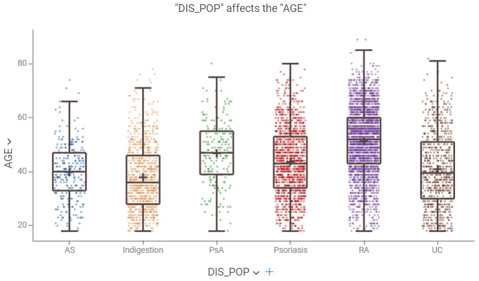

Analysis of variance ([ANOVA](https://en.wikipedia.org/wiki/Analysis_of_variance)) is a technique that can be used to determine whether the examined factor has a significant impact on the studied feature.

## Perform ANOVA

* Open a table
* Run **Top Menu > ML > Analysis of Variances (ANOVA)...**
* Select the source table
* Select `Factor` and `Feature` columns
* Set the significance level `Alpha`
* Set `Normality` and/or `Variances` checks options
* Press **OK**

Datagrok provides blazingly fast results:

## Outputs

### Box plot

The box plot shows the distribution of the feature data splitted with respect to factor levels:

### Summary

The ANOVA summary table presents results of computations:

The decision regarding the significance of the factor's influence on the studied feature is ensured:

See also:

* [Statistical hypothesis testing](https://en.wikipedia.org/wiki/Statistical_hypothesis_testing)
* [One-way ANOVA](https://en.wikipedia.org/wiki/One-way_analysis_of_variance)
* [Box plot](https://datagrok.ai/help/visualize/viewers/box-plot)
