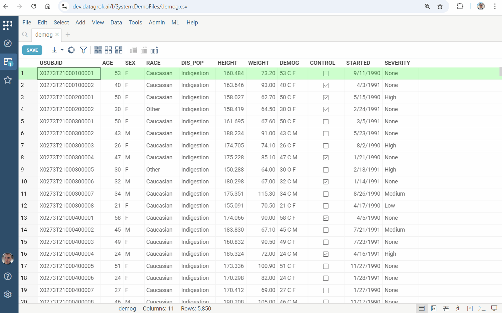

Analysis of variance ([ANOVA](https://en.wikipedia.org/wiki/Analysis_of_variance)) determines whether the examined factor has a significant impact on the studied feature.

## Perform ANOVA

* Open a table
* Run **Top Menu > ML > Analysis of Variances (ANOVA)...**
* Select the source table
* Select `Factor` and `Feature` columns
* Set `Significance` and `Validate` check option
* Press **OK**

The following analysis appears:

## Outputs

### Box plot

The box plot shows the distribution of values by categories:

### Summary

The ANOVA summary table presents results of computations:

The null hypothesis is rejected if the p-value is smaller than the specified significance.

See also:

* [Statistical hypothesis testing](https://en.wikipedia.org/wiki/Statistical_hypothesis_testing)
* [One-way ANOVA](https://en.wikipedia.org/wiki/One-way_analysis_of_variance)
* [Box plot](https://datagrok.ai/help/visualize/viewers/box-plot)
