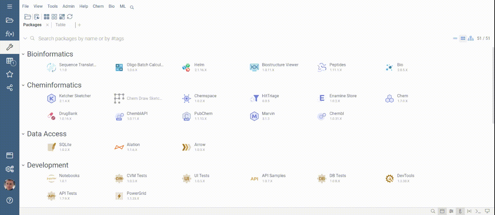

Dimensionality reduction is an unsupervised machine learning (ML) technique that reduces the number of features in a dataset while preserving its meaningful structure and relationships.

## PCA

Principal Component Analysis (PCA) captures the most significant patterns in the data by transforming it into a new coordinate system to maximize variance along orthogonal axes.

* Open a table
* Run **Top Menu > ML > PCA...**
* Select the source table and `Feature` columns
* Set the number of principal `Components`
* Set `Center` and/or `Scale` data pre-processing options
* Press **OK**

Datagrok ensures blazingly fast computations:

See also:

* [PCA](https://en.wikipedia.org/wiki/Principal_component_analysis)

## UMAP

Uniform Manifold Approximation and Projection (UMAP) is a nonlinear method for mapping high-dimensional data to a lower-dimensional space preserving its global and local structures.

* Open a table
* Run **Top Menu > ML > UMAP...**
* Select the source table and `Feature` columns
* Set `Hyperparameters` and press **OK**

Use [scatter plot](https://datagrok.ai/help/visualize/viewers/scatter-plot) and/or [3D scatter plot](https://datagrok.ai/help/visualize/viewers/3d-scatter-plot) to visualize results:

See also:

* [UMAP](https://arxiv.org/abs/1802.03426)

## t-SNE

t-distributed stochastic neighbor embedding (t-SNE) reveals the underlying complex data structure by representing its similar points as nearby neighbors in a lower-dimensional space.

* Open a table
* Run **Top Menu > ML > t-SNE...**
* Select the source table and `Feature` columns
* Set `Hyperparameters` and press **OK**

See also:

* [t-SNE](https://en.wikipedia.org/wiki/T-distributed_stochastic_neighbor_embedding)

## SPE

Stochastic proximity embedding (SPE) is a self-organizing method that produces meaningful underlying dimensions from proximity data.

* Open a table
* Run **Top Menu > ML > SPE...**
* Select the source table and `Feature` columns
* Set `Hyperparameters` and press **OK**

See also:

* [SPE](https://onlinelibrary.wiley.com/doi/10.1002/jcc.10234)
