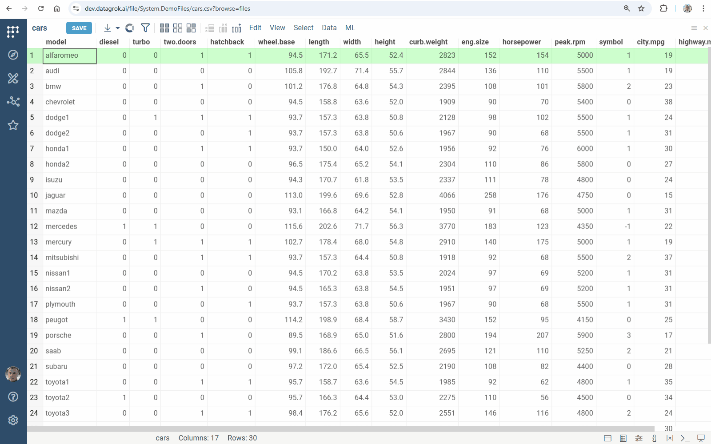
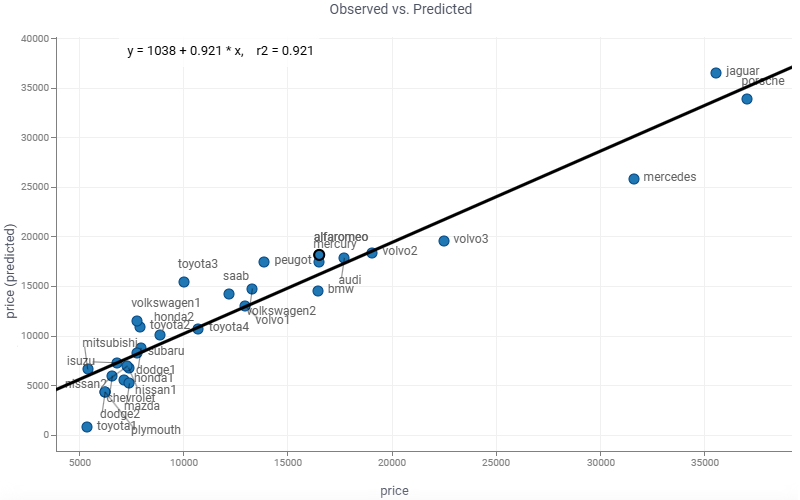
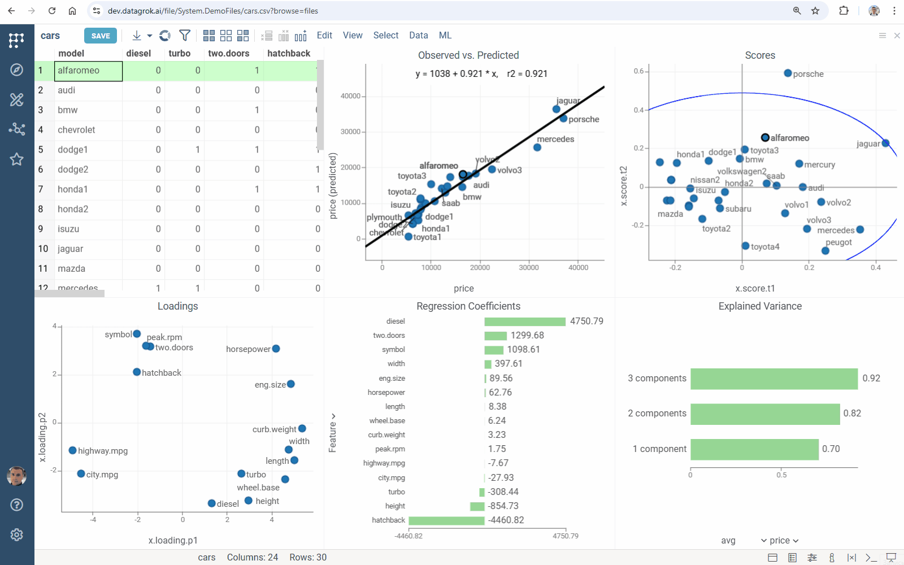
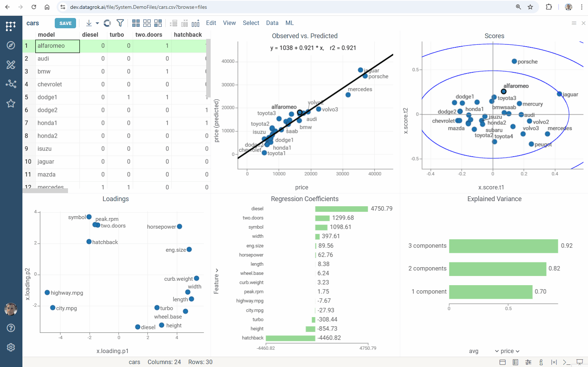
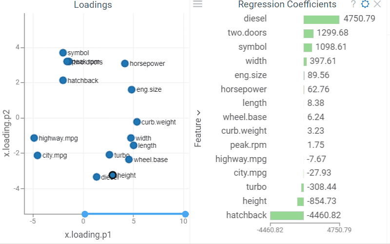
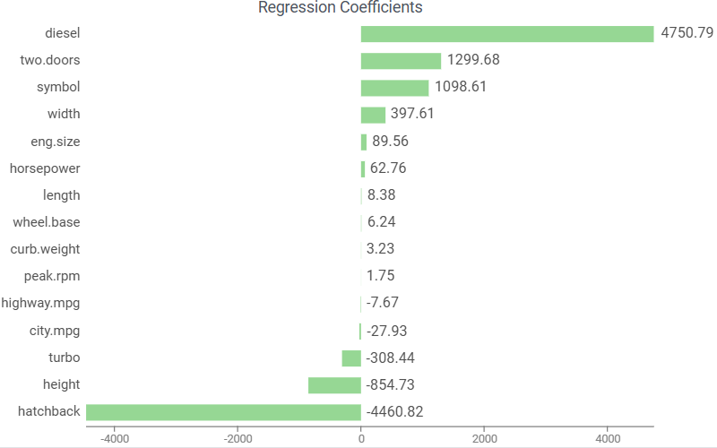
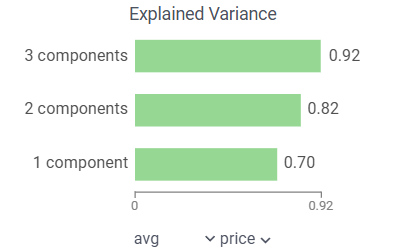
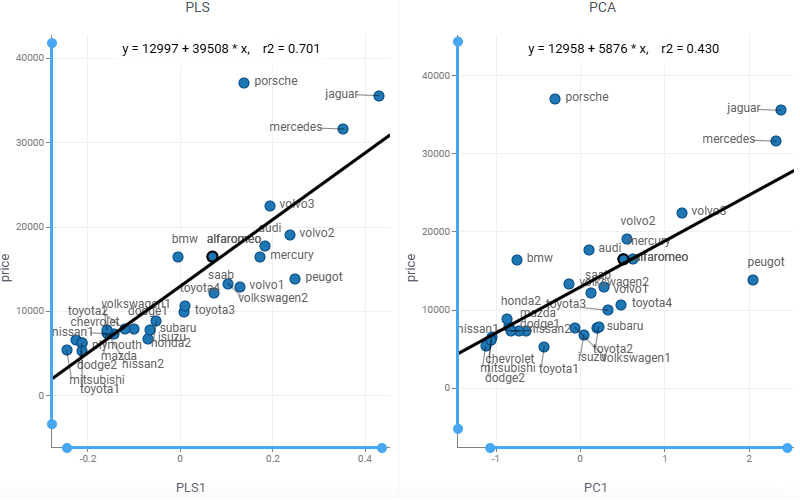

Multivariate analysis (MVA) is based on the statistical principle of multivariate statistics, which involves observation
and analysis of more than one statistical outcome variable at a time.

Partial least squares regression ([PLS regression](https://en.wikipedia.org/wiki/Partial_least_squares_regression)) is a particular type of MVA. PLS provides quantitative multivariate modelling methods, with inferential possibilities similar to multiple regression, t-tests and ANOVA. It constructs linear model using **latent factors** that

* maximally summarize the variation of the predictors
* maximize correlation with the response variable.

## Regress and analyze

1. Open a table.
2. On the Top Menu, select `ML | Analyze | Multivariate Analysis...`. A dialog opens.
3. In the dialog, specify
   * the column with response variable (in the `Predict` field)
   * the columns with the predictors (in the `Using` field)
   * the number of `Components`, i.e. latent factors
   * `Names` of data samples
4. Press `Run` to execute. You get
   * the [Observed vs. Predicted](#observed-vs-predicted) scatterplot comparing the response to its prediction
   * the [Scores](#scores) scatterplot reflecting data samples similarities and dissimilarities
   * the [Loadings](#loadings) scatterplot indicating the impact of each feature on the latent factors
   * the [Regression Coefficients](#regression-coefficients) bar chart presenting parameters of the obtained linear model 
   * the [Explained Variance](#explained-variance) bar chart measuring how well the latent factors fit source data

### Observed vs. Predicted

The **Observed vs. Predicted** scatterplot compares the response variable to its prediction. The [coefficient of determination](https://en.wikipedia.org/wiki/Coefficient_of_determination) `r2` indicates the goodness of fit:

Combine it with the [Scores](#scores) scatterplot to explore data samples:

### Scores

The **Scores** scatterplot shows the values of the latent factors for each observation in the dataset:

* the predictors (T-scores)
* the response variable (U-scores).

It indicates correlations between observations (how observations related to each other, occurrence groups or trends).

Combine it with the [Observed vs. Predicted](#observed-vs-predicted) scatterplot to explore data samples:

### Loadings

The **Loadings** scatterplot visually represents the influence of each feature on the latent factors: high loadings indicate a strong influence.

Use it in combination with the [Regression Coefficients](#regression-coefficients) bar chart to explore features:

### Regression coefficients

The **Regression Coefficients** bar chart presents parameters of the obtained linear model (used with the original data scale):

Combine it with the [Loadings](#loadings) scatterplot to explore features:

### Explained variance

The **Explained Variance** bar chart shows the explained variance of variables by PLS-components, cumulative sum by each of components.

Use it to explore how well the latent components fit source data: closer to one means better fit.

## PLS components

Compute the predictors representation by the latent factors:

1. Open a table.
2. On the Top Menu, select `ML | Analyze | PLS...`. A dialog opens.
3. In the dialog, specify
   * the column with response variable (in the `Predict` field)
   * the columns with the predictors (in the `Using` field)
   * the number of `Components`, i.e. latent factors

PLS components contain more predictive information than ones provided by principal component analysis ([PCA](https://datagrok.ai/help/explore/dim-reduction#pca)). The [coefficient of determination](https://en.wikipedia.org/wiki/Coefficient_of_determination) `r2` indicates this:

## See also

* [Dimensionality reduction](dim-reduction.md)
* [Analysis of variances](anova.md)
* [Tutorial](https://public.datagrok.ai/apps/tutorials/Tutorials/MachineLearning/MultivariateAnalysis)
