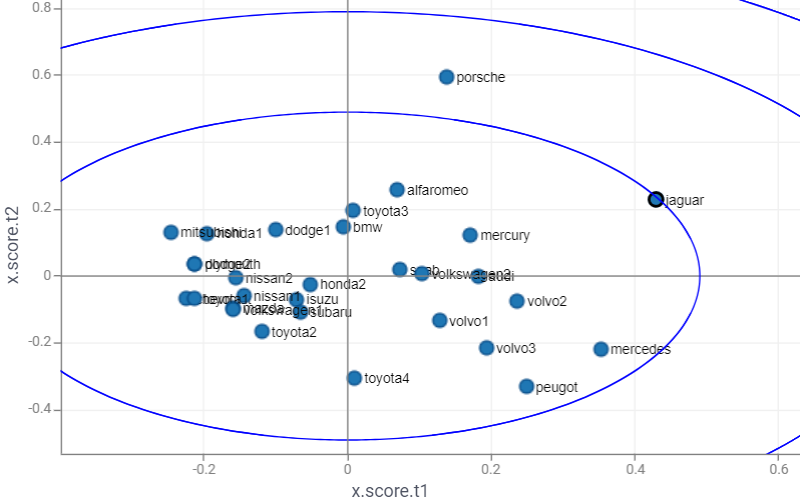

Multivariate analysis (MVA) is based on the statistical principle of multivariate statistics, which involves observation
and analysis of more than one statistical outcome variable at a time.

Partial least squares regression (PLS regression) is a particular type of MVA. PLS provides quantitative multivariate modelling methods, with inferential possibilities similar to multiple regression, t-tests and ANOVA. It reduces the predictors to a smaller set of uncorrelated components and performes least squares regression on these components.

## Regress and analyse

* Open a table
* Run from the top menu: `ML | Analyze | Multivariate Analysis...`
* Select a table that contains features
* Select feature columns
* Select column with sample names
* Select prediction column
* Select the number of extracted PLS components
* Press OK

## Outputs

### Loadings

The loadings plot shows correlations between variables. Comparing the correlation loadings to the scores shows how the variables relate to the observations.

### Reference vs. predicted

A scatter plot and a regression line indicate how the model fits and predicts.

### Scores

The scores plot shows object similarities and disasimilarities.

### Regression coefficients

A bar chart illustrates features influence on the predicted value.

See also:

* [Multivariate analysis](https://en.wikipedia.org/wiki/Multivariate_analysis)
* [Partial Least Squares (PLS)](https://en.wikipedia.org/wiki/Partial_least_squares_regression)
