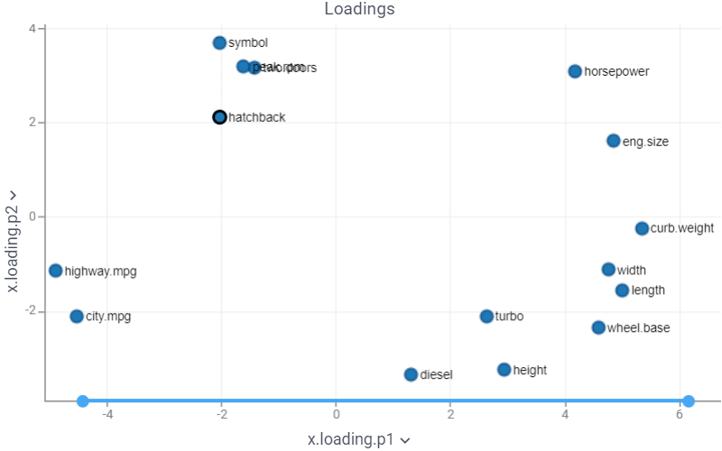

Multivariate analysis (MVA) is based on the statistical principle of multivariate statistics, which involves observation
and analysis of more than one statistical outcome variable at a time.

Partial least squares regression ([PLS regression](https://en.wikipedia.org/wiki/Partial_least_squares_regression)) is a particular type of MVA. PLS provides quantitative multivariate modelling methods, with inferential possibilities similar to multiple regression, t-tests and ANOVA. It constructs linear model using latent factors that

* maximally summarize the variation of the predictors
* maximize correlation with the response variable.

## Regress and analyze

1. Open a table.
2. On the Top Menu, select `ML | Analyze | Multivariate Analysis...`. A dialog opens.
3. In the dialog, specify
   * the column with responce variable (in the `Predict` field)
   * the columns with the predictors (in the `Using` field)
   * the number of `Components`, i.e. latent factors
   * `Names` of data samples
4. Press `Run` to execute. You get
   * the [Observed vs. Predicted](https://datagrok.ai/help/explore/multivariate-analysis/plots/predicted-vs-reference) scatterplot comparing the responce to its prediction
   * the [Regression Coefficients](https://datagrok.ai/help/explore/multivariate-analysis/plots/regression-coefficients) bar chart presenting parameters of the obtained linear model
   * the [Loadings](https://datagrok.ai/help/explore/multivariate-analysis/plots/loadings) scatterplot indicating the impact of each feature on the latent factors
   * the [Scores](https://datagrok.ai/help/explore/multivariate-analysis/plots/scores) scatterplot showing data samples similarities/dissimilarities
   * the [Explained Variance](https://datagrok.ai/help/explore/multivariate-analysis/plots/explained-variance) bar chart measuring how well the latent factors fit source data

## PLS components

## Outputs

### Loadings

The loadings plot shows correlations between variables. Comparing the correlation loadings to the scores shows how the variables relate to the observations.

### Reference vs. predicted

A scatter plot and a regression line indicate how the model fits and predicts.

### Scores

The scores plot shows object similarities and dissimilarities.

### Regression coefficients

A bar chart illustrates features influence on the predicted value.

See also:

* [Multivariate analysis](https://en.wikipedia.org/wiki/Multivariate_analysis)
* [Partial Least Squares (PLS)](https://en.wikipedia.org/wiki/Partial_least_squares_regression)
