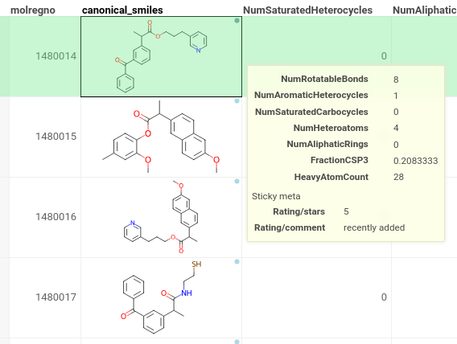
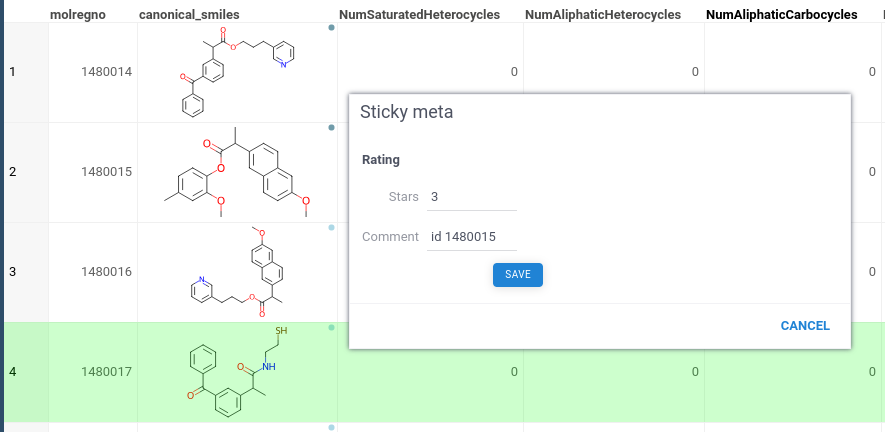
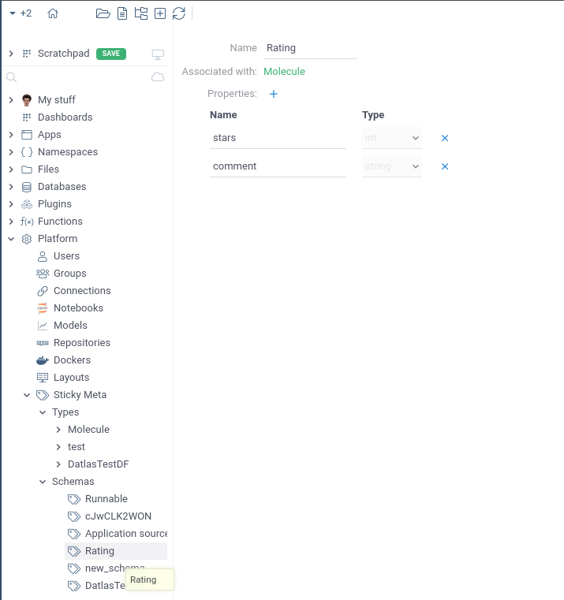

Sticky meta is a powerfull feature that allows to access some information, that is linked to given data across all the datagrok platform.

For instance, you might work with molecule datasets, where molecules are written in SMILES notation. You can add a sticky meta parameter for a molecule, and it will be fetched across all the datasets. You will be able to use this data just as another column: filter sticky meta, assign new values and share them between projects. The magic happens behind the scenes: sticky meta values are automatically synced and stored on server-side.

## Sticky cells

If there is a cell with a special indicator opened in table viewer, it is possible to add sticky values to it. Just right-click the cell, select Sticky meta, and set sticky values you need. These values are assigned to this cell content and are accessible all over the platform.

||||
|:--:|:--:|:--:|
|  |  |  |

## Sticky columns

While working with table that has objects, that can storre sticky meta, sticky values can be exported into columns. Updates done in these columns will directly update sticky meta assigned to object in corresponding row. You can edit multiple values with Batch Edit as well.

## Other system objects

You can add Schemas to any Datagrok object: Function, Notebook, or Data Connection. Just add their type to desired schema.

## Configuring Sticky meta

To specify values, that can be attached to object, see "Platform/Sticky Meta" section. It has configutration of schemas and types, that Datagrok detects in dataframes.

Schema is a set of typed properties and a set of object descriptors these properties are associated with. These object descriptors are called Entity Types. Entity type has a name and a set of tags that object should have. After that is specified, any column, that matches specified set of tags, will have it cells attached to Sticky meta schema

|||
|:--:|:--:|
| | |

## Associating objects with sticky meta 

Different entities for sticky meta are identified differently. System entities are identified using their ID. Rest of entities, that you reference in dataframe, are identified through their handle, which is a string value of a column, passed through canonicalizer.

