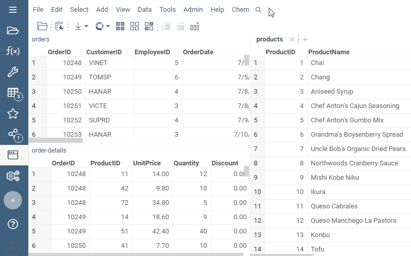

You can link tables based on the key columns. The link type determines which records should be synchronized between the
datasets (current record, filter, selection, and mouse-over record). 

We support the following link types:

* **Current row:** to row, to selection, to filter
* **Mouse-over row:** to selection, to filter
* **Filter:** to filter, to selection
* **Selection:** to filter, to selection.

The value on the left (for the first table) is the synchronization source (to be changed by the user).
The values on the right (for the second table) determines what gets synchronized as a response to user actions.

For example, "current row to filter" means that changing of the current row in the first table triggers
filtering of the second table. Rows in the second table with the key column values differing from
current row's key column values will get filtered out. This sort of link enables a simple
master-details browsing. Current row in the first table controls the filter in the second one.

In a more complex case, you can establish links using set operations, for instance "selection to filter".
This means that all records of the second table, except for those that correspond to the
selected rows in the main table, will be filtered out. Selection in the first table
controls the filter in the second one.

You can create chains of links, where a change in the first table would trigger a cascade of
synchronizations. In the following example, we are establishing two links:

* "order" to "order-details" on the "OrderID" columns, using `row to filter`
* "order-details" to "products" on the "ProductID columns, using `filter to filter`

When you click on a row in "orders", this filters the "order-details" table, which in turns
filters the "product" tables. In the end, when you click on the order above you see corresponding
rows on the "order-details" and "products" level.

See also:

* [JavaScript API Samples: Linking Tables](https://public.datagrok.ai/js/samples/data-frame/link-tables)
* [Join tables](../transform/join-tables.md)
