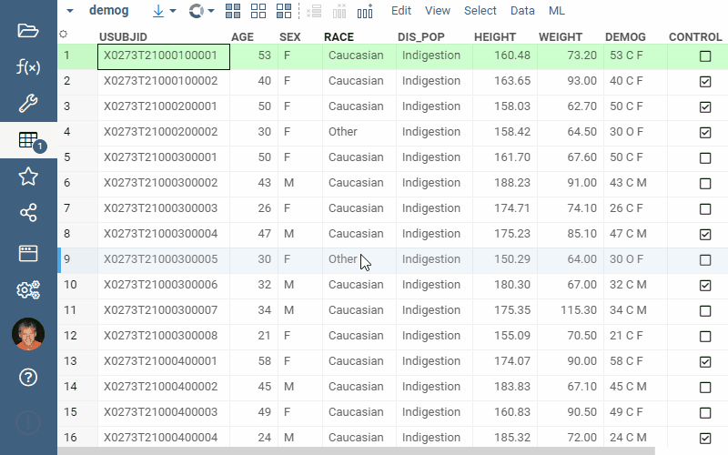

## Layouts

View Layout contains relative positions of viewers in
a [table view](../../datagroknavigation/views/table-view.md), along with the viewers' properties. By separating layouts from the actual
data displayed, it's possible to save current layout (**View | Layout | Save to Gallery**) and later apply it to a
different dataset
(**View | Layout | Open Gallery**). 
Saved layouts that are [applicable](../view-layout.md#layout-applicability) to the current table are shown in the 
"Layouts" pane, see picture below.

To clone current view, either do **View | Layout | Clone**, or click on the plus sign on the view header strip, and
choose **Clone**.

To save a layout and then apply it to a different dataset:
1. Open a dataset
2. Add viewers, arrange them, and customize the way you want
3. Click View | Layout | Save to gallery to save the layout on a server (or View | Layout | Download to save locally)
4. Open another dataset with similar columns
5. Click View | Layout | Open Gallery and select a layout saved in step 3. Or, in case you saved it locally at step 3, drag-and-drop the layout file to the view.

----CHECK ABOVE -----

View Layout contains relative positions of [viewers](../visualize/viewers/viewers.md) in
a [table view](../datagroknavigation/views/table-view.md), along with the viewers' properties. By separating layouts from the actual
data displayed, we now can save current layout (**View | Layout | Save to Gallery**)
and later apply it to a different dataset
(**View | Layout | Open Gallery**).

To clone current view, either do **View | Layout | Clone**, or click on the plus sign on the view header strip, and
choose **Clone**.

:::note developers: DataFrame-synchronized tags
Sometimes, you want presentation-related tags (such as color coding) to be defined on a table level so
that all derived table views will pick it. In such cases, these tags need to be saved as part of the layout.
When such layout is applied, these tags are re-applied back to table/column tags. 
Such a tag should start with "%", i.e. "%myColorCoding".
:::

## Viewer layout

Similarly to view layout, it is possible to reuse the settings of individual [viewers](../visualize/viewers/viewers.md).
Under
the 'Viewer' menu (either right-click on the viewer, or click on the 'hamburger' menu on the top left), you will find
the following layout-specific commands:

* Clone
* Save to Gallery

To open a gallery containing viewer and view layout suggestions: **View | Layout | Open Gallery**

### Layout suggestions

Moreover, the platform will proactively suggest layouts (even created by other users) to be applied to your data, if a
previously saved layout can be used for visualizing currently opened dataset. The suggestions are based on
the [layout applicability](#layout-applicability), popularity and specificity of the layout, as well as on the
previously observed actions.

To check layouts applicable to the current table, open 'Layouts' pane on the left. Alternatively, open the specialized
view/viewer layout suggestion panel: **View | Layout | Open Gallery**

### Layout applicability

When a view layout is saved, the visual arrangement of the viewers along with the metadata of the layout data columns (
columns selected on viewers, such as "X" column on a scatter plot) gets saved. Metadata includes column name, type,
semantic type, and other metadata.

To determine whether a view layout is applicable to a particular table, the platform checks whether all layout data
columns could be mapped to the table columns. There are few different ways a layout column gets mapped to the table
column, which are evaluated in the following order:

1. Column names AND column types match
2. Both columns have the same [layout-id](../govern/catalog/tags.md#layout-id)
3. Both columns have the same [semantic type](../govern/catalog/tags.md#quality)

See also:

* [Table view](../datagroknavigation/views/table-view.md)
* [Self-learning platform](../govern/catalog/self-learning-platform.md)
