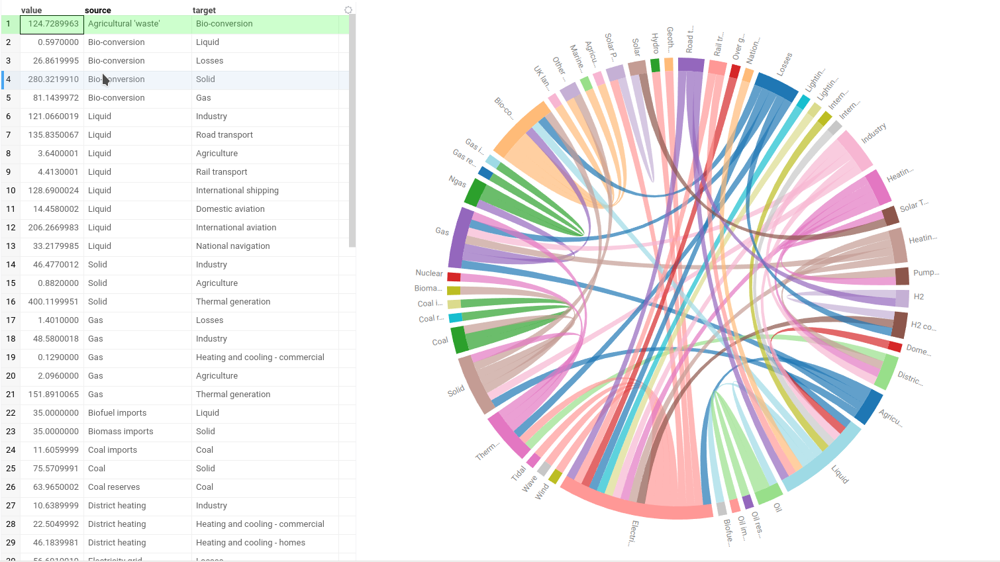

A chord diagram is a graphical method of displaying the inter-relationships
between data.
You can use it to visualize complex networks or flows between
different entities.
Chrod diagram arranges data radially around a circle and draws the flows
between the data points as arcs connecting the data.
The chord width represents the strength of the flow
between the entities.

## Creating a Chord viewer

To create a **Chord** viewer, navigate to the **Main Menu**
and select **Add > Javascript Viewers > Chord**.

> Developers: To add the viewer from the console, use:
`grok.shell.tv.addViewer('Chord')`

When you add a chord viewer in Datagrok, the platform selects three columns:

* A categorical "From" column
* A categorical "To" column
* A numeric "Chord length" column representing the flow strength between source
and target categories.

Datagrok uses several heuristic rules to select the most appropriate columns.
Both "From" and "To" columns should contain same categorical values.
Additionally, Datagrok can utilize column names
such as "source," "target," and "value" as hints to identify appropriate columns.

## Configuring a Chord viewer

You can set the "Source," "Target," and "Chord length" columns,
and customize visualization options.
To do that, click the **Gear** icon on top of the viewer and use the **Data**
and **Misc** info pane
on the **Context Panel** to manage the viewer's settings.

For example, you can:

* Select the aggregation type for connections via **Agg type** control.
The possible modes are to count the connections or to sum the "Chord length" values.
* Set the connection color mode by source or by target via **Color by** control.
* Change the sorting order of the categories via **Sort by** control.
* Set the direction of categories via **Direction** option.
* Show or hide categories without connections by selecting **Include nulls** checkbox.

## Interaction with other viewers

The **chord** viewer responds to data filters but row selection is limited.
Clicking a connection or category in the viewer selects
the corresponding rows in the grid.
However, selecting rows in the grid or other viewers
doesn't impact the representation of the chord viewer.

## Viewer controls

| Action                                                  | Control                            |
|---------------------------------------------------------|------------------------------------|
| Select all rows containing the category                 | Click the category                 |
| Select row containing connection between two categories | Click on the connection            |
| Add connection/category to selection                    | Shift+click the connection/category|
| Toggle connection/category selection                    | Ctrl+click the connection/category |

## See also

* [Viewers](../viewers/viewers.md)
* [Network viewer](network-diagram.md)
* Sankey viewer
