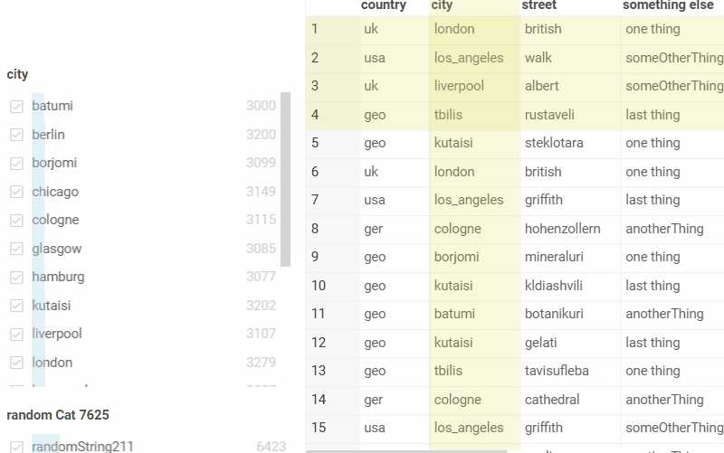
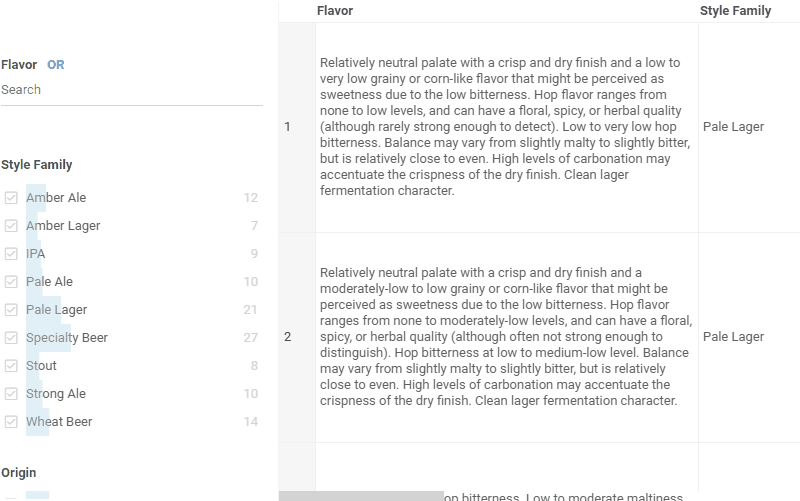
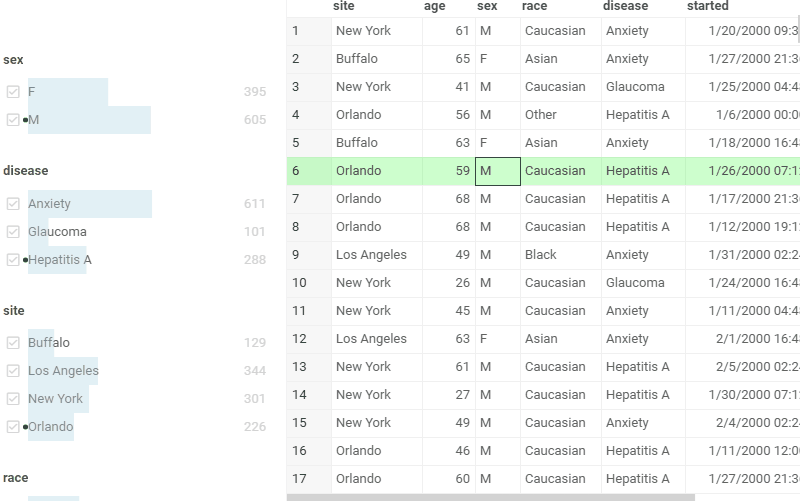
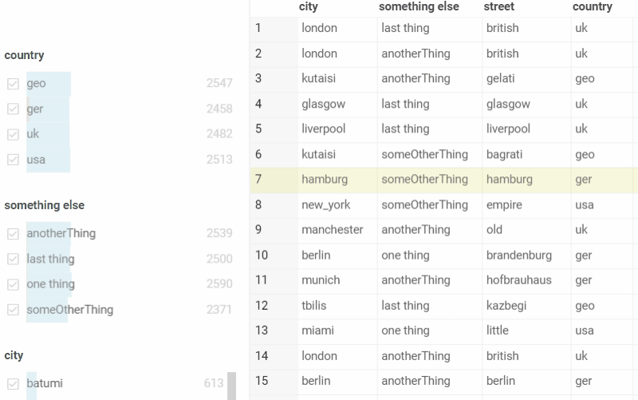
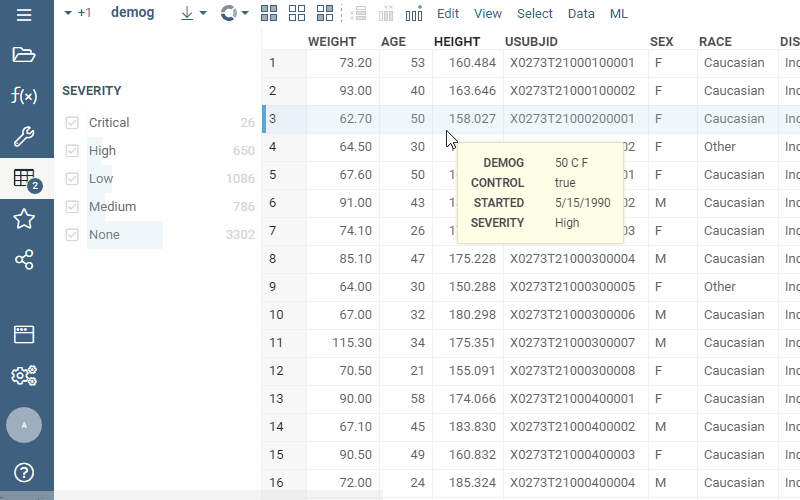

A set of controls for quick filtering, selection, and visual assessment of column values.

General:

|                   |                         |
|-------------------|-------------------------|
| 1st column click  | Toggle filter           |
| 2nd column click  | Toggle selection        |
| Name column click | Filter by that category |
| Up / down         | Filter by that category |
| Esc               | Reset filter            |


## Search

Each categorical filter group has a search field for filtered values. Click the Search icon to the right of the filter
caption to open it. This icon appears when you hover the mouse over the filter.

If you start typing text in the field, the filter will show all values that partially contain this text. But if you are
typing words, separating them with a comma, then the filter will show only those values that exactly match each other.

It is also allowed to paste multi-line text from the clipboard into the search field. In this case, the filter will also
display those values that exactly match each word. The checkbox on the left of the search field controls weather to select
filtered out values only. If this checkbox is enabled, upon searching for value(or values), filter will automatically select
only those values that match the search criteria. In contrary case if the checkbox is disabled, search will only filter out values
and not select them.



## Text filter

This filter is used for fuzzy searching for the specified search terms, and applies to string columns that 
have the "Text" semantic type.

To add a search term, enter it in the search box, and press Enter. Use the checkboxes and the "and/or"
switch to control search results. And/Or switch is used to control the logical operation between the search terms.
To control the fuzzynes of the search, use the slider at the bottom of the search box. By default, the fuzzynes value is set to 0, which corresponds to the exact match. The higher the fuzzynes value, the more fuzzy the search will be. All the exact matches from the filter will be highilghted in the column values.



## Expression filter

Expression filter lets you create custom search terms for any column. These terms are in the form of `column name` `operation` `value`. The following operations are supported:

* numerical columns: `none`, `=`, `!=`, `>`, `<`, `>=`, `\<=`, `in`, `not in`, `-`, `is null`, `is not null`
  * `age > 40`
  * `height is null`
* string columns: `none`, `contains`, `starts with`, `ends with`, `equals`, `!=`, `regex`, `in`, `not in`, `is null`, `is not null`
  * `race contains sian`  // Asian, Caucasian
  * `race starts with B`
  * `race in (Black, Asian)`
  * `race regex ck$`
* datetime columns: `none`, `equals`, `before`, `after`, `range`, `is null`, `is not null`
  * `started after 7/1/1991`
  * `started `
* bool columns: `true`, `false`

In the filter, you can choose the column, choose available operation and value. To add expressions you can click the `+` button, or press enter.
Similarly to the text filter, you can control the logical operation between the expressions by using the `and/or` switch. In case of string columns, exact matches to the query will be highlighted in the column values.



### Free-text filter mode

To switch the expression filter to free-text mode, click the `Free text` icon on the filter. In this mode, you can enter custom search terms in a text form. The filter will parse the text and create expressions based on the entered search terms. It is also possible to use logical conditions to combine simple expressions, for example:

* `age > 30 and height > 190`
* `age > 30 and sex = F`

In case if column name contains spaces, you can put the column name inside of escape sequence:

* `${column name with spaces} contains someString`


## Hierarchical filter

A hierarchical filter organizes column values in a tree-like structure. This filter is used for columns that have categories. For example, if the dataset contains two columns, _Sex_ and _Name_, the hierarchical filter shows the values of the _Name_ column grouped by sex categories, and each category or sub-category can be expanded, collapsed, turned on or off.

The hierarchical filter can be added from the filters hamburger menu. After the filter is added, it detects existing hierarchies based on the values (for example `Country`, `City`, `Street`). 

* To rearrange, add or remove columns, click on the 'tree' icon in the filter, enable needed columns and arrange them in the desired order.
* To navigate around the categories/subcategories, you can use your mouse or up/down arrows.
* To expand/collapse the categories, click on the `>` icon on the left of the category name or use the right/left arrow buttons.
* To toggle the category, click on the checkbox on the left of the category name or use the space bar.
* To enable only one subcategory, double-click or press enter.
* To select the corresponding category/subcategory, click the corresponding count number (same as in categorical filter).
* The green and gray indicator circles to the left of category name show the current and mouse over row of the dataframe respectively. 



## Combined boolean filter

Combined boolean filter (or Flags filter) combines multiple boolean filters into one. It can be very versatile in cases where there are many boolean columns and individual filters overcrowd the filter panel. When first opening the filters panel, if dataframe contains multiple boolean columns, the combined boolean filter will be automatically created instead of separate filters for each column. Each row of the filter corresponds to a column, and contains two checkboxes, corresponding to the true and false values respectively. Applied filters can be combined using logical 'and' or 'or' operations. Like categorical filter, Flags filter includes all interactivity features, such as mouse over highlighting, selection, current row indicator, etc.

* If both checkboxes are checked in a row, the filter for that row is considered to be inactive. In this case, the value indicator of the row will show the ammount of true values in the column.
* To toggle the filter for particular row, click on the corresponding checkbox.
* To toggle the logical operation between the filters, click on the 'and/or' switch.
* To select the filtered values (true or false) for corresponding column, click the corresponding count number (same as in categorical filter).
* To navigate around the filter columns, you can use your mouse or up/down/left/right arrows.
* The green and gray indicator circles to the left of the row show the current and mouse over row of the dataframe respectively.
* If multiple boolean columns are added to the dataframe (for example by [Categorize](../../transform/categorize-data.md)), the combined boolean filter will be automatically created.


## Column tags

* For **molecular columns**, use the **.structure-filter-type** column tag to
  define filter type:
  * Set **.structure-filter-type** to `Sketch` to use Sketcher for filtering
    molecular columns.
  * Set **.structure-filter-type** to `Categorical` to use molecular column
    values as categories in the filter group.

* For [**multi-value columns**](https://community.datagrok.ai/t/visualization-related-updates/521/12?u=skalkin),
 use the **.multi-value-separator** column tag to
  parse multiple values as separate filter categories. The most common
  separators are `\n`, `,`, `;`.
  <details>
  <summary>Example</summary>
  <pre> t.col('languages').setTag(DG.TAGS.MULTI_VALUE_SEPARATOR, '\n'); </pre>
  
  </details>

* To work with custom filters, use such column tags as `.custom-filter-type` and
  `.ignore-custom-filter`. The `.custom-filter-type` tag contains a custom
  filter name to be used by default for a column. Its value consists of two
  parts: the namespace and the function name (`<PackageName>:<FilterType>`,
  e.g., `Chem:substructureFilter`). Use the `.ignore-custom-filter` tag to
  control custom filters visibility. If both tags are used,
  `DG.TAGS.CUSTOM_FILTER_TYPE` takes precedence over
  `DG.TAGS.IGNORE_CUSTOM_FILTER`.

To set the column tag value via the UI:

1. Right-click the column's header and select **Column Properties** from the
   context menu. A dialog with column metadata opens.
1. In the dialog, use the **Plus** icon to add a new tag.
1. Enter the tag name and value.
1. Click **OK** to save changes.

To set the column tag value programmatically:

```javascript
column.tags[DG.TAGS.STRUCTURE_FILTER_TYPE] = 'Categorical';
```

## Drag-and-drop

Drag-and-drop columns right from the grid to add the corresponding filters:



See also:

* [Viewers](../viewers/viewers.md)
* [Table View](../../datagrok/navigation/views/table-view.md)
* [JS API: Filters](https://public.datagrok.ai/js/samples/ui/viewers/types/filters)
