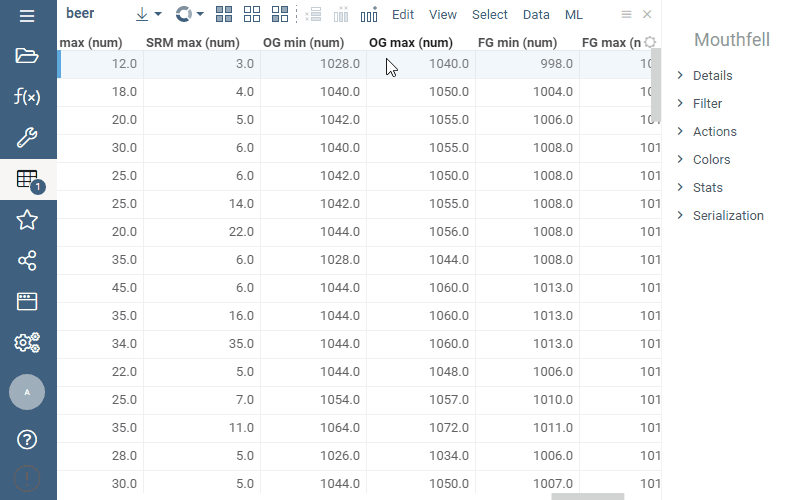
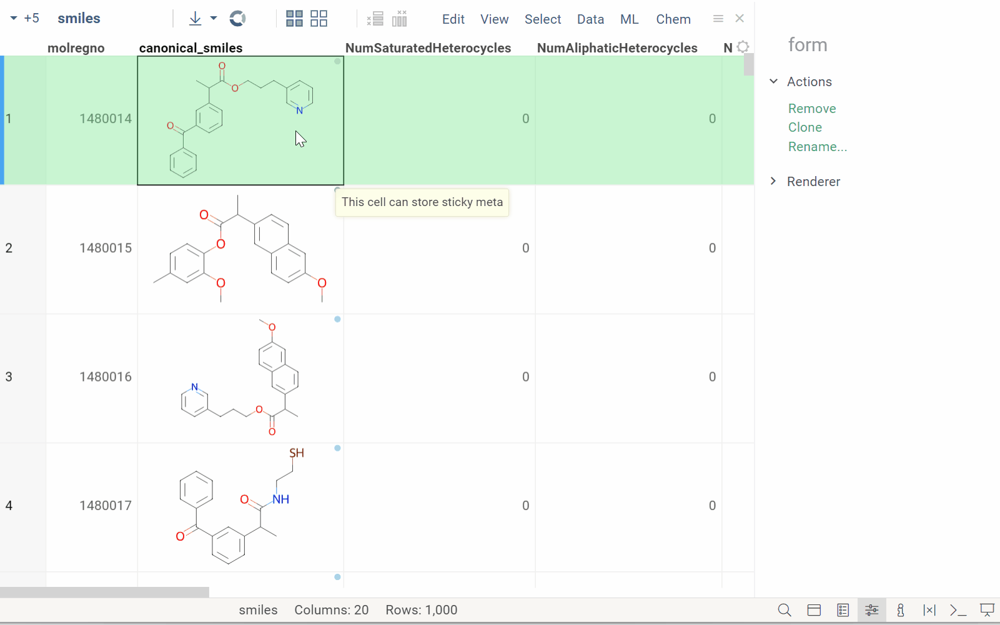
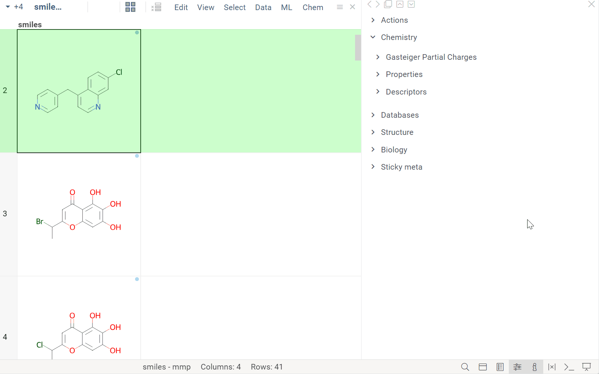
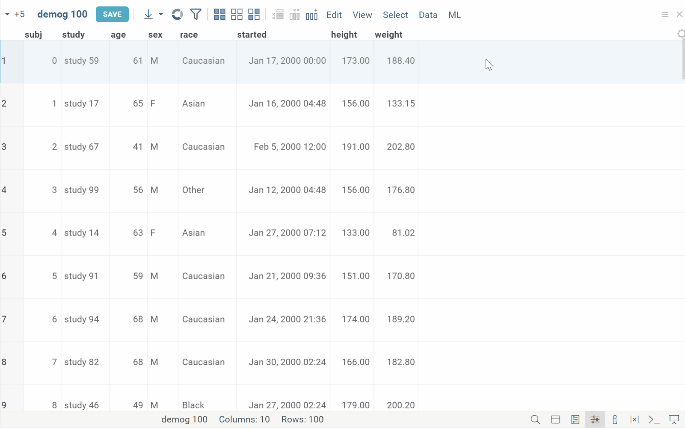
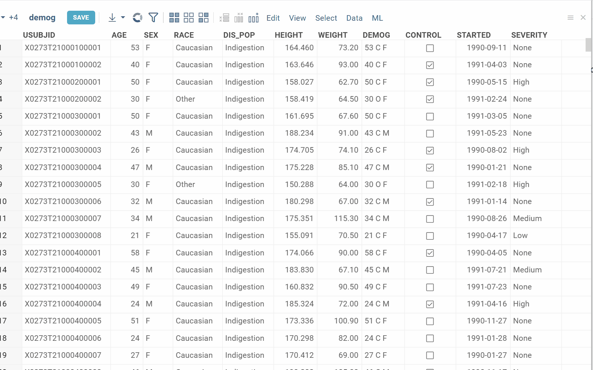
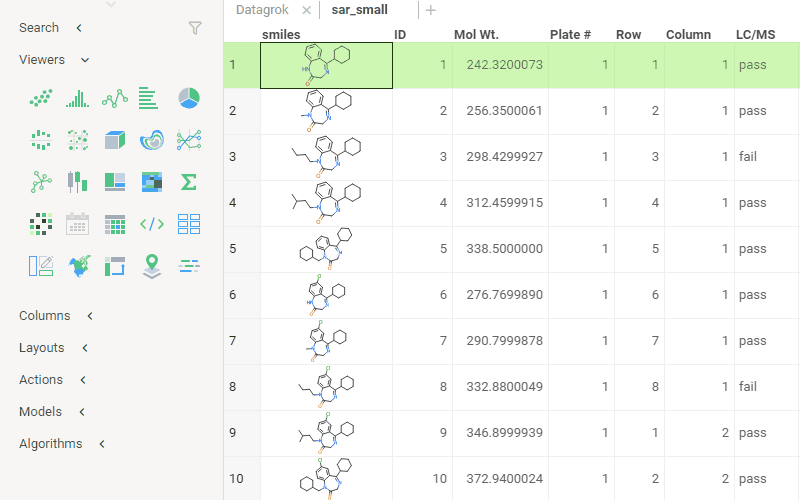
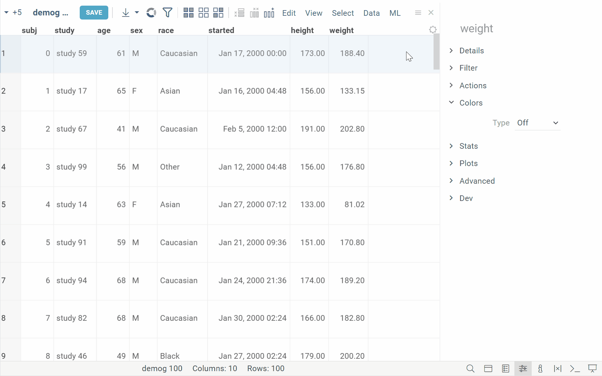
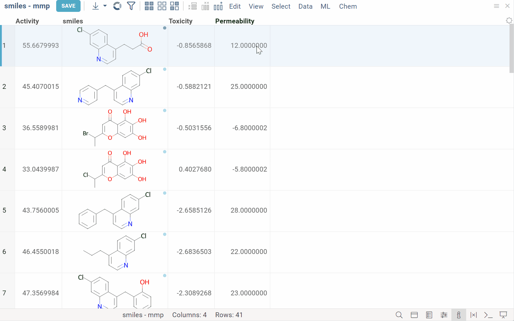

```mdx-code-block
import Tabs from '@theme/Tabs';
import TabItem from '@theme/TabItem';
```

Grid is a [viewer](viewers.md) for tabular data. It's like Excel on steroids.

:::note

Certain features and functionalities described in this article are part of the [PowerGrid package](https://github.com/datagrok-ai/public/blob/master/packages/PowerGrid/README.md). For a complete experience, we recommend installation.

:::

:::note developers

<!--To edit column permissions, use:
`table.col('myColumn').tags['editableBy'] = "username"`. <br/>-->
[Learn how to customize the grid programmatically](../../develop/how-to/customize-grid.md)

:::

## Controls

|                                       |                                 |
|---------------------------------------|---------------------------------|
|<h4>**Select**</h4>        ||
|Select rows                            | Shift+Mouse Drag                |
|Deselect rows                          | Ctrl+Shift+Mouse Drag           |
|Select columns                         | Mouse Drag rows                 |
|Select columns                         | Shift+drag column headers       |
|Select columns                         | Ctrl+click column headers       |
|Deselect columns                       | Ctrl+Shift+click column headers |
|(De)select rows                        | (Ctrl+) Shift + ↑↓              |
|(De)select columns                     | (Ctrl+) Shift + ←→              |
|(De)select rows                        | (Ctrl+) Shift + mouse-drag      |
|(De)Select rows with the current value | (Ctrl+) Shift + ENTER           |
|Select rows above current              | Ctrl + Shift + Home             |
|Select rows below current              | Ctrl + Shift + End              |
| Toggle row selection                  | <kbd>Spacebar</kbd>             |
|<h4>**Navigate**</h4>        ||
|Up, Down, Left, Right                   | Navigate                        |
|Page Up, Page Down                      | Navigate                        |
|Ctrl+Home                               | Jump to first row               |
|Ctrl+End                                | Jump to last row                |
|Home                                    | Jump to first column            |
|End                                     | Jump to last column             |
|Ctrl+UP / DOWN                          | Prev / next selected row        |
|Alt+F                                   | Show in full screen             |
|<h4>**Sort**</h4>||
| Sort a column                          | Double-click column header      |
| Sort current column                    | Ctrl+Shift+UP                   |
|<h4>**Edit**</h4>||
| Edit cell                              | Double-click                    |
| Copy cell value                        | Ctrl+C                          |
| Paste into cell                        | Ctrl+V                          |
| Invert column selection                | Ctrl+click                      |
| Add a row (requires `Allow Edit` set to `true`) | Enter or click the **plus** **(+)** icon in the bottom row |
| Undo                                   | Ctrl+Z                          |
| Redo                                   | Ctrl+Shift+Z                    |
| Delete selected rows and/or columns    | Shift+Del                       |
|<h4>**Resize and reorder**</h4>||
| Reorder columns   | Drag the column header.<br/>Selected columns are repositioned simultaneously next to each other   |
| Resize columns                 | Drag the right border of the column header.<br/>Selected columns are resized simultaneously      |
| Resize row height              | Drag the border of the row header     |
|<h4>**Column properties**</h4>||
| Open                           | <kbd>F2</kbd>                   |

## Rows and columns

You can access available options for rows, columns, and cells in a number of ways:

* From an object's context menu (right-click to open)
* From the **Top Menu** options and icons
* For the current object, from the [Context Panel](link)
* For columns, by clicking the **Hamburger** **(≡)** icon (hover over the column's header to display)

From there, you can [change the cell format](#format-cells), [color code a column](#color-code-columns), [pin rows](#pin-rows-and-columns), and do more. For shortcuts, see [Controls](#controls).

### Rows

Grid rows have different states: 

* Selected (highlighted in orange)
* MouseOver (on hover, highlighted in light blue)
* Current (click or navigate using the up **(↑)** and down **(↓)** keys, highlighted in green). 
* Filtered

These states are synchronized with other viewers, making it easy to explore your
data. For example, moving between rows in the grid updates both the current
molecule on a scatterplot and similar molecules in the 
[similarity viewer](../../datagrok/solutions/domains/chem/chem.md#similarity-and-diversity-search).
The same works in reverse. Clicking a molecule on a scatterplot or a similarity
viewer updates the current row in all other viewers, including grid. 

To further aid with data exploration, the **Context Panel** dynamically updates
to show [info panes](../../explore/data-augmentation/info-panels.md) specific to
the current molecule.


### Columns

Unlike Excel, cells within a grid column are assigned one of the
predefined data types: `string`, `int`, `bigint`, `qnum`, `double`, `datetime`,
or `bool`. Additionally, a column may have [tags](../../govern/catalog/tags.md), a 
[semantic type](../../govern/catalog/semantic-types.md) (e.g., `Molecule`), and an 
[entity type](../../govern/catalog/sticky-meta.md#metadata-objects), which lets you
annotate specific data points with custom metadata.

To edit column settings, either right-click the column's header to access
its context menu or click the column's header to display available options
in the **Context Panel**.

Subject to permissions, you can:

* Change the column's properties (e.g., it's data type or [cell renderer](#cell-renderers))
* Customize the column's appearance or behavior (e.g., change the cell's format, color-code values, pin rows, etc.) 
* Specify who can edit a column. Users without edit permissions will receive a notification when attempting to edit a restricted column.

<details>
<summary>Column properties</summary>

| Property         | Description                                        |
|------------------|----------------------------------------------------|
| New name         | New column name                                    |
| Visible          | Allows to hide column                              |
| Is Color Coded   | Enable/Disable column color coding                 |
| Show Value       | Allows to do not show values on color coded column |
| Width            | Column width, in pixels                            |
| Background Color | Background Color, 32 bit integer                   |
| Decimal Places   | Decimal Places                                     |
| Custom Name      | Custom name, original will be saved                |
| Column Name      | Column Name                                        |
| Custom Format    | Custom Format                                      |
| Cell Type        | Cell Type                                          |

  </details>

:::tip tips

<Tabs>
<TabItem value="navigation" label="Navigation">

For quick navigation, preview, or batch actions, use the 
[Column Manager](../../datagrok/navigation/column-manager.md).
To open, on the **Status Bar**, click **Columns:**

<br/>


</TabItem>
<TabItem value="repositioning" label="Repositioning">

To quickly move a column to the beginning or end of your dataset, click the column's header and start dragging. The arrows appear. Drop the column onto an arrow to adjust its position in the spreadsheet.

<br/>



</TabItem>

<TabItem value="profiling" label="Profiling">

For quick profiling, use the **Plots** info pane. Simply select columns, and
their content is automatically visualized in the **Context Panel**.

<br/>


</TabItem>
</Tabs>

:::

## Cells

In addition to displaying a single data point based on its type, a grid cell
may contain the following:

* [Cell renderers](#cell-renderers)
* [Summary columns](#summary-columns)
* [Forms](#forms)
* [Data from linked tables](#data-from-linked-tables)
* [Images](#images)


### Cell renderers

Cell renderers customize how cell data is shown. For instance, molecules in
SMILES notation may be rendered in 2D. For specific semantic types,
such as molecules or URL images, cell renderers are applied automatically. To
apply a cell renderer manually:

1. Right click the column header and select **Column properties...**. A dialog
   opens.
1. In the dialog, set the tag key to `cell.renderer` and the tag value to the
   desired cell renderer  name (e.g., `Tags`). 
  >Note: Some cell renderers <!--(e.g., [MultiChoice](link))  //TODO: New doc: supported-cell-renderers.md--> may require
  >additional parameters. 
1. Click **OK**.

Examples of built-in renderers include molecules, URL based images, fit lines, comboboxes, and more. <!--For the full list, see [Supported cell renderers](../supported-cell-renderers.md).  //TODO: New doc: supported-cell-renderers.md-->

:::note developers

[Create custom cell renderers](../../develop/how-to/custom-cell-renderers.md)

:::


### Summary columns

Summary columns show data from multiple columns within a row. To simply display
data from multiple columns, use _smart forms_. To visualize
numerical data, use _sparklines_.

To add a summary column, right-click any cell, then choose **Add** > **Summary
Columns**, and select your preferred option from the menu.

To change selected columns for the summary column, click its header and choose
the columns you want in the **Context Panel** under **Renderer**.

<Tabs>
<TabItem value="sparklines" label="Sparklines">

Sparklines use charts to visualize numerical values within a row,
offering a quick way to compare rows visually.
Supported summary column types:

* Sparklines
* Bar Chart
* Radar
* Pie Bar Chart
<!--* Markup-->


</TabItem>

<TabItem value="smart-forms" label="Smart forms">

Smart forms show values from multiple columns within a single cell. They inherit
color-coding and [cell renderers](#cell-renderers) from the source columns, and their content
dynamically adjusts to fit the cell size.


</TabItem>
</Tabs>

### Forms

You can design a custom form to show information from multiple columns within a cell.

To add a form:

1. Right-click a cell, select **Add** > **Forms** > **Design a Form...**. This open a [form viewer](forms.md),  where each column name and value is presented as a separate component. 
1. Design your form with clicks and drags.
1. Once done, click the **CLOSE AND APPLY** button to add the form as a column to your dataset.



### Data from linked tables

You can display data from one linked table within another. For example, you may
want to show order details alongside customer orders.

Here's how:

1. [Link the tables](../../transform/link-tables.md).
1. Right click any cell, select **Add** > **Linked Tables**, and choose the table you want. A column with data from the linked table is added to your dataset. 

 

### Images

Datagrok supports two types of images in cells: embedded and linked. Supported formats are .jpg, .png, and .jpeg.

To embed an image, double click a cell and select the source file.


For linked images, Datagrok automatically detects and visualizes images saved as URLs (those starting with "http://" or "https://", and ending with one of the supported image formats) using a [cell renderer](#cell-renderers). 

<details>
<summary>Troubleshooting</summary>

If images are not detected automatically, right-click the column header and select **Column Properties**. This opens a dialog. In the dialog, under **Tags**, set the following parameters:

* `quality` to `ImageUrl`
* `cell.renderer` to `ImageUrl`.

</details>

## Working with data

Subject to permissions, you can [add, delete, or modify records in your dataset](#controls). 
In addition, the **Top Menu** provides multiple options for data
cleaning and transformation. For example, you can
 [add calculated columns](../../transform/add-new-column.md),
[impute missing values](../../transform/missing-values-imputation.md), 
[delete duplicates](../../transform/aggregate-rows.md#), and more.

To learn more about data transformation, visit the 
[Transform](../../transform/transform.md) section of our documentation.

In addition to actions directly on your table's data, you can augment your
dataset with additional information. You have these options:

* Use built in tools from the **Top Menu**. For example, for molecules, you can add
  a column with descriptors via **Top Menu** > **Chem** > **Calculate** >
  **Descriptors...**
* Add columns using info panes

  <details>
  <summary>How to add</summary>

  You can add the content of most info panes as a column. 

  To add the entire info pane, click the **Add new column** **(...)** icon next to
  the info pane's name. To add a specific calculation or object within an info
  pane, click the **plus (+)** icon next to the object or calculation you want to
  add. 

  

  </details>

### Filtering

To toggle filters, in the **Top Menu**, click the filter icon.



The **Filters Panel** is a [viewer](viewers.md). [Learn more about filters](filters.md).


## How To

### Format cells

To change a cell's format:

1. Right-click the column's header and select
**Format**. Alternatively, right-click a cell and select **Current column** >
**Format**. 
2. Select the format you want from the options provided or set a custom format
   by choosing the **Custom...** option.



<br/>

:::note developers

See:

* [Formatting notation](../../govern/catalog/tags.md#format) for dates and numbers
* [Formatting via JS API](../../develop/how-to/customize-grid.md#formatting)

:::

<!--

### Add new rows or columns

To add a new row, either click the **plus (+)** icon after the bottom row in your dataset, or go to the **Top Menu** and select **Edit** > **Add rows..**. This opens a dialog where you can specify the number of rows to add, as well as their position relative to your current row.

To add a new column, in the **Top Menu**, select **Edit** > **Add New Column...**. This opens a dialog where 

//TODO: WIP TBD-->

### Pin rows and columns

You can pin rows and columns from the context menu. Pinned rows can be saved in
projects and as layouts, using the column's name and cell
value (for unique rows only).

To pin:

1. Select rows or columns you want to pin. 
1. Right-click your selection and choose the relevant option from the **Pin**
   menu. Your selection is now pinned.

To unpin rows, select the **Unpin** option from the **Pin** context menu.



### Color code columns  

You can color code columns with these schemes: 
   
* "Categorical" for categorical columns (`string` and `bool` data types)
* "Conditional" or "linear" for numeric columns
* "Linear" for datetime columns.

To color-code a column, right click its header and select the desired scheme
from the **Color Coding** submenu. This applies color to the
column's background. To customize color-coding settings, click the column's
header and adjust them in the **Context Panel** under **Colors**.



To copy color coding from one column to others, use the **Pick Up Coloring** and
**Apply Coloring** commands from the column's **Color Coding** menu. These
commands copy both standard and custom color-coding, including the **Off** setting
which removes color coding. Note that you can't transfer settings
between numeric and categorical columns. The **Apply Coloring** command remains
inactive if no color coding has been picked up. These settings are retained for
a viewer instance but are not saved through layout serialization. <!-- //TODO rewrite the last sentence for clarity-->

### Show, hide, or reorder columns

To show, hide, or reorder columns:

1. Right-click any cell and select **Order or Hide Columns...**. A dialog opens
2. In the dialog:
   * To hide a column, clear a checkbox next to the column's name. To show a
     column, select the corresponding checkbox. 
   * To reorder columns, drag column names or use the arrow controls

<br/>



## Resources

* Tutorials:
  * [Grid](https://dev.datagrok.ai/apps/tutorials/Tutorials/ExploratoryDataAnalysis/GridCustomization)
  * [Viewers](https://dev.datagrok.ai/apps/tutorials/Tutorials/ExploratoryDataAnalysis/Viewers)

* YouTube:

   [](https://www1.youtube.com/watch?v=7MBXWzdC0-I&t=2971s)

See also:

* [Viewers](../viewers/viewers.md)
* [Table View](../../datagrok/navigation/table-view.md)
* [JS API: Grid](https://public.datagrok.ai/js/samples/ui/viewers/types/grid)
