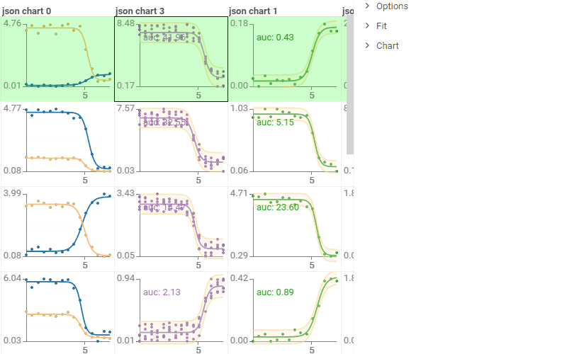

# Curves

**Curves** provides support for fitted curves (such as dose-response curves),
including in-grid rendering, storing charts in cells, interactivity, and automatic fitting.

- Fitting: computing parameters of the specified function to best fit the data
  - Uses the BFGS optimization algorithm (multi-threading for performance).
      For dose-response curves, we are typically fitting the sigmoid function
  - Ability to dynamically register custom fitting functions
    - Automatic fit function determination
    - Caching of custom fitting functions
  - Ability to get fitting performance characteristics (r-squared, classification, etc.)
- Deep integration with the Datagrok grid
  - Either fitting on the fly or using the supplied function + parameters
  - Multiple series in one cell
  - Candlesticks, confidence intervals, and droplines drawing
  - Ability to define chart, marker, or fitting options (such as fit function or marker color)
      on the column level, with the ability to override it on a grid cell or point level
  - Clicking a point in a chart within a grid makes it an outlier -> curve is re-fitted on the fly
  - Ability to specify a chart as a "reference" so that it is shown on every other chart for comparison
- Ability to overlay curves from multiple grid cells (special viewer)
- Work with series stored in multiple formats (binary for performance, JSON for flexibility, etc.)

## Rendering fitted curves using JSON format

To render a fitted curve based on series points, you need to write it in the following JSON format:

```json
{
  "series": [
    {
      "name": "Test series",
      "pointColor": "#2ca02c",
      "fitLineColor": "#2ca02c",
      "confidenceIntervalColor": "#fbec5d",
      "markerType": "circle",
      "showFitLine": true,
      "showCurveConfidenceInterval": true,
      "fitFunction": "sigmoid",
      "parameters": [1.7391934768969721, -0.9451759934029763, 4.846020678949615, 0.15841886339211816],
      "parameterBounds": [1.73919347689, -0.9451759934029, 4.846020678949, 0.15841886339],
      "showPoints": "points",
      "clickToToggle": true,
      "droplines": ["IC50"],
      "points": [
        { "x": 0.10000000149011612, "y": 0.04152340441942215 },
        { "x": 0.6000000238418579, "y": 0.11901605129241943, "outlier": true },
        { "x": 1.100000023841858, "y": 0.11143334954977036, "outlier": false },
        ...
      ]
    }
  ],
  "chartOptions": {
    "showStatistics": ["auc", "rSquared"],
    "minX": 0.10000000149011612,
    "minY": 0.04152340441942215,
    "maxX": 7.099999904632568,
    "maxY": 1.7591952085494995,
    "xAxisName": "Concentration",
    "yAxisName": "Activity",
    "logX": true,
    "logY": false,
  }
}
```

Each series has its own `name`, `point color`, `fit line color`, `confidence interval color`, and `marker type`
(could be either circle, asterisk, square, triangle, etc.) assigned. Additionally, each series has a few boolean
fields indicating whether or not to display the fit line and the curve confidence intervals. The `fit function`
for each series can be either a sigmoid function or a [custom-defined function](/README.md#creating-custom-fit-function).
Furthermore, the `parameters` for the fit function can be explicitly set or left unset as well as the `parameter bounds`,
which can control the parameters bounds during the fit respectively. If the parameters are set explicitly, the
fitting process won't be executed, and vice versa. Moreover, the user can choose whether the points, candlesticks,
both or nothing can be shown using the `show points` parameter. Also, there is a `click to toggle` boolean field which
indicates if clicking on the point toggles its outlier status and causes curve refitting or not. The `droplines`
property allows the user to choose the droplines he wants to see on the plot. The `data points` for each series
are represented as arrays of objects, with each object containing x and y coordinates and also a boolean outlier value.

Moreover, there is a `chart options` parameter that allows setting the plot parameters. The user has the option to
obtain various statistics, such as the area under the curve (`auc`) or the coefficient of determination (`rSquared`).
Also, the user can set the minimum and maximum x and y of the plot, as well as the axes names which will be rendered if
the plot size is big enough. Additionally, there are boolean fields that allow to logarithmize the data by x or by y.



## Creating a custom fit function

To render a custom fit function, you need to write in the following JSON format:

```json
"fitFunction": {
  "name": "Polynomial",
  "function": "([p1, p2, p3, p4], x) => p1 * x * x * x + p2 * x * x + p3 * x + p4",
  "getInitialParameters": "(xs, ys) => [0.1, -1, 4, 4]",
  "parameterNames": ["Slope", "Intercept", "Parameter 3", "Parameter 4"]
}
```

Each fitting function has its own `name`. This name is used to cache the created custom function, enabling
efficient retrieval and reuse. Additionally, the fit function has `parameter names`, which are stored as
an array of strings.

Also, there are two functions: `getInitialParameters`, which takes arrays of x and y and returns determined
initial parameter values, and `function`, which takes the array of parameters and given x coordinate and
returns the result of the fit function. These functions are written as JavaScript arrow function expressions.


See also:

- [Packages](../../help/develop/develop.md#packages)
- [JavaScript API](../../help/develop/js-api.md)
