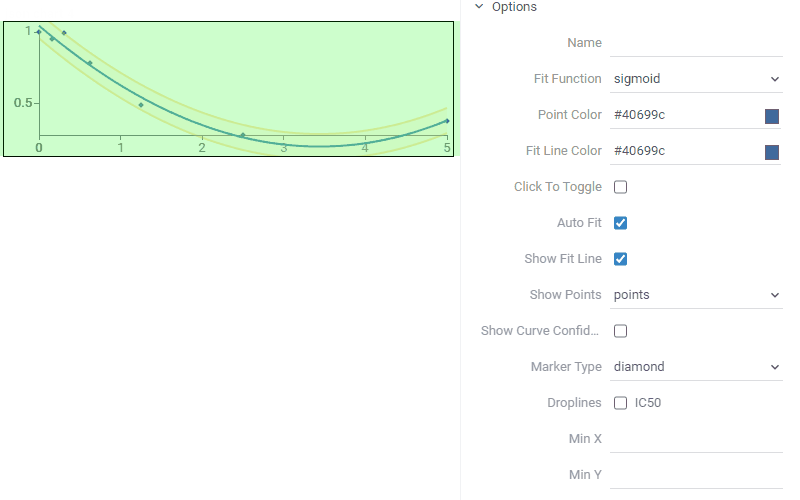

# Curves

**Curves** provides support for fitted curves (such as dose-response curves),
including in-grid rendering, storing charts in cells, interactivity, and automatic fitting.

- Fitting: computing parameters of the specified function to best fit the data
  - Uses the BFGS optimization algorithm (multi-threading for performance).
      For dose-response curves, we are typically fitting the sigmoid function
  - Ability to dynamically register custom fitting functions
    - Automatic fit function determination
    - Caching of custom fitting functions
  - Ability to get fitting performance characteristics (r-squared, classification, etc.)
- Deep integration with the Datagrok grid
  - Either fitting on the fly or using the supplied function + parameters
  - Multiple series in one cell
  - Candlesticks, confidence intervals, standard deviation and droplines drawing
  - Ability to define chart, marker, or fitting options (such as fit function or marker color)
      on the column level, with the ability to override it on a grid cell or point level
  - Clicking a point in a chart within a grid makes it an outlier -> curve is re-fitted on the fly
  - Ability to specify a chart as a "reference" so that it is shown on every other chart for comparison
- Ability to overlay curves from multiple grid cells (special viewer)
- Work with series stored in multiple formats (binary for performance, JSON for flexibility, etc.)

## Rendering fitted curves using JSON format

To render a fitted curve based on series points, you need to write it in the following JSON format:

```json
{
  "series": [
    {
      "name": "Test series",
      "pointColor": "#2ca02c",
      "fitLineColor": "#2ca02c",
      "confidenceIntervalColor": "#fbec5d",
      "markerType": "circle",
      "showFitLine": true,
      "showCurveConfidenceInterval": true,
      "fitFunction": "sigmoid",
      "parameters": [1.7391934768969721, -0.9451759934029763, 4.846020678949615, 0.15841886339211816],
      "parameterBounds": [
        {"min": 1.739193476892, "max": 1.739193476898},
        {"max": -0.9451759934029},
        {},
        {"min": 0.158418863392114}
      ],
      "showPoints": "points",
      "clickToToggle": true,
      "droplines": ["IC50"],
      "points": [
        { "x": 0.10000000149011612, "y": 0.04152340441942215, "stdev": 0.061523404876 },
        { "x": 0.6000000238418579, "y": 0.11901605129241943, "outlier": true },
        { "x": 1.100000023841858, "y": 0.11143334954977036, "outlier": false, "color": "#2ca02c" },
        // ...
      ]
    }
  ],
  "chartOptions": {
    "showStatistics": ["auc", "rSquared"],
    "minX": 0.10000000149011612,
    "minY": 0.04152340441942215,
    "maxX": 7.099999904632568,
    "maxY": 1.7591952085494995,
    "title": "Dose-Response curves",
    "xAxisName": "Concentration",
    "yAxisName": "Activity",
    "logX": true,
    "logY": false,
  }
}
```

Each series has its own parameters, such as:

- `name` - controls the series name
- `pointColor` - overrides the standardized series point color
- `fitLineColor` - overrides the standardized series fit line color
- `confidenceIntervalColor` - overrides the standardized series confidence interval color
- `markerType` - defines the series marker type, which could be `circle`, `asterisk`, `square`, etc.
- `showFitLine` - defines whether to show the fit line or not
- `showCurveConfidenceInterval` - defines whether to show the confidence intervals or not
- `fitFunction` - controls the series fit function, which could be either a sigmoid function or a
[custom-defined function](/README.md#creating-custom-fit-function).
- `parameters` - controls the series parameters, if set explicitly - the fitting process won't be executed. The parameter order of the
sigmoid function is: `max, tan, IC50, min`.
- `parameterBounds` - defines the acceptable range of each parameter, which is taken into account during the fitting. See also `parameters`
- `showPoints` - defines the data display mode, which could be either `points`, `candlesticks`, `both`, or none
- `clickToToggle` - defines whether clicking on the point toggles its outlier status and causes curve refitting or not
- `droplines` - defines the droplines that would be shown on the plot (for instance, IC50)
- `points` - an array of objects with each object containing `x` and `y` coordinates and its own parameters:
  - `outlier` - if true, renders as 'x' and gets ignored for curve fitting
  - `stdev` - when defined, renders an error bar candlestick
  - `color` - overrides the marker color defined in series `pointColor`

Each chart has its own parameters as well, such as:

- `minX`, `minY`, `maxX`, `maxY` - controls the minimum x and y values of the plot
- `title` - defines the plot title. If the plot size is enough, will render it
- `xAxisName`, `yAxisName` - defines the x and y axis names. If the plot size is enough, will render it
- `logX`, `logY` - defines whether the x and y data should be logarithmic or not
- `showStatistics` - defines the statistics that would be shown on the plot (such as the area under the curve
(`auc`) or the coefficient of determination (`rSquared`))


## Creating a custom fit function

To render a custom fit function, you need to write in the following JSON format:

```json
"fitFunction": {
  "name": "Polynomial",
  "function": "([p1, p2, p3, p4], x) => p1 * x * x * x + p2 * x * x + p3 * x + p4",
  "getInitialParameters": "(xs, ys) => [0.1, -1, 4, 4]",
  "parameterNames": ["Slope", "Intercept", "Parameter 3", "Parameter 4"]
}
```

Each fitting function has its own `name`, which is used to cache the created custom function, enabling
efficient retrieval and reuse, and `parameterNames`, which are stored as an array of strings.

Also, there are two functions: `getInitialParameters`, which takes arrays of x and y and returns determined
initial parameter values, and `function`, which takes the array of parameters and the given x coordinate and
returns the result of the fit function. These functions are written as JavaScript arrow function expressions.



See also:

- [Packages](../../help/develop/develop.md#packages)
- [JavaScript API](../../help/develop/packages/js-api.md)
