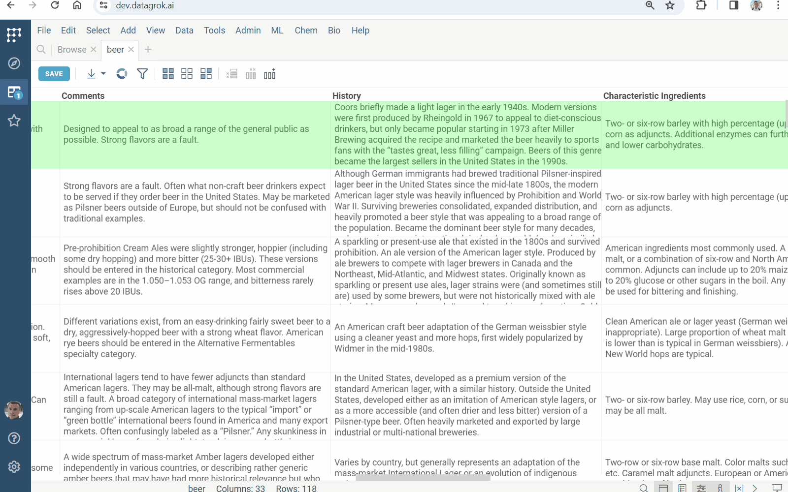
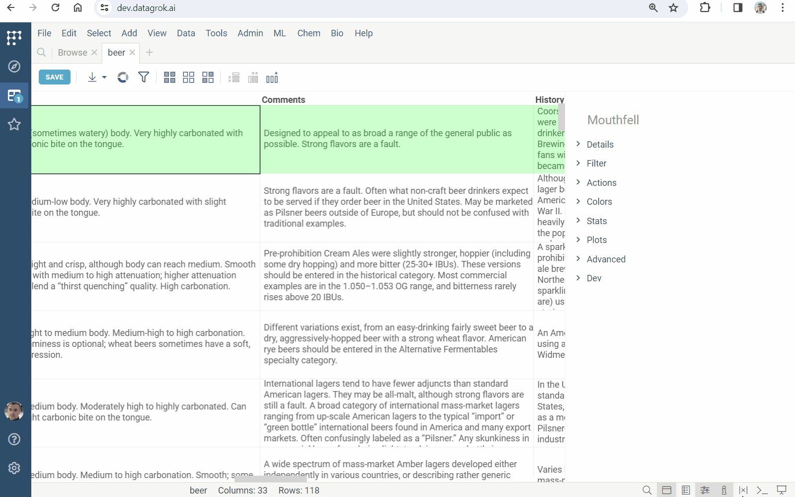
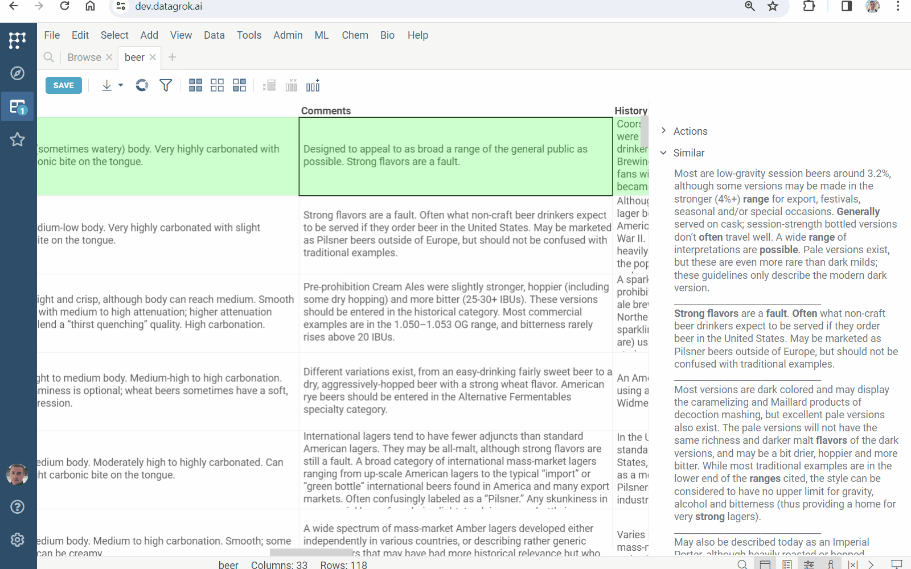

# NLP

*NLP* is a [Datagrok package](https://datagrok.ai/help/develop/#packages) for natural language processing. The package provides integration with [AWS Translate](https://aws.amazon.com/translate/), a neural machine translation service, and extends Datagrok with [info panels](https://datagrok.ai/help/explore/data-augmentation/info-panels) for text files.

*Natural Language Processing*, or *NLP* for short, is a branch of artificial intelligence that builds a bridge between computers and human languages. This field has many applications, including:

* [language identification](https://en.wikipedia.org/wiki/Language_identification)
* [machine translation](https://en.wikipedia.org/wiki/Machine_translation)
* [sentiment analysis](https://en.wikipedia.org/wiki/Sentiment_analysis)
* [text summarization](https://en.wikipedia.org/wiki/Automatic_summarization)
* [topic modeling](https://en.wikipedia.org/wiki/Topic_model)
* [entity extraction](https://en.wikipedia.org/wiki/Named-entity_recognition)

## Text extraction

It all starts with extracting text. This is a building block for other, more
complex tasks. Due to the high demand, it is essential to support as many
popular text file formats as possible. The platform comes with a built-in
[file browser](https://datagrok.ai/help/access/files/#file-manager)
for easy file management. The package extends it by processing text from
`pdf`, `doc`, `docx`, `odt`, and other text formats.


## Language identification

Determining the language of a document is an important preprocessing step for
many language-related tasks. Automatic language detection may be part of
applications that perform machine translation or semantic analysis. Datagrok's
language identification is powered by Google's [Compact Language Detector v3 (CLD3)](https://github.com/google/cld3) and supports over [100 languages](https://github.com/google/cld3#supported-languages).
As with text extraction, this functionality is used in the [Translation](#neural-machine-translation) info panel.

## Neural machine translation

The package creates a new info panel for text files. It uses [AWS Translate](https://aws.amazon.com/translate/) service, which supports over [70 languages](https://docs.aws.amazon.com/translate/latest/dg/what-is.html#what-is-languages).

To translate a text, navigate to the file browser and select one of the demo files (see the `texts` folder). Alternatively, open your personal folder and drag-and-drop your file to the platform. Now, whenever you click
on the file, you will see a suggestion to translate it in the context panel on the right.


The language is identified automatically, but you always have a chance to change it manually.
The default target language is English, so be sure to choose another option if the original text is in English.

## Text statistics

Increasingly often texts are analyzed for readability. Readability scores take
into account various parameters: the average number of words per sentence or
syllables per word, percentage of long words, etc.

The `Text Statistics` info panel calculates two common formulas:

* [Flesch reading-ease](https://en.wikipedia.org/wiki/Flesch%E2%80%93Kincaid_readability_tests) test for English
* [LIX](https://en.wikipedia.org/wiki/Lix_(readability_test)) formula for other languages


## Search

The package has search tools for similar texts.

Open table and select a cell of text column. If not specified, set the `Text` quality in properties of the selected column:

* Right-click on the column and select `Column Properties...`. A dialog opens
* Press `+` in `Tags` and add the *quality* tag with the value *Text*. Now, a tooltip of the column contains `quality: Text`



Select any cell of the column and expand `Similar` in `Context Panel`. You will get a set of **similar** elements of the column. Search results are separated with a line, and common words are in bold:



Explore the obtained search results in the `Similar` panel:

* Click to navigate directly to the grid cell containing the text of interest
* Right-click to add a word to filters



## Videos

[User Meeting 9: Natural Language Processing](https://www.youtube.com/watch?v=GM3XixUFFUs&t=94s)

## Developer notes

The package demonstrates two ways of developing [info panels](https://datagrok.ai/help/explore/data-augmentation/info-panels) for Datagrok: with panel scripts and with JavaScript panel functions.

To write a panel script in any of the [languages supported by the platform](https://datagrok.ai/help/compute/scripting#supported-languages), you should indicate the `panel` tag and specify conditions for the panel to be shown (in the `condition` [header parameter](https://datagrok.ai/help/compute/scripting/#header-parameters)):

```python
# name: language detection
# language: python
# input: file file {semtype: text} [a text to analyze]
# output: string language {semtype: lang} [detected language]
# tags: nlp, panel
# condition: file.isfile && file.size < 1e6 && supportedext(file.name)
```

The [scripts](https://github.com/datagrok-ai/public/tree/master/packages/NLP/scripts) folder contains more examples of such panel scripts, which are written in Python and work specifically on text files.

A different approach is used to add an info panel from a JavaScript file. The panel function should be properly annotated to return a widget. A simplified example is shown below:

```javascript
//name: Translation
//tags: panel, widgets
//input: file textfile
//output: widget result
//condition: isTextFile(textfile)
export function translationPanel(textfile) {
    return new DG.Widget(ui.divText("Lost in Translation"));
}
```

Refer to [src/package.js](https://github.com/datagrok-ai/public/blob/master/packages/NLP/src/package.ts) to see the panel's complete code.

See also:

* [Natural language processing](https://en.wikipedia.org/wiki/Natural_language_processing)
* [Scripting](https://datagrok.ai/help/compute/scripting)
* [Info panels](https://datagrok.ai/help/explore/data-augmentation/info-panels)
